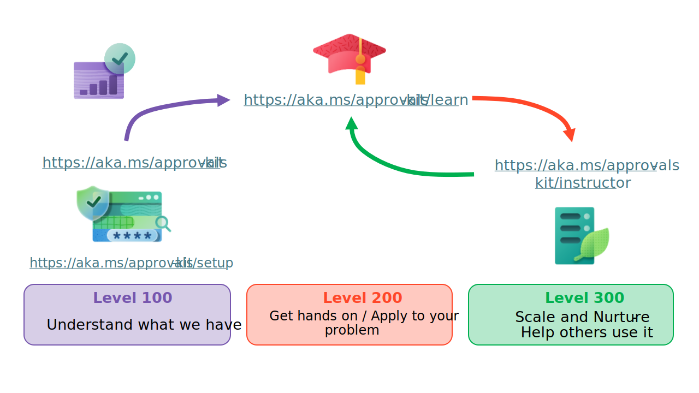

# Nurturing and educating the user community and the technical approvals community

Are you looking to streamline your organization's approval processes and reduce manual effort? Look no further than the Approvals Kit, a low-code solution that allows you to automate approvals across various platforms. In this article, we discuss the setup the Approvals Kit, aligning it with your environments and scaling adoption. Once you're up and running, we show you how to take advantage of the Automation Kit learn module. Using the learn module you can learn and apply automated approvals processes either individually or as a group. Finally, we discuss how to scale your automated approvals with the help of workshop instructor guides and mentors from earlier cohorts of learning. Let's get started!

## Learning levels

Example learning levels

| Level | Description | Related content |
|-------|-------------|------------------|
| Level 100 | Typically involves learning what the Approvals Kit is and how it's set up and applied to your organization | [User Journey](./user-journey.md), [Setup Guide](./setup.md)
| Level 200 | Involves getting hands on and using the Approvals kit. Once you have mastery of the key concepts applying the learnings to automating your approvals process | [Approvals Kit in Power Automate workshop overview](/training/modules/approvals-kit-workshop/)
| Level 300 | Scale and nurture others in the organization to adopt and use the approvals kit | [Instructor Guide](https://aka.ms/approvals-kit/instructor)

It's not enough to simply set-up the Approvals Kit and expect everyone to start using it. To truly reap the benefits of this low-code solution, it's important to create a process to nurture and educate both the user community and the technical community. In addition, it's important to involve the governance team to ensure that the Approvals Kit aligns with your organization's policies and regulations. Microsoft provides a set of [best practices for nurturing adoption](/power-platform/guidance/adoption/nurture-best-practices) of Power Platform solutions, which can be extended to the Approvals Kit. These best practices include creating a center of excellence, identifying champions, providing training and support, and measuring success. By following these best practices and tailoring them to the Approvals Kit, you can ensure that your organization fully embraces this powerful tool.

## Learning personas

To effectively nurture and support the approvals [user journey](./user-journey.md), it's important to consider the needs of each persona involved.

For the Power Platform administrator, the focus should be on [setting up](./setup.md) the Approvals Kit. Consider how you govern and monitoring its usage and ensuring that service level agreements with the business are met. From a technical point of view creating and assigning environments, importing the approvals kit solution as a system administrator or customizer.

For the Approvals administrator, the focus should be on configuring the kit to match the business requirements and analyzing the approval processes for improvement opportunities. Learning goals include how to design, model and building low-code approval automation, or work with other makers to trigger and respond to approvals.

For the Approver, the focus should be on understanding how to set up out of office and delegate approvals to others.

Finally, for the instructor persona, the focus should be on setting up, provisioning, and monitoring a group of learners as they apply the Approvals Kit. The [Instructor guide](https://aka.ms/approvals-kit/instructor)

By creating a learning path tailored to each persona's needs, you can ensure that everyone involved in the approvals process is equipped with the knowledge and skills they need to succeed.

## Factors to consider

The Approvals Kit as part of your low-code solution, there are several factors to consider to ensure a successful implementation. As a starter for discussion with your user and center of excellence community include three key points to consider for each factor.

By considering these factors and addressing them appropriately, you can ensure a successful adoption of the Approvals Kit as part of your low-code solution.

### Environment strategy

- Determine the appropriate number of environments across development, test and production for approvals process.
- Access to data and isolation requirements for approval workflows.
- Setup of security roles and permissions for different personas.

### Data loss prevention policy

- Understand how the data that needs to be integrated with the Approvals Kit and how data is protected.
- Consider the impact of data loss prevention policies on the approvals process and ensure that they're properly configured.
- Ensure that data is properly classified and labeled to prevent data leakage.

### Automation skills and patterns

- Determine the appropriate level of automation for your approvals processes.
- Identify common patterns and use cases for approval automation and develop reusable components.
- Ensure that automation is properly tested and validated to prevent errors and ensure reliability.

### Exception management

- Develop a process for handling exceptions and errors in the approvals process.
- Ensure that exceptions are properly logged and tracked for analysis and improvement.
- Develop contingency plans for handling unexpected events or failures.

### Monitoring

- Develop a process for monitoring the performance and usage of the Approvals Kit.
- Identify key metrics to track, such as approval time and volume.
- Ensure that monitoring is properly configured and alerts are set up for critical events.
