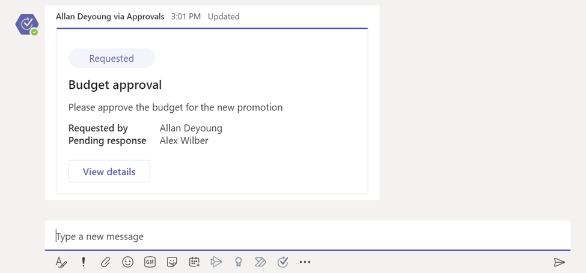
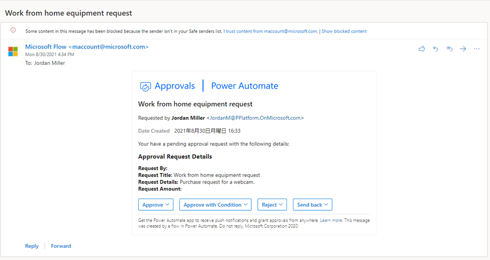
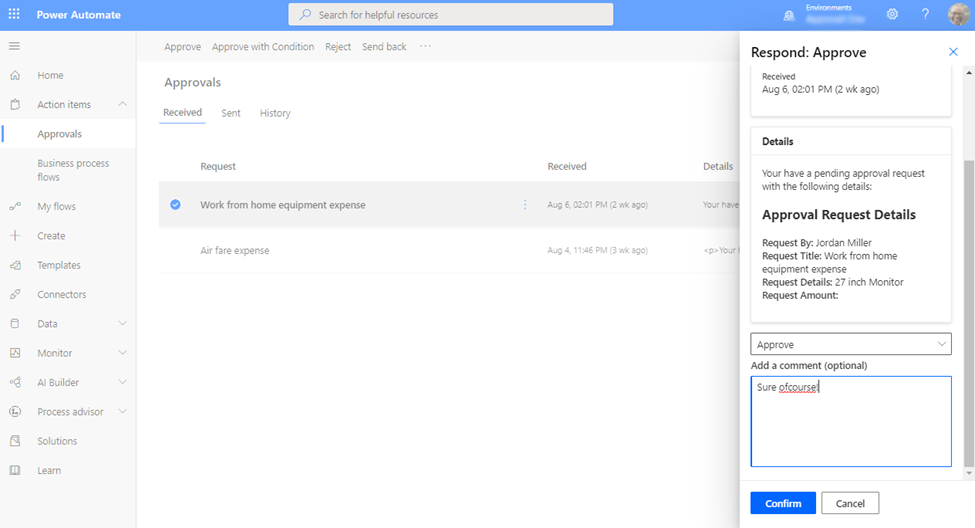

# Processing approval requests

You have multiple options to process approval requests you have received and also multiple results to choose from.

Approvals Kit has the standard Approve and Decline and several other options to accommodate complex approval scenarios. Review the table to understand the meanings and how the system handles the approval request based on results.

|Icon|Status|Description|
|----|------|-----------|
||Approve|Approves the request. Approvals Kit will automatically request the next approval for approval, or will complete the approval with status set to Approved.|
||Approve with condition|Approves the request with condition. Approvals Kit will automatically request the next approval for approval, or will complete the approval with status set to Approved with condition.|
||Reject|Declines the request. The Approvals Kit automatically terminates the approval request, and sets the approval statues to Declined|
||Send back|Sends back the request to the previous approver. Approvals Kit sets the current approval request status back to Not Started, and look up the previous approval request to override existing result to Pending again for the previous approval to look at the request again. If two or more requests occur in the previous step simultaneously, all of the previous steps are processed in the same way.|
||Reassign|Reassigns the approval request to whoever you specify. Approval request remains to be Pending

In addition to your decisions, there are also three other statuses that can be shown in the approval status.

|Icon|Status|Description|
|----|------|-----------|
||Not Started|This status means that the approval request hasn't started, and is awaiting previous request to complete.
||Pending|The approval status shows as pending if the approval request is pending decision from the approver.
||Pending (Timeout)|This status means that the approval request hasn't responded by the approver with in the first 30 days, and the Power Automate cloud flow run that is managing this request is restarted automatically. Once restarted, the status changes back to Pending again.
||System Processing|This status shows if the cloud flow is still processing the results.|

## Approving from Microsoft Teams

You can directly respond to an approval request from Microsoft Teams. A notification is sent to you in Teams if you receive a request. You can also respond by checking the Teams Approvals app. For further information on how to process requests from Microsoft Teams, follow the steps in [Respond to an approval in Microsoft Teams](../../teams/respond-to-approvals-in-teams#approve-or-reject-an-request-in-teams.md)

## Approving from Outlook

The approval request can be directly approved from Outlook or Outlook
online. When an approval request is received, a request is
sent to the approver.

## Approving from Power Automate mobile app

If you would like to make approvals while you are on the go, you can use Power Automate mobile app. To install, follow the links available from [Power Automate mobile
website](https://flow.microsoft.com/mobile/download/).

1. Open Power Automate mobile app

1. Select Activity

1. Select Approvals

1. Select the approval request you would like to make decision on

*Note: The screens on Android, iOS and Windows Phone may differ slightly, however, the functionality is the same on all devices.*

## Approving from Power Automate Approvals center

You can approve a request from Power Automate approvals center. To make an approval, following the following steps:

1. Go to [Power Automate website](https://flow.microsoft.com/)

2. Select **Action items**

3. Select **Approvals**

4. Select the approval request you would like to decide

5. Choose your response

6. Select **Confirm**

