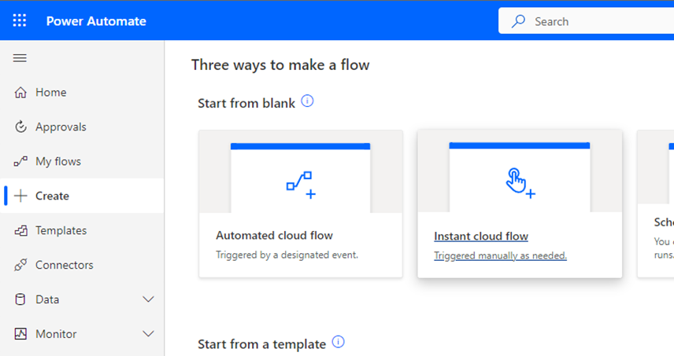
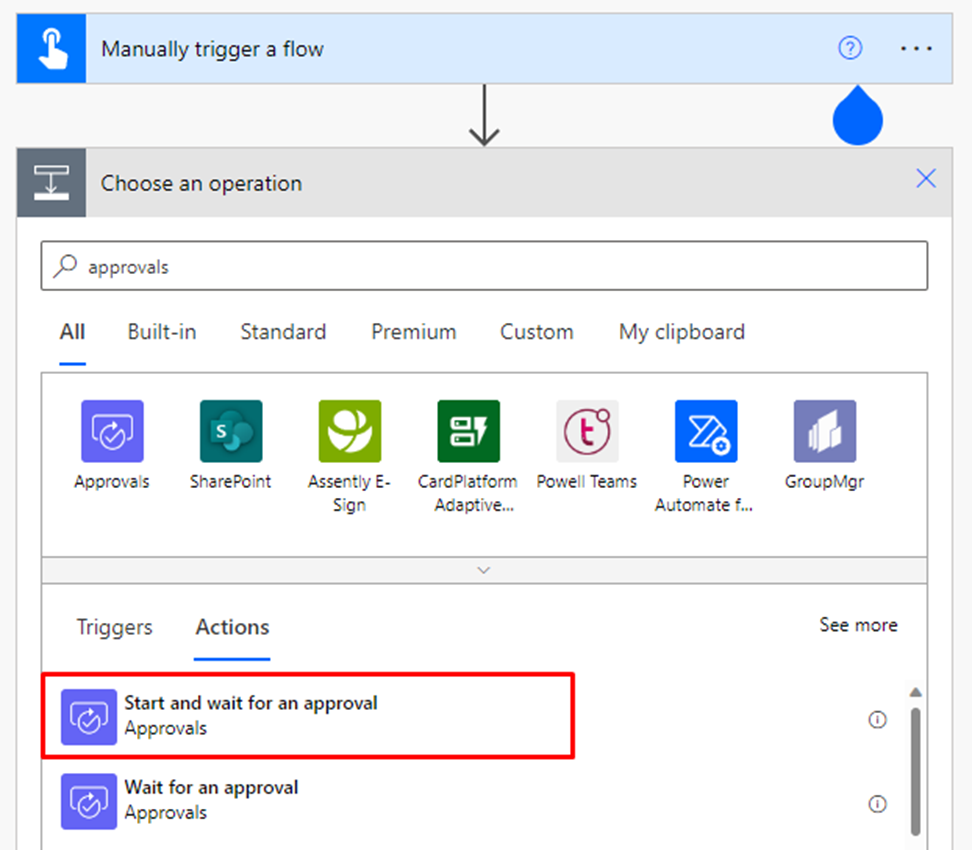
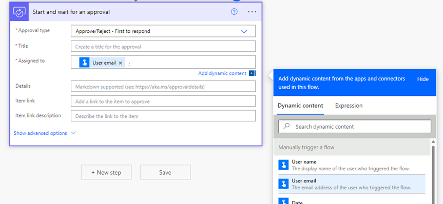
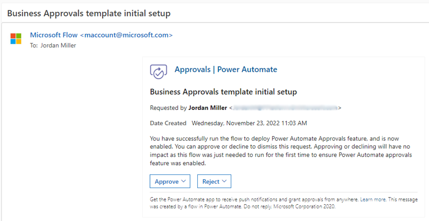

# Business Approvals Kit setup

This Approvals Kit and guidance is targeted towards the person or department responsible for setting up approval system in their
organization. The goal of this guidance is to help you walking you through the prerequisites, setup instructions, and individual components of the Approvals Kit.

## Overview

The Approvals Kit is a collection of components that are designed to help you get started with digitalizing your organization's approval processes using Microsoft Power Platform. More information about individual components can be found in the Approvals Kit.

> Note: The Approvals Kit can only be used currently in Dataverse environments, and setting up in Dataverse for Teams environments and default environments are not supported.*

## Prerequisites

- Microsoft Dataverse environment (Default Environment can't be used)

- Required licenses:

  - Power Apps per user or per app license for users who will:

    - Configure approvals

    - Approve requests AND need to check progress between each approval step

    - Create approval requests AND need to check progress between each approval step

    - Administer approval processes

  - Power Automate Process license for:
  
    - Approve requests but DO NOT need to check progress between each approval step using the template

    - Create approval requests but DO NOT need to check progress between each approval step using the template

  - Power Apps and Power Automate pay as you go plans as alternatives to per user licenses
  
  - More information: [Licensing overview for Microsoft Power Platform](/power-platform/admin/pricing-billing-skus#power-appspower-automate-for-microsoft-365)
  
  - Data Loss Prevention Policy categorized to be usable for the following connectors:

    - [Approvals](/connectors/approvals/)

    - [Microsoft Dataverse](/connectors/commondataserviceforapps/)

    - [Microsoft Teams](/connectors/teams/)

    - [Office 365 Groups](/connectors/office365groups/)

    - [Office 365 Outlook](/connectors/office365/)

    - [Office 365 Users](/connectors/office365users/)

    - Approvals Kit custom connector

    - More information: [Data loss prevention policies](/power-platform/admin/wp-data-loss-prevention)

  - Power Automate approvals connector capability enabled (see section on enabling Power Automate approvals capability for steps)

## Setting up a new environment to install (optional)

1. Create an environment in which to set up the Approvals Kit

    a.  Go to the Power Platform admin center

    b.  Select **Environments** \> + **New**, and then enter a name, type, and purpose

    c.  Select **Yes** for creating the database, and then select **Next**.

    d.  Leave **Sample apps and data set** to **No**

    e.  Select **Save**

1. Go to your new environment

    a.  Go to [make.powerapps.com](https://make.powerapps.com)

## Enabling Power Automate approvals capability

Approvals Kit relies on the out of the box approvals functionality from Power Automate. If you're using the approvals function for the first time, it needs to be enabled first. In new environments, the Power Automate Approvals feature is configured on-demand the first time any approval flow runs in an environment. The on-demand setup is performed either the **Create an Approval** or **Start and wait for an approval** cloud flow actions execute. To enable the approvals feature, proceed with the following steps.

*Note: Only run these steps for the first time you're using Approvals connector in the environment you're going to install the template on. If you have already previously used the Approvals connector in the same environment, you can omit this section.*

1. Select the environment you're going to deploy the Approvals Kit on

1. Go to [make.powerautomate.com](https://make.powerapps.com/), select **Create**, and select "Instant cloud flow"

   

1. Name the flow "Approvals Kit" or any name of your choice that you can remember

1. Select **Manually trigger a flow** and select **Create**

1. Select **+ New step** and search "approvals"

1. Select **Start and wait for an approval**

   

1. Select **Approve/Reject \-\- First to respond**

1. Enter the title as "Approvals Kit initial setup" or any name of your choice that you can remember

1. Set Assigned to as **User email** from the list of Dynamic content available

   

1. Select **Save**. It may prompt you with a warning *No Microsoft Dataverse database for this environment has been provisioned*. The  warning is normal and is the exact reason why you're running these prerequisite steps

1. Select **Test** and choose **Manually**, and select **Test** again

1. It prompts you to sign in. Select **Continue**, then select **Run flow**

1. Select **Done** and it transfers you to another screen with a message "Your flow is running..."

> *Note: **[It will take around 10 minutes for this to run for the first time]{.ul}**. If you are having problems running this flow, read the support article [Power Automate Approvals Provisioning Overview and Troubleshooting](https://support.microsoft.com/topic/power-automate-approvals-provisioning-overview-and-troubleshooting-2306313a-49fa-efde-c716-a34c573ec942) and reach out to your IT administrator or contact Microsoft support.*

After the flow is successfully run, a **email** requesting for approval is sent. You can select either approve or reject as the main purpose is to just run a flow with Approvals component included. Selecting either doesn't affect the later set-up steps. You're now ready to install the core components of Approvals Kit.

## Installing the core components

Setting up a designated environment for Approvals Kit is recommended as all users within your organization that need to access the Business Approvals process. Further information on environments is available in [environments overview](/power-platform/admin/environments-overview). If you're a business user, creating an environment typically requires a person with administrative access to Power Platform. Reach out to your IT department to ask for assistance on environment setup.

> Note: Approvals Kit uses [solution management capabilities](/power-apps/developer/data-platform/introduction-solutions) of Dataverse to package up all assets. To ensure consistency and same experience for every customer, the template is provided as [managed solutions](/power-platform/alm/solution-concepts-alm). If you would like to extend this template, you will need to use a separate [unmanaged solution](/power-platform/alm/solution-concepts-alm) layer as you cannot directly modify this template.

### Import the solution

Open [https://make.powerapps.com](https://make.powerapps.com). Go to the environment you either created or been allocated, in which the Approvals Kit should be hosted.

Importing the solution is the first step of the installation process and is required for every other component in the Approvals Kit to work. Import needs either a new created environment or import in the existing environment (excluding the Default environment) in which to installed.

1. Download the Approvals Kit ZIP file ([aka.ms/businessapprovals/download](https://aka.ms/businessapprovals/download)).

1. Go to <https://make.powerapps.com>

1. On the left pane, select **Solutions**

1. Select **Import**, and then **Browse**

1. Select the Approvals Kit core components solution from File Explorer
    (BusinessApprovalsCoreComponents\_*x_x\_x_xx*\_managed.zip)

1. When the compressed (.zip) file has been loaded, select **Next**

1. Review the information, and then select **Next**

1. Establish connections to activate your solution. If the connections don't exist create new connections to proceed with import. If you create a new connection, you must select **Refresh**.

   

1. Select **Import**

1. Once import is complete, you should see Business Approvals Kit in the list of solutions

*Note: The import may take up to 10 minutes to be completed.*

### Activate the core cloud flows

The template includes multiple core components that are used to manage the approval experience. To use the template, you need to turn on the cloud flows that came with the template.

1. Go to [make.powerapps.com](https://make.powerapps.com/), select **Solutions**, and then open the **Business Approvals Kit** solution to view the flows. Activate cloud flows using in the list to ensure no errors occur as there are dependencies across the flows. Some cloud flows may be enabled when importing the solution in the previous steps.

  a.  Turn on: BACore \| Approval Time-out

  b.  Turn on: BACore \| Approver OOF

  c.  Turn on: BACore \| Cascade Process Status

  d.  Turn on: BACore \| Cascade Publishing Activation

  e.  Turn on: BACore \| Child \| Get Dynamic Approver

  f.  Turn on: BACore \| Child \| Get Dynamic Data Instance

  g.  Turn on: BACore \| Child \| Get Default Settings

  h.  Turn on: BACore \| Child \| Log Runs

  i.  Turn on: BACore \| Child \| Evaluate Rule

  j.  Turn on: BACore \| Cleanup \-\- Remove Deactivated Records

  k.  Turn on: BACore \| Daily \| Calculate Approval Timeouts

  l.  Turn on: BACore \| Publish Process

  m.  Turn on: BACore \| Runtime \-\- Start Approval

  n.  Turn on: BACore \| Runtime \-\- Start Node

  o.  Turn on: BACore \| Runtime \-\- Start Stage

  p.  Turn on: BACore \| Runtime \-\- Start Workflow

  q.  Turn on: BACore \| Runtime \-\- Update Approval

  r.  Turn on: BACore \| Runtime \-\- Update Node Instance

  s.  Turn on: BACore \| Runtime \-\- Update Stage Instance

  t.  Turn on: BACore \| Sync Approver OOF

1. You have completed installing the core components. Your next step is to set up the approval processes in How to use Approvals Kit section.
