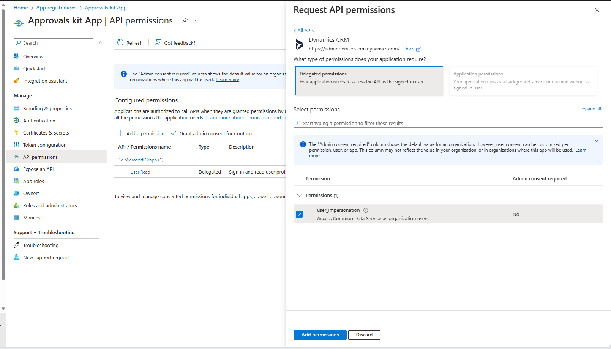

# Business Approvals Kit manual setup

The Approvals Kit and guidance is targeted towards the person or department responsible for setting up approval system in your organization. Key sections walk you through the prerequisites, setup instructions, and individual components of the Approvals Kit.

## Overview

The Approvals Kit is a collection of components that are designed to help you get started with digitalizing your organization's approval processes using Microsoft Power Platform. More information about individual components can be found in the Approvals Kit.

> Note: The Approvals Kit can only be used currently in Dataverse environments, and setting up in Dataverse for Teams environments and default environments are not supported.*

## Prerequisites

- Microsoft Dataverse environment (Default Environment can't be used)

- Required licenses:

  - Power Apps per user or per app license for users who will:

    - Configure approvals

    - Approve requests AND need to check progress between each approval step

    - Create approval requests AND need to check progress between each approval step

    - Administer approval processes

  - Power Automate Process license for:
  
    - Approve requests but DO NOT need to check progress between each approval step using the template

    - Create approval requests but DO NOT need to check progress between each approval step using the template

  - Power Apps and Power Automate pay as you go plans offer alternatives to monthly user, application or flow licenses
  
  - More information: [Licensing overview for Microsoft Power Platform](/power-platform/admin/pricing-billing-skus#power-appspower-automate-for-microsoft-365)
  
  - Data Loss Prevention Policy categorized to be usable for the following connectors:

    - [Approvals](/connectors/approvals/)

    - [Microsoft Dataverse](/connectors/commondataserviceforapps/)

    - [Microsoft Teams](/connectors/teams/)

    - [Office 365 Groups](/connectors/office365groups/)

    - [Office 365 Outlook](/connectors/office365/)

    - [Office 365 Users](/connectors/office365users/)

    - Approvals Kit custom connector

    - More information: [Data loss prevention policies](/power-platform/admin/wp-data-loss-prevention)

  - Power Automate approvals connector capability enabled (see section on enabling Power Automate approvals capability for steps)

## Setting up a new environment to install (optional)

1. Create an environment in which to set up the Approvals Kit

    a.  Go to the Power Platform admin center

    b.  Select **Environments** \> + **New**, and then enter a name, type, and purpose

    c.  Select **Yes** for creating the database, and then select **Next**.

    d.  Leave **Sample apps and data set** to **No**

    e.  Select **Save**

1. Go to your new environment so that you can import the Approvals Kit solution for a manual install.

    a.  Go to [make.powerapps.com](https://make.powerapps.com)

## Enabling Power Automate approvals capability

Approvals Kit relies on the out of the box approvals functionality from Power Automate. If you're using the approvals function for the first time, it needs to be enabled first. Enabling approvals can be done using the power platform command line interface or manually by running a cloud flow that includes an approval

### Command Line Setup

Using the power platform command line can be used install the flow approvals solution into the environment. In the environment allocated for the Approvals Kit, use the following PowerShell commands as a starter script

```pwsh
$envs = (pac admin list --json | ConvertFrom-Json) | Where-Object { $_.DisplayName -eq "Your Environment Name"  }
pac application install --environment $envs[0].EnvironmentId --application-name "msdyn_FlowApprovals"
```

### Manual Setup

In new environments, the Power Automate Approvals feature can be installed into an environment using the Power Platform Admin center with the following steps.

1. Open the [Power Platform Admin center](https://aka.ms/ppac)

1. In the left nagivation select **Resources**

1. Select **Dynamics 365 apps**

1. From the list select **Microsoft Flow Approvals**

1. Select the **...** menu for Microsoft Flow Approvals

1. Select **Install** from the menu

1. Select the environment that the Approvals Kit will be installed in

1. Review the terms of service

1. Agree to the terms of service and select **Install**

> *Note:* It can take around 10 minutes to install

## Installing the core components

Setting up a designated environment for Approvals Kit is recommended for all users within your organization that need to access the Business Approvals process. Further information on environments is available in [environments overview](/power-platform/admin/environments-overview). If you're a business user, creating an environment typically requires a person with administrative access to Power Platform. Reach out to your IT department to ask for assistance on environment setup.

> Note: Approvals Kit uses [solution management capabilities](/power-apps/developer/data-platform/introduction-solutions) of Dataverse to package up all assets. To ensure consistency and same experience for every customer, the template is provided as [managed solutions](/power-platform/alm/solution-concepts-alm). If you would like to extend the template, you will need to use a separate [unmanaged solution](/power-platform/alm/solution-concepts-alm) layer as you cannot directly modify this template.

### Enable the Power Apps component framework

Once Microsoft Flow Approvals has been for the environment, enable the Power Apps component framework using these steps.

1. Sign in to the [Power Platform admin center](https://admin.powerplatform.microsoft.com/).

1. Select an environment where you want to enable this feature.

    You need to do this for **main** and all **satellite** environments.

1. On the top pane, select **Settings**.

1. Select **Product** > **Features**.

1. Turn on **Allow publishing of canvas apps with code components**.

1. Select **Save**.

### Import the Creator Kit

Next, install the creator kit using one of the options in [Install the Creator Kit](/power-platform/guidance/creator-kit/setup)

### Import the solution

Open [https://make.powerapps.com](https://make.powerapps.com). Go to the environment you either created or been allocated, in which the Approvals Kit should be hosted.

Importing the solution is the first step of the installation process and is required for every other component in the Approvals Kit to work. Import needs either a new created environment or import in the existing environment (excluding the Default environment) in which to installed.

1. From the expanded section **Assets** for the latest release, download the Approvals Kit file **BusinessApprovalsKit_*_managed.zip**.

1. Go to <https://make.powerapps.com>

1. On the left pane, select **Solutions**

1. Select **Import**, and then **Browse**

1. Select the Approvals Kit core components solution from File Explorer
    (BusinessApprovalsKit_*_managed.zip)

1. Once the compressed (.zip) value is available, select **Next**

1. Review the information, and then select **Next**

1. Establish connections to activate your solution. If the connections don't exist create new connections to proceed with import. If you create a new connection, you must select **Refresh**.

   

1. Select **Import**

1. Once import is complete, you should see Business Approvals Kit in the list of solutions

*Note: The import can take up to 10 minutes to be completed.*

### Post Import Steps

Once Approvals kit solution is imported to an environment successfully, there's a need to update Approvals kit custom connector to point out to the target tenant Identity provider and turn on cloud flows

#### Update Custom Connector

As the custom connector for approvals kit work on delegation permission, it's necessary to have an app registered to interact with Dataverse table and Custom API.

##### App Registration

Follow these steps to perform the app registration

1. Sign in to https://entra.microsoft.com/

1. Select **App Registration** from Application section under **Identity**.


1. Select New registration and provide a name, for example **Approvals kit App**. select **Register**.

1. Under **API permission**, select **Add a permission** and select **Dynamic CRM**.


1. Choose **Delegated permission** and select user_impersonation. Select **Add Permissions**.



1. Create Secret by moving to **Certificates and Secrets** section and select **New client secret**.

1. Add description and select an appropriate expiry date. Select **Add**.

1. Copy the secret value and save it. You'll use the copied value when configuring custom connector in the next section.

1. Also make a note of Client ID from Overview section.

#### Update Approvals kit - Custom Connector

1. Edit the **Approvals kit** custom connector present inside Business Approval solution

1. Under **Security** tab, Modify the following

- Select Authentication type as **OAuth 2.0**.
- Enter the Client ID, Secret noted in previous section.
- Specify the environment URL under Resource URL section.

1. Select Update connector.

1. Under **Test** tab, create a **New connection**.

1. Specify the account details for the connection and allow access if prompted.

1. Edit the **Custom connector** again and under **Test** section, Test the **GetPublishedWorkflow** operation.

1. The operation should run successfully with Status as 200.

#### Activate the core cloud flows

The template includes multiple core components that are used to manage the approval experience. To use the template, you need to turn on the cloud flows that came with the template.

1. Go to [make.powerapps.com](https://make.powerapps.com/), select **Solutions**, and then open the **Business Approvals Kit** solution to view the flows. Activate cloud flows using in the list to ensure no errors occur as there are dependencies across the flows. Some cloud flows can be enabled when importing the solution in the previous steps.

    a.  Turn on: BACore \| Approval Time-out

    b.  Turn on: BACore \| Approver OOF

    c.  Turn on: BACore \| Cascade Process Status

    d.  Turn on: BACore \| Cascade Publishing Activation

    e.  Turn on: BACore \| Child \| Get Dynamic Approver

    f.  Turn on: BACore \| Child \| Get Dynamic Data Instance

    g.  Turn on: BACore \| Child \| Get Default Settings

    h.  Turn on: BACore \| Child \| Log Runs

    i.  Turn on: BACore \| Child \| Evaluate Rule

    j.  Turn on: BACore \| Daily \| Calculate Approval Timeouts

    k.  Turn on: BACore \| Publish Process

    l.  Turn on: BACore \| Runtime \-\- Start Approval

    m.  Turn on: BACore \| Runtime \-\- Start Node

    n.  Turn on: BACore \| Runtime \-\- Start Stage

    o.  Turn on: BACore \| Runtime \-\- Start Workflow

    p.  Turn on: BACore \| Runtime \-\- Update Approval

    q.  Turn on: BACore \| Runtime \-\- Update Node Instance

    r.  Turn on: BACore \| Runtime \-\- Update Stage Instance

    s.  Turn on: BACore \| Sync Approver OOF

1. Once installation is complete for the core components, your next step is to set up the approval processes in How to use Approvals Kit section.
