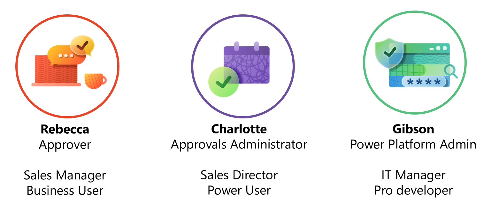
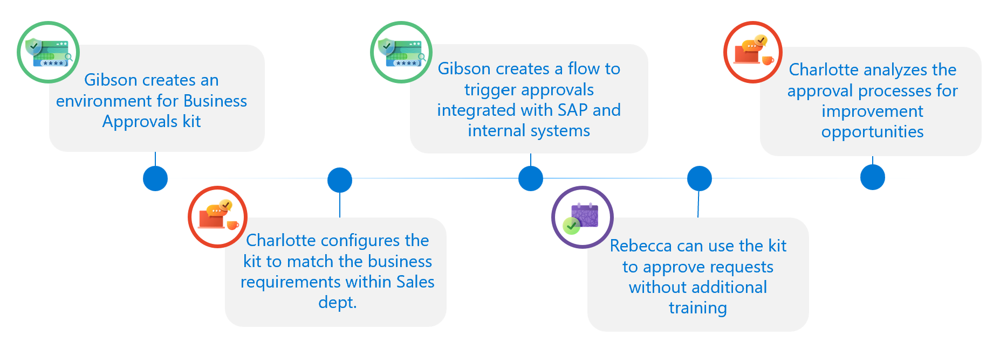
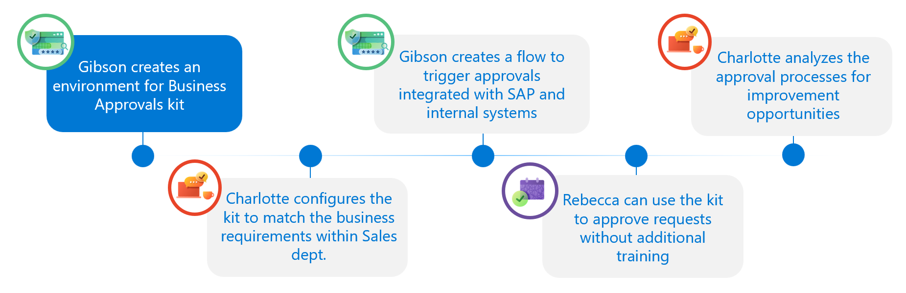
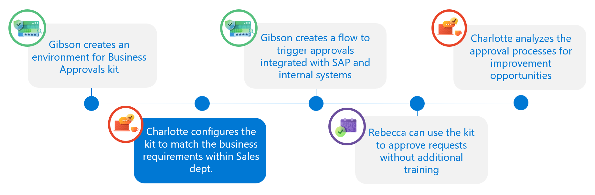
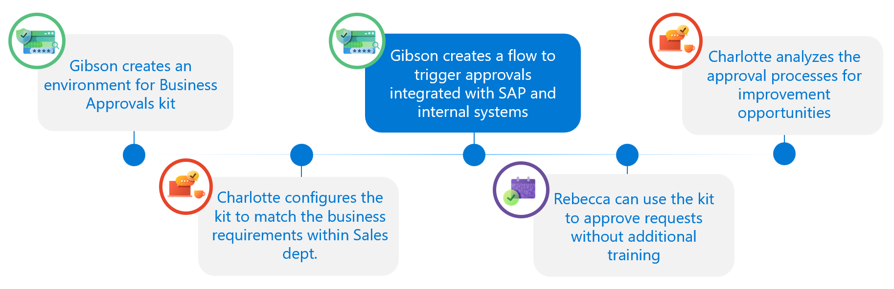
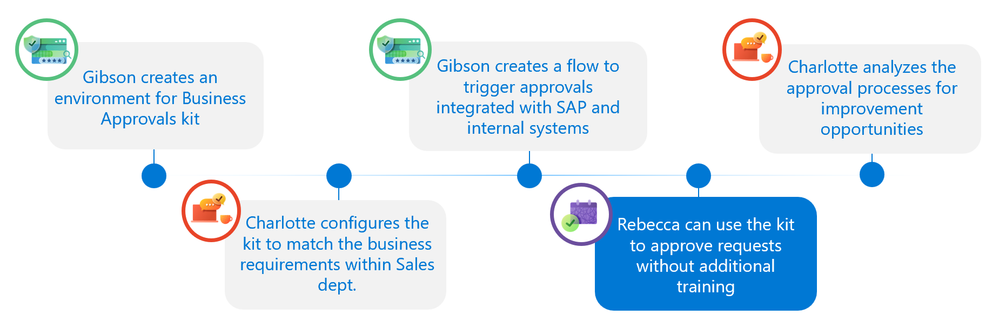

# User Journey

There are three major personas of Approver, Approvals Administrator and Power Platform Administrator as part of user journey using the Approvals kit.

|Persona |Example Role |User Type    |Description|
|--------|-------------|-------------|-----------|
|Approver|Sales Manager|Business User|Receives and approval to Accept for Decline|
|Approvals Administrator|Sales Director|Power User|Configures the kit to match the business requirements. Analyzes the approval processes for improvement opportunities|
|Power Platform Admin|IT Manager|Pro Developer|Environment Admin or System Customizer|

## Example User Journey

An example user journey can be illustrated in the following series of steps

|Role|Actions|
|----|-------|
|Pro Developer/Admin|Gibson creates or nominates an environment to install Business Approvals kit. As a system customizer the Approvals Kit is installed|
|Approvals Administrator|Charlotte configures the kit to match the business requirements within Sales dept|
|Maker|Gibson or another Power Platform maker creates a flow to trigger approvals integrated with SAP and internal systems
|Approver|Rebecca can use the Microsoft Teams to approve requests without extra training|
|Approvals Administrator|Charlotte analyzes the approval processes for improvement opportunities|

## Experience

### Install

Gibson can review the [Setup Guide](./setup.md) to ensure the prerequisites are in place. Using [System administrator](/power-platform/admin/database-security#environments-with-a-dataverse-database) or [System customizer](/power-platform/admin/database-security#environments-with-a-dataverse-database) permissions the Approvals Kit Power Platform solution has been installed into an environment and Approvals Administrators have access to the application.

### Configure Business Approval Process

Charlotte uses the Process Designer to create a new business approval workflow, define approval stages and conditions and approval steps within each stage that matches the business requirements within the Sales department.

The [Configuring preset approvals](./configuring-preset-approvals.md) an example of how to configure key elements inside the Process Designer.

### Approval Triggers

Gibson or another maker or professional developers within organization can easily integrate their existing solutions and IT systems. Triggers can include connections such as SQL server, Azure Functions. The approval process can be started simply by adding one cloud flow or adding it to existing cloud flow actions.

The rest of the approval processes are then automatically handled and managed in the Business Approvals kit.

The [Triggering approvals](./triggering-approvals.md) includes more information on 

#### Integration with business applications

Common approval scenarios require integrations with business applications such as SAP and Dynamics 365, etc. Native connectors are available to integrate with these services

#### Integration with RPA

Using desktop flows allow streamlining of your approval processes with legacy systems, automating your approval experiences in a modern way.

### Make Approvals

Rebecca and other configured approvers are sent messages as adaptive cards in Microsoft Outlook and Microsoft Teams. These approvals include details provided by Charlotte as the business approval designer to help determine if the request should be approved or declined.

Review the [Processing Approval Request](./processing-approval-requests.md) for more information on the approvals process.

Approvers can also use the [Setup out of office and delegation](./setup-out-of-office-and-delegation.md)
