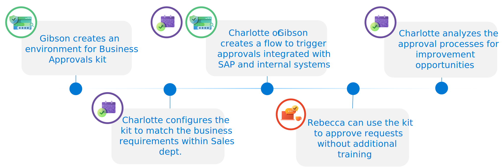

# User Journey

To explore a possible user journey using the Business Approvals Kit the following example will be used to discuss a possible end to end process.

Charlotte is a business user who wants to make approvals that has the following components to consider

| Scenario | Notes |
|----------|-------|
| SAP Invoices | When SAP invoices are submitted based on data inside the invoice a manual approval is required |
| Manager Approvals | Manager approval is required for SAP invoices above the line manager approval limits |
| Approver availability | Depending on where the approver is in the world there are different holiday schedules or working schedules. Waiting for approvals can cause delays until an approver returns |
| Handling holidays | Approvers may be on holiday when a request is submitted. In this case there could be delays in processing the approval request or confusion on who is an alternate approver |
| Power Platform permissions | Charlotte has limited permissions to build and deploy approvals solutions to test and production environments |
| COE Team Support | Charlotte works with Gibson as her technical contact and mentor to help install solutions and as a mentor when creating low code Power Platform solutions |

Given these factors the Business Approvals Kit is selected by Charlotte as it provides support for multi level approvals and handling for different approver available scenarios. Working together with Gibson from the Center of Excellence team Charlotte navigates the process of installing the Business Approvals Kit into an environment. Once the kit is installed, Charlotte is then able to model the approval process. Given SAP Power Automate is a newer area for Charlotte she works with Gibson to build the required triggers to obtain the SAP data and then trigger the Approval Workflow. Using the created workflow and Power Automate Cloud flow together Approvals are generated for Approvers like Rebecca to accept and decline requests.

## User Journey Persona Summary

Reviewing this user journey example there are three major personas of Approver, Approvals Administrator and Power Platform Administrator as part of user journey using the Approvals kit.

|Persona |Example Role |User Type    |Description|
|--------|-------------|-------------|-----------|
|Power Platform Admin|IT Manager|Pro Developer|Creates / Assigns Environments and import Approvals Kit solution as System Administrator or System Customizer|
|Approvals Administrator|Sales Director|Power User|Configures the kit to match the business requirements. Analyzes the approval processes for improvement opportunities|
|Approver|Sales Manager|Business User|Receives an approval to Accept for Decline|

## Example

An example user journey can be illustrated as a summarized diagram in the following series of steps

|Role|Actions|
|----|-------|
|Pro Developer/Admin|Gibson creates or nominates an environment to install Business Approvals kit. As a system customizer the Approvals Kit is installed|
|Approvals Administrator|Charlotte configures the kit to match the business requirements within Sales dept|
|Maker|Gibson or another Power Platform maker creates a flow to trigger approvals integrated with SAP and internal systems
|Approver|Rebecca can use the Microsoft Teams to approve requests without extra training|
|Approvals Administrator|Charlotte analyzes the approval processes for improvement opportunities|

## Experience

### Install

Gibson can review the [Setup Guide](./setup.md) to ensure the prerequisites are in place. Using [System administrator](/power-platform/admin/database-security#environments-with-a-dataverse-database) or [System customizer](/power-platform/admin/database-security#environments-with-a-dataverse-database) permissions the Approvals Kit Power Platform can be installed into an environment and provide access for Approvals Administrators to access the application.

### Configure Business Approval Process

Charlotte uses the Process Designer to create a new business approval workflow, define approval stages and conditions and approval steps within each stage that matches the business requirements within the Sales department.

The [Configuring preset approvals](./configuring-preset-approvals.md) an example of how to configure key elements inside the Process Designer.

### Approval Triggers

Gibson or another maker or professional developers within organization can easily integrate their existing solutions and IT systems. Triggers can include connections such as SQL server, Azure Functions. The approval process can be started simply by adding one cloud flow or adding it to existing cloud flow actions.

The rest of the approval processes are then automatically handled and managed in the Business Approvals kit.

The [Triggering approvals](./triggering-approvals.md) includes more information on how to create a Power Automate cloud flow to begin an approval workflow.

#### Integration with business applications

Common approval scenarios require integrations with business applications such as SAP and Dynamics 365, etc. Native connectors are available to integrate with these services

#### Integration with RPA

Using desktop flows allow streamlining of your approval processes with legacy systems, automating your approval experiences in a modern way.

### Process approval requests

Rebecca and other configured approvers are sent messages as adaptive cards in Microsoft Outlook and Microsoft Teams. These approvals include details provided by Charlotte as the business approval designer to help determine if the request should be approved or declined.

Review the [Processing Approval Request](./processing-approval-requests.md) for more information on the approvals process.

Approvers can also use the [Setup out of office and delegation](./setup-out-of-office-and-delegation.md)
