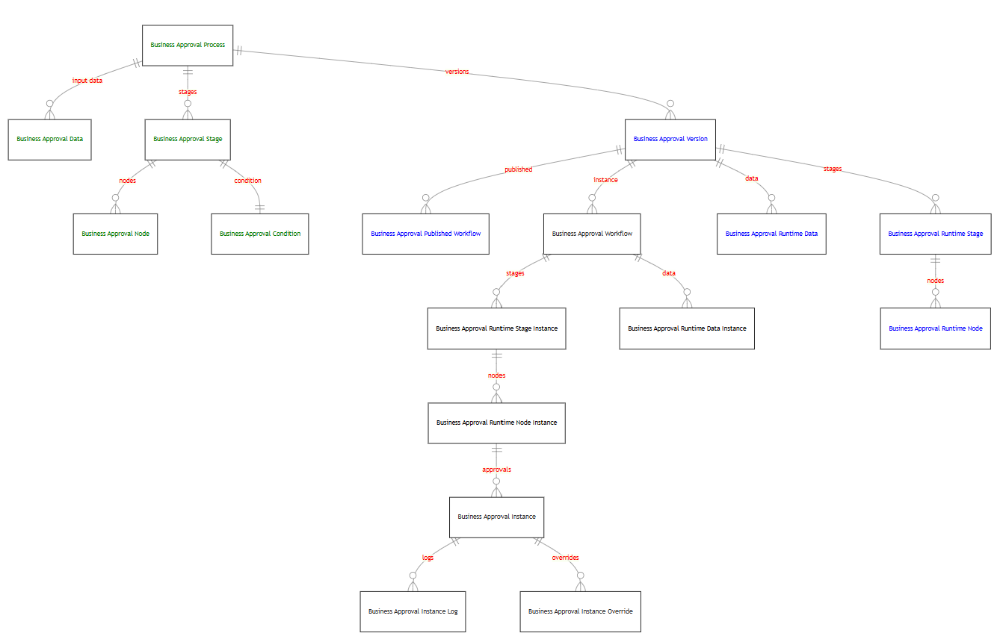

# What’s in the Approvals Kit

## Tables

There are mainly two types of tables used in approval templates.

- Process Definition Tables - Define the approval processes. This is used to lookup and configure approval processes to your business needs.
- Reference Tables - Define approvers, work profile and calendar dates
- Runtime Tables - Store the results/status of the approvals

### Process Definition Tables

The following tables are used for definition

|Name|Description|Example(s)|
|----|----------|-------|
|Business Approvals Process|One record per approval scenarios that the Approvals Kit will manage|Invoice Approval
|Business Approval Data|One record per data item used to define the input fields of what will be used within the approval process|"Request Amount", "Transportation Method" and "Department"
|Business Approval Stage |On record per stage within the approval process|"Manager Approval" or "Line Manager Approval"
|Business Approval Condition|Define optional condition for a stage|None, If, Switch
|Business Approval Node|Defines each step of the approval including the type of approval of that step and the approver|
|Business Approval Version|A saved version of a business approval process|
|Business Approval Published Workflow|Defined a published approval process version|
|Business Approval Published Runtime Data|Defined data for a published approval process version|

### Reference Tables

|Name|Description|Example(s)|
|----|----------|-------|
|Business Approver|Defines for associated to approver(s) for each node within the approval process|
|Business Approval Work Profile|Set up for each approver to define settings|Out of office
|Business Approval Holiday Calendar|Define the company holidays|Non work days and weekend such as Saturdays
|Business Approval Public Holidays|Define the holidays separate from the organization holiday

### Runtime Tables

Each time a new approval requests are made, data is stored into runtime tables based on the configuration of the definition tables.

|Name|Description|Notes|
|----|----------|-------|
|Business Approval Runtime Instance|Used to manage all incoming approval requests and the related tables used for the request|Created approval generated from data in your source triggered system. Created for a version of a published business approval process
|Business Approval Runtime Data|Is used to store the metadata of what is defined in approval data|For example, if you have defined "Request Amount" in Approval Data table, the Instance Data would store the actual request amount for the request
|Business Approval Runtime Node|Stores a copy of Nodes transactional reference to the approval request. It is used to hold each transactional step of the approval including the type of approval of that step and the approver|
|Business Approval Runtime Node Instance|creates a working copy of Nodes transactional reference to the approval request. It is used to hold each transactional step of the approval including the type of approval of that step and the approver|Any changes made during runtime is saved here
|Business Approval Runtime Stage|Stores a transactional reference of Business Approval Stage.|
|Business Approval Runtime Stage Instance|creates a working copy of Business Approval Stage. It is used to hold each transactional stage of the approval|Any changes made during runtime is saved here

### Data Model

Entity Relationship diagram that shows the relationships between key tables

