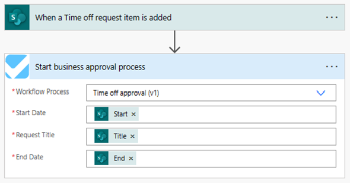
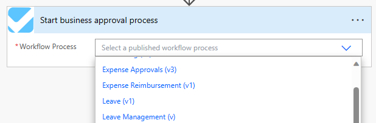
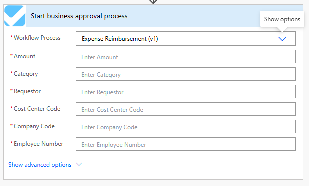

# Overview

The Approvals Kit includes a custom connector to help the process of starting a new business approval process.



The custom connector provided as part of the kit uses [Custom code support](/connectors/custom-connectors/write-code) to query the defined workflow processes and application data (variables) required by the workflow.

## Dynamic Parameters

The custom connector makes use of multiple OpenAPI actions to get published workflows, get data fields and start a business approval process.

### Get Published Workflows

The get published workflow action queries Dataverse to return currently active and published workflows so that the maker can define which approvals workflow should be started.

### Get Approval Data Fields

To get the data fields for a workflow the custom connector makes user of the [Use dynamic schema](/connectors/custom-connectors/openapi-extensions#use-dynamic-schema) so that **x-ms-dynamic-schema** calls the custom code action.

The custom code actions include the C# code to query the data fields so that the maker can provide the required fields.

### Create Workflow Instance

The create workflow instance action saves the business approval workflow data as a JSON serialized string so that the approvals process is started.

## Operations

This connector depends on three operations mentioned below:

* GetPublishedWorkflows
* GetApprovalDataFields
* CreateWorkflowInstance

### GetPublishedWorkflows

This operation helps in listing all the published business approval templates by calling the native API and reading the table **Business Approval Published Workflows**.

`/api/data/v9.2/cat_businessapprovalpublishedworkflows`



### GetApprovalDataFields

This operation helps in fetching the list of dynamic schemas applicable for the selected workflow. Under the hood, it calls a Custom API (`GetDynamicParameters`) which returns the schema definition based on the workflow ID provided/selected.

`/api/data/v9.2/cat_GetDynamicParameters(ProcessID={processID})`

> **_NOTE:_** The return values of the API, which are of type Entity, are further modified using custom code for custom connector to support and align with the Open API schema. Refer `ModifySchema()` method in the Script.csx file for more information.



### CreateWorkflowInstance

This operation helps in creating a record in `businessapprovalworkflowqueues` by making a POST operation to the native API.

`/api/data/v9.2/cat_businessapprovalworkflowqueues`

Here, we use a `CreateWorkflowQueue()` method using custom code for the custom connector to prepare and parse JSON, which holds all the parameter values and the Workflow ID (aka ProcessID). This also performs the final POST call to create the record.

Below are the two values which are updated during the post call:

```json
     "cat_runtimedata": "[{"id":"9a664958-c656-ee11-be6f-0022482a97de","value":"True"},{"id":"7ddc1057-c656-ee11-be6f-0022482a91f4","value":"123"},{"id":"49dc1057-c656-ee11-be6f-0022482a91f4","value":""},{"id":"9b664958-c656-ee11-be6f-0022482a97de","value":"10/11/2023 8:49:51 AM"},{"id":"7cdc1057-c656-ee11-be6f-0022482a91f4","value":"Another title"}]",
     "cat_processid": "57b2ee16-ea51-ee11-be6f-0022482a97de"
```
