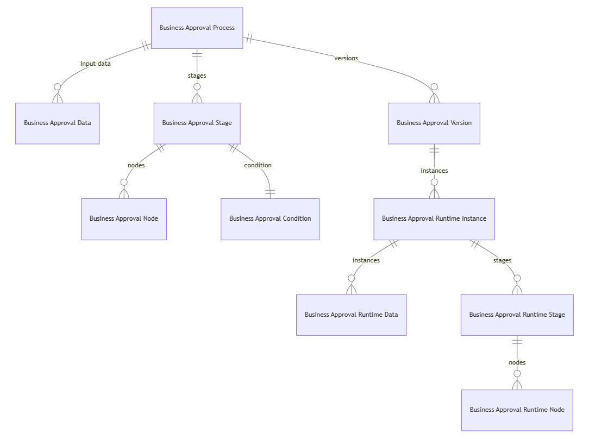

# Approvals kit content overview

The approvals kit is built on the out of the box [approvals connector](/connectors/approvals/) using a Power Platform solution. The solution includes a set of Power Apps, Power Automate and Dataverse components to make creating business approvals processed easier to author and trigger.

The kit enables you to rapidly make changes without the need to update or deploy a Power Platform solution. You can create variations for one Approval without the need of effecting other approval processes. Additionally, using Dataverse gives the ability to use the Auditing features of Dataverse to record Approvals process.

Key components of the kit:

- **Process designer**: A Power App that allows Business users to create and version approval workflows with input application data, stages and conditions. Data used by the Process designer is stored in Dataverse design time tables.
- **Custom connector**: Provides a simple way for makers to use a Power Automate Trigger to start the process of a business approval based on the Power Platform connectors and actions
- **Dataverse**: A set of custom tables that allow workflows to be defined and monitored
- **Power Automate cloud flows**: A set of cloud flows that react to changes in the Dataverse tables to manage the end to end approval process
- **Consuming apps / flows**: Power Platform solutions can create a connection reference to the Approvals Kit connector to begin a business approval workflow.

## Power Automate

This section summarizes the Power Automate components that make up the Approvals Kit

## Cloud Flows

The table represents a list of flows and processes related to a Business Approval Process. Each row describes a specific flow or process and its purpose.

|Name                                             | Description |
|-------------------------------------------------|-------------|
|BACore \| Approval Time-out                      | Handles timeout counter reaching zero by using a Dataverse trigger that retrieves a list of business approvers. It then checks if the delegate is out of office and assigns the backup delegate if necessary. If there's no delegate or backup delegate, it retrieves the default approver. Finally, it creates an override for the delegate if one exists.|
|BACore \| Approver OOF                           | This flow subscribes to a Dataverse trigger on Business Approvers and listens for changes in a specific entity. When a change occurs, it retrieves a list of delegates and their out-of-office status. It then selects an available delegate and creates an override for any running approval instances assigned to the original approver who is out of office. The override sets the delegate as the new approver and provides a reason for the override.|
|BACore \| Cascade Process Status                 | Cascade Process status from Business Approval Process handling Application Data, Stage Status, Node Status and Conditions|
|BACore \| Cascade Publishing Activation          | Update the associated Runtime Data status. When triggered, it retrieves all associated runtime data records for a specific process version and updates their state code to match the trigger's state code |
|BACore \| Child \| Activate Published Workflow   | Copy Business Approval Runtime Data to create Business Approvals Published Workflows and Business Approval Published Runtime Data|
|BACore \| Child \| Evaluate Rule                 | Evaluate a Business Approval Node condition |
|BACore \| Child \| Get Default Settings          | Get the Business Approval settings or default values if none set |
|BACore \| Child \| Get Dynamic Approver          | Lookup user or manager and from the office graph to add approvers to Business Approvals |
|BACore \| Child \| Get Dynamic Data Instance     | Get Approver or Business Approval Data Instance data |
|BACore \| Child \| Log Runs                      | Log data to Business Approval Instance Logs |
|BACore \| Copy Process                           | Triggered with requests from a Power App V2. It then retrieves a list of records from an entity named Business Approvers from Dataverse.
|BACore \| Daily \| Calculate Approval Timeouts   | This flow decrements the timeout counter of business approval instances. The counter is decrements down one day for each business if the timeout mode is set to business days and it's a workday with no holidays. Otherwise, the counter decremented by one actual day.
|BACore \| Publish Process                        | Copy the process definition, stages, conditions and nodes |
|BACore \| Runtime \-\- Initialize Workflow Queue | Subscribes to a Dataverse trigger on Business Approval Workflow Queues and creates a new workflow instance for a business approval process. It retrieves data from a runtime data instance and creates a new record for each item in the data instance. The flow also retrieves the active version of the business approval process and creates a new record for the workflow instance
|BACore \| Runtime \-\- Start Approval            | Subscribes to a Dataverse trigger on Business Approval Instance and creates a new workflow instance for a business approval process. It retrieves data from a runtime data instance and creates a new record for each item in the data instance. The flow also retrieves the active version of the business approval process and creates a new record for the workflow instance
|BACore \| Runtime \-\- Start Node                | Subscribes to a Dataverse trigger on Business Runtime Node Approval Instance that creates approvals, stage, conditions. It includes the ability to move to new stage based on conditions. A node can complete a Business Approval workflow or a defined stage
|BACore \| Runtime \-\- Start Stage               | Subscribes to a Dataverse trigger on Business Approval Runtime Stage Instance. It sets the first node to process in the workflow if nodes defined or complete the stage if no nodes defined.
|BACore \| Runtime \-\- Start Workflow            | Subscribes to a Dataverse trigger on Business Approval Workflow. It initializes the first stage or saves and error isn't stages defined
|BACore \| Runtime \-\- Update Approval           | Subscribes to a Dataverse trigger on Business Approval Instance. When a change occurs, it checks the status of the instance and performs different actions based on the outcome. If the outcome is **Approve**, it cancels other running instances and updates the node instance status. If the outcome is **Reject**, it cancels other running instances and updates the node instance status to **Canceled**.
|BACore \| Runtime \-\- Update Node Instance      | Subscribes to a Dataverse trigger on Business Approval Runtime Node Instance. When a change occurs, it checks the instance status field and performs different actions based on its value. It either creates a new node instance or completes the runtime stage instance status or it cancels the runtime stage instance status.
|BACore \| Runtime \-\- Update Stage Instance     |  Subscribes to a Dataverse trigger on Business Approval Runtime Stage Instance. Depending on the status, it either creates a new stage instance or updates the workflow instance to complete.
|BACore \| Sync Approver OOF                      | Runs a daily task to set or clear the out of office state
|BACore \| Update Active Published Workflow       | Subscribes to a Dataverse trigger on Business Approval Version and calls child flow Activate Published Workflow

## Davaverse
This section summarizes the Dataverse components that make up the Approvals Kit

### Tables

There are mainly two types of tables used in approval templates.

- Process Definition Tables - Define the approval processes. These tables are used to look up and configures approval processes to your business needs
- Version Tables - Define the versions of published processes
- Reference Tables - Define approvers, work profile and calendar dates
- Runtime Tables - Store the results/status of the approvals

#### Process Definition Tables

The following tables are used for definition

|Name|Description|Example(s)|
|----|----------|-------|
|Business Approvals Process|One record per approval scenarios that the Approvals Kit manages|Invoice Approval
|Business Approval Data|One record per data item used to define the input fields of that are used within the approval process|For example Request Amount, Transportation Method and Department
|Business Approval Stage |One record per stage within the approval process|"Manager Approval" or "Line Manager Approval"
|Business Approval Condition|Define optional condition for a stage|None, If, Switch
|Business Approval Node|Defines each step of the approval including the type of approval of that step and the approver|

#### Reference Tables

|Name|Description|Example(s)|
|----|----------|-------|
|Business Approver|Defines for associated to approver(s) for each node within the approval process|
|Business Approval Work Profile|Set up for each approver to define settings|Out of office
|Business Approval Holiday Calendar|Define the company holidays|Non work days and weekend such as Saturdays
|Business Approval Public Holidays|Define the holidays separate from the organization holiday

#### Version Tables

|Name|Description|Example(s)|
|----|----------|-------|
|Business Approval Version|A saved version of a business approval process|
|Business Approval Published Workflow|Defined a published approval process version|
|Business Approval Published Runtime Data|Defined data for a published approval process version|
|Business Approval Published Runtime Stage|Defined stage or stages for a published approval process version|
|Business Approval Published Runtime Node|Defined node or nodes for a published approval process stage|

#### Runtime Tables

For each approval request that is made, data is stored into runtime instance tables. These entries are based on the configuration of the definition version tables.

|Name|Description|Notes|
|----|----------|-------|
|Business Approval Workflow|Used to manage all incoming approval requests and the related tables used for the request|Created approval generated from data in your source triggered system. Created for a version of a published business approval process
|Business Approval Runtime Data Instance|Is used to store the metadata of what is defined in approval data|For example, if you define "Request Amount" in Approval Data table, the Instance Data would store the actual request amount for the request
|Business Approval Runtime Stage Instance|Creates a working copy of Business Approval Stage version. The record is used to hold each transactional stage of the approval|Any changes made during runtime are saved here
|Business Approval Runtime Node Instance|creates a working copy of Nodes transactional reference to the approval request. Used to hold each transactional step of the approval including the type of approval of that step and the approver|Any changes made during runtime are saved here
|Business Approval Instance|Stores a transactional reference of Approval for a specific node instance|
|Business Approval Instance Log|Stores a transactional reference of Approval reference and outcome|
|Business Approval Instance Override|Stores a transactional a new approver that overrides the original approval instance|

#### Data Model

Entity Relationship diagram that shows the relationships between key tables.

Notes:

- Tables in green are the current working version of a Business Approval Process
- Tables in blue are the related tables that save information about a version of a process
- Tables in black are the related tables that save transactional information for a specific approval process

[Open diagram](../media/datamodel.png)
