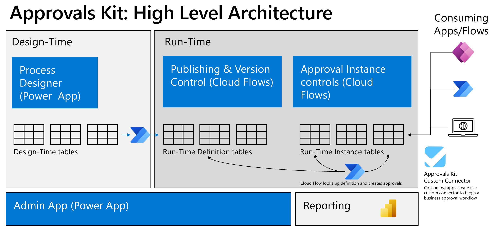

# What’s in Approvals Kit

The Approvals kit is built on the out of the box [Approvals connector](/connectors/approvals/) using a Power Platform solution. The solution includes a set of Power Apps, Power Automate and Dataverse components to make creating business approvals processed easier to author and trigger.

The kit enables you to rapidly make changes without the need to update or deploy a Power Platform solution. You can create variations for one Approval without the need of effecting other approval processes. Additionally, using Dataverse gives the ability to use the Auditing features of Dataverse to record Approvals process.

## Overview

Key components of the kit:

- **Process designer**: A Power App that allows Business users to create and version approval workflows with input application data, stages and conditions. Data used by the Process designer is stored in Dataverse design time tables.
- **Custom connector**: Provides a simple way for makers to use a Power Automate Trigger to start the process of a business approval based on the Power Platform connectors and actions
- **Dataverse**: A set of custom tables that allow workflows to be defined and monitored
- **Power Automate cloud flows**: A set of cloud flows that react to changes in the Dataverse tables to manage the end to end approval process
- **Consuming apps / flows**: Power Platform solutions can create a connection reference to the Approvals Kit connector to begin a business approval workflow.
