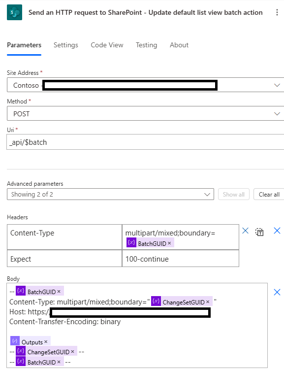
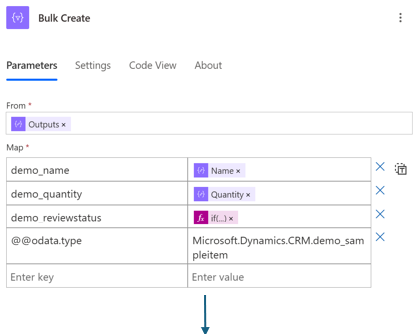
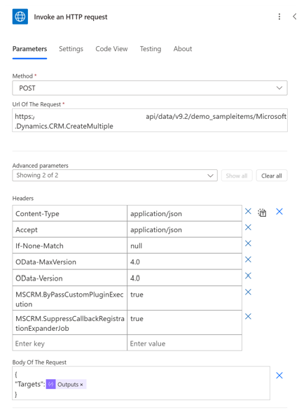

# Avoid Anti-patterns

## Avoid nested for-each loops

Nested “For Each” loops can be resource-intensive operations in cloud flows, significantly impacting performance and resource consumption.

- **Increased Execution Time**: When using nested loops, the total number of iterations can multiply rapidly. For instance, if you have two loops, each with 10 iterations, the total number of iterations becomes 10 x 10 = 100. This exponential increase can significantly extend the execution time of your flow, especially if each iteration processes large datasets or performs complex operations.
- **Limits and Quotas**: Power Automate enforces limits and quotas on various aspects of flow execution, such as the maximum number of iterations allowed within a loop and the overall execution time. Nested loops can quickly approach these limits, leading to flow failures or throttling, particularly when dealing with large datasets or frequent executions.
Additional Details:
- **Performance Impact**: Each iteration within a nested loop consumes processing power and memory. As the number of iterations grows, the demand on system resources increases, potentially slowing down the entire flow.

Learn more: [Concurrency looping and debatching limits](../../limits-and-config.md)

Depending on your scenarios, you can avoid nested loops by using the following alternatives:

### Processing Related Records from a Parent Table

**Scenario:** You have an outer loop that uses the “List Rows” action in Dataverse to retrieve a list of product categories from the *ProductCategory* table where the *IsPromotion* column is true. An inner loop then processes related records from the *Product* table for each category retrieved by the outer loop.

**Alternative Approach:** Use OData Query Expansion to streamline this process. This method allows you to work with a single “Apply to Each” loop, reducing the total number of requests to Dataverse to just one *RetrieveMultiple* call.

**Steps to Implement OData Query Expansion:**
- Expand Query Parameter: Use the Expand Query parameter to specify the lookup column name that links the ProductCategory table to the Product table. This retrieves related records in a single query. For example set the Expand Query paramenter to  ```Products($select=ProductName,Price) ```
- Select Specific Columns: Use the $select parameter to limit the columns returned from the related table. This reduces the amount of data processed and improves performance.
- Filter Rows: Apply conditions directly on the lookup table’s columns using the - Filter Rows parameter. This ensures that only relevant records are retrieved and processed. For example, set the Filter parameter to  ```IsPromotion eq true```

By using OData Query Expansion, you can efficiently retrieve and process related records with a single loop, minimizing resource consumption and improving the performance of your flow.

## Avoid infinite runs

With Power Automate, it's easy to encounter a situation where flows start to trigger infinitely, especially when the flow updates the same table that triggers it. This can lead to an infinite loop of executions.

When saving a flow that might result in an infinite trigger loop, Power Automate provides a warning to the maker.

:::image type="content" source="media/infinite-loop.png" alt-text="Screenshot of the warning a maker receives when trying to save a flow that can result in an infinite loop":::

Prevent infinite runs by:

- **Use Trigger Conditions**: Trigger conditions ensure that the flow only runs when specific criteria are met, preventing unnecessary executions. Implement trigger conditions by adding a conditions to the trigger to check for certain values or states before the flow proceeds. For example, you can set a condition to check if a particular status is met. For example, if your flow updates a status field, you can set a trigger condition to only run the flow if the status is not already set to the desired value.
- **Terminate the flow**: An alternative approach is to stop the flow from continuing if it detects a condition that would cause an infinite loop. Use the “Terminate” action within your flow to end the flow when a specific condition is met. This can be used as a safeguard to prevent further actions if the flow is about to enter an infinite loop. For example, if the flow detects that it has already processed a record, it can terminate itself to avoid reprocessing.

By incorporating these strategies, you can effectively manage and prevent infinite trigger loops in your Power Automate flows, ensuring they run efficiently and as intended.

## Avoid performing large amount of data transformation operations

When working with large-scale data transformations, consider whether the task should be handled as an Extract-Transform-Load (ETL) process. For example, if you are using a Power Automate cloud flow to read data from a large Excel spreadsheet, perform data formatting or validations, and then write the data into Dataverse, it may be more appropriate to use [Power Platform Dataflows](/power-query/dataflows/create-use) or another ETL tool instead of cloud flows.

Dataflows are designed to handle large volumes of data efficiently, providing better performance for ETL tasks compared to cloud flows. ETL tools offer specialized features for data transformation, validation, and loading, which can simplify complex data processing tasks.

If you need to manage the data load using orchestration logic that you can implement in cloud flows, consider combining cloud flows with Dataflows. Here’s how you can do it:

1. **Invoke Dataflow Refresh**:
   - **Action**: Use the Dataflow connector in Power Automate to trigger a refresh action. This initiates the ETL process defined in your Dataflow.
   - **Example**: Set up a Cloud Flow that triggers the Dataflow refresh based on a schedule, for example daily, or an event, for example when a new file is uploaded to a SharePoint folder.

2. **Post-ETL Actions**:
   - **Trigger**: Use the “When a dataflow refresh completes” trigger in Power Automate to perform actions after the ETL process is finished.
   - **Example**: After the Dataflow completes, you can use a cloud flow to send notifications, update records, or perform additional data processing.

:::image type="content" source="media/use-dataflow.png" alt-text="Screenshot of using dataflow actions in a cloud flow" border="true":::

By leveraging the strengths of both Dataflows and cloud flows, you can create a robust and efficient data processing solution that handles large datasets effectively while maintaining the flexibility of orchestration logic.

# Avoid using a for each loop to update a large number of records

Often, users need to create or update thousands of records in a data source when a flow is triggered in Power Automate. Many users end up using a "For Each" loop to process each record sequentially, which can cause latency and delays.

To improve the performance, try these two approaches:

1. **Batch Operations**:
   - **Description**: Create or update records in batches. Many connectors and services provide API endpoints that support batch requests. This allows you to group multiple operations into a single HTTP request.
   - **Implementation**: Use the batch operation feature to send multiple create or update requests in one go. These operations are executed sequentially in the order specified in the batch request. The order of the responses matches the order of the requests in the batch operation.
   - **Benefits**: Reduces the number of individual requests sent to the data source, thereby minimizing latency and improving performance.

2. **Parallelism in "For Each" Loop**:
   - **Description**: Enable parallel processing within the "For Each" loop to handle multiple records simultaneously.
   - **Implementation**: Configure the "For Each" loop to process up to 50 records in parallel. This is particularly useful for services that do not support batch operations.
   - **Benefits**: Significantly reduces the overall processing time by handling multiple records at the same time.

By using these approaches, you can optimize your Power Automate flows to handle large volumes of data more efficiently, reducing latency and improving overall performance.

For information on making batch requests, refer to the following REST API documentation:

- [SharePoint REST API](/sharepoint/dev/sp-add-ins/make-batch-requests-with-the-rest-apis)
- [Dataverse Web API](/power-apps/developer/data-platform/webapi/execute-batch-operations-using-web-api)



When working with Dataverse, you can utilize the [Bulk Operations Web APIs](/power-apps/developer/data-platform/bulk-operations). These APIs offer a distinct advantage over Batch Operations:

- **Batch Operations**: Although batch operations are posted in a single request, they are executed as multiple individual operations. Each operation within the batch is processed separately.
- **Bulk Operations**: In contrast, bulk operations are posted and executed as a single operation. This means that the entire bulk request is counted as one operation, which can significantly reduce the number of actions and improve efficiency.

Invoke Bulk Operations by:

- **Using HTTP with Entra ID**: You can invoke the Bulk Operations Web API using HTTP requests authenticated with Entra ID.
- **Using HTTP Connector with Service Principals**: Alternatively, you can use the HTTP connector in Power Automate when working with Service Principals to invoke these APIs.

Pepare the records in JSON format using Select action:


Use HTTP with Entra ID to post the request using CreateMultiple Web API:


If we have 100 records in the JSON output, this only incurs one single action instead of 100 Create Row actions in Dataverse.

By using Dataverse Bulk Operations, you can reduce the number of actions required, streamline your processes, and enhance performance.