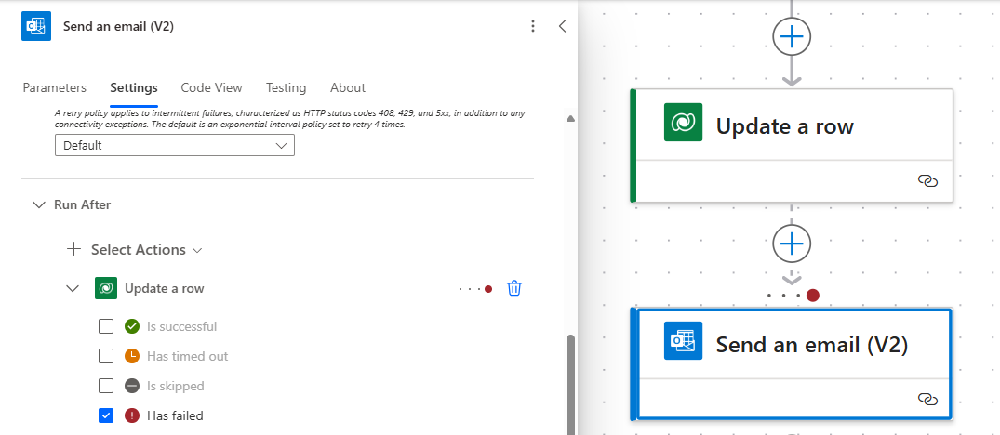
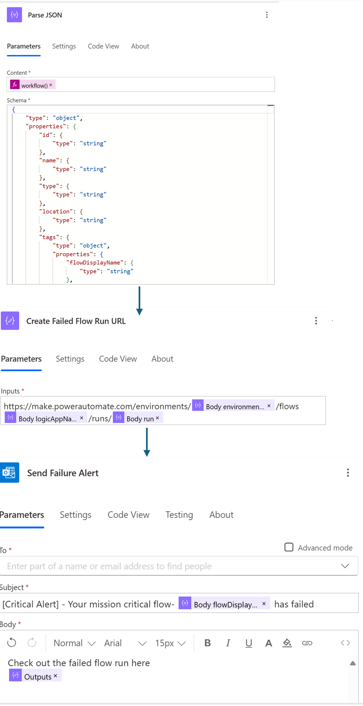
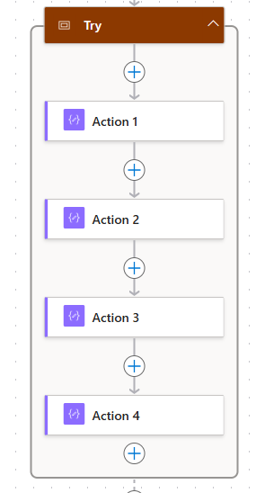
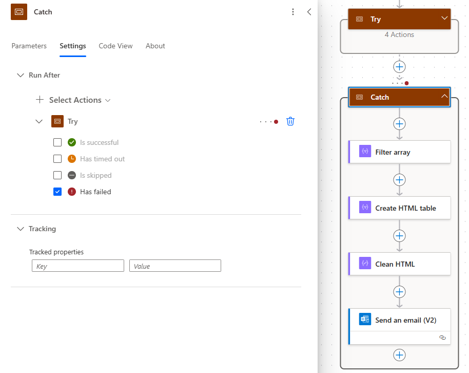
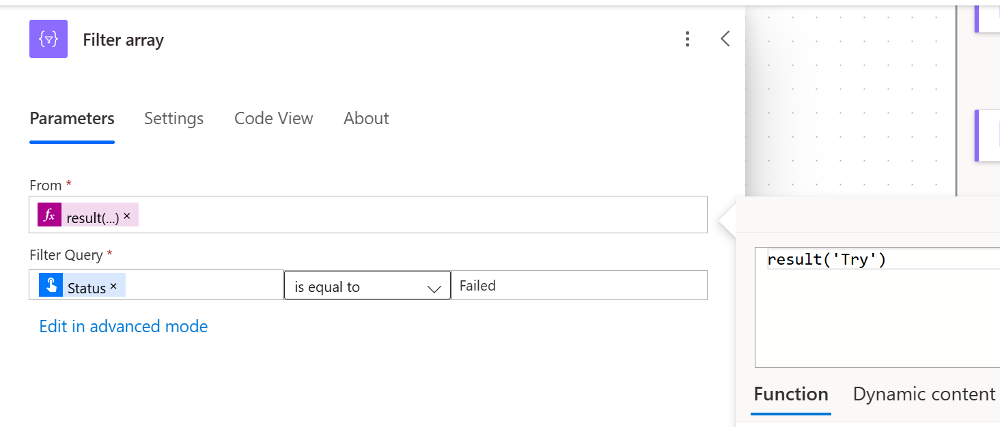
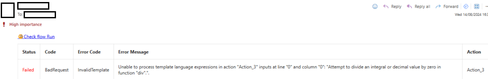
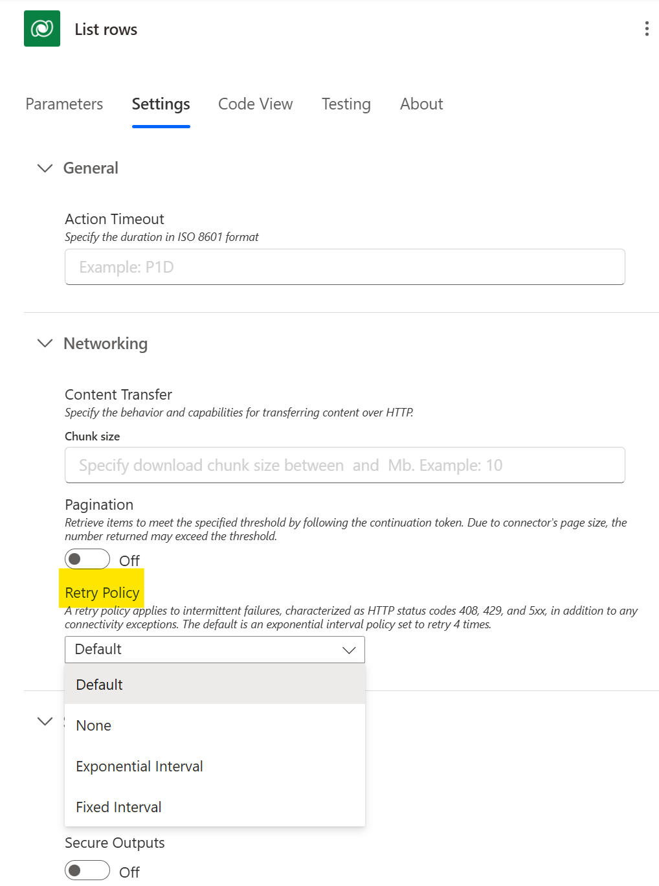

# Employ robust error handling

Error handling is important for ensuring the reliability and robustness of your automated workflows in Power Automate. Implementing effective error handling strategies can help you manage and resolve issues efficiently. 

Here are some key strategies:

## Configure Run After settings

Use the "Configure run after" settings to specify what should happen if an action fails, times out, is skipped, or is successful. For each action, you can set conditions to determine the next steps based on the outcome of the previous action. This allows you to create alternative paths for error handling. For example, if an action fails, you can configure the next action to send a notification or log the error details.

In this example, a user gets a email anytime the flow fails at the step “Update a row”:



You can also use the **workflow() function** in Power Automate to get detailed information about the flow run, including the current environment guid, Flow name, Flow guid and run ID.  
  
Workflow() json schema

```json
{
    "type": "object",
    "properties": {
        "id": {
            "type": "string"
        },
        "name": {
            "type": "string"
        },
        "type": {
            "type": "string"
        },
        "location": {
            "type": "string"
        },
        "tags": {
            "type": "object",
            "properties": {
                "flowDisplayName": {
                    "type": "string"
                },
                "environmentName": {
                    "type": "string"
                },
                "logicAppName": {
                    "type": "string"
                },
                "environmentFlowSuspensionReason": {
                    "type": "string"
                },
                "state": {
                    "type": "string"
                },
                "createdTime": {
                    "type": "string"
                },
                "lastModifiedTime": {
                    "type": "string"
                },
                "createdBy": {
                    "type": "string"
                },
                "triggerType": {
                    "type": "string"
                }
            }
        },
        "run": {
            "type": "object",
            "properties": {
                "id": {
                    "type": "string"
                },
                "name": {
                    "type": "string"
                },
                "type": {
                    "type": "string"
                }
            }
        }
    } }
```

<!-- TODO replace with parse json action and better description -->



You can then parse that information and build the flow run URL which you can include as a hyperlink in the notification email.

> [!CAUTION]
> Use this option judiciously, as it can result in excessive custom logging and an increased number of actions, which may negatively impact overall performance. Overuse can lead to an anti-pattern, where frequent alerts and actions degrade the efficiency and effectiveness of your workflow.

## Scope actions for error handling**:

Group related actions into scopes and use scopes to handle errors collectively. You can implement a try-catch pattern using scopes to manage errors. Create a "Try" scope for your main actions and a "Catch" scope for error handling. If an error occurs in the main scope, the error handling scope can be triggered to manage the error. Configure the "Catch" scope to run if the "Try" scope fails.
**Example**: If a data retrieval action fails, the error handling scope can send an alert and log the error for further investigation.

Results of Try will give you all the details of the action within the try block. In the example, we have 4 Compose Actions within the try block configured as follows

Action1 – test (string)

Action 2 – concat('af','g')

Action 3 – div(1,0)

Action 4 – test (string)





Use Filter array to filter the Result function to get the failed errors. Users can further clean up the records and create an HTML table to send email alerts as shown below





## Use retry policy

The retry policy in flow settings is designed to handle transient failures, which are temporary issues that can often be resolved by retrying the action. 

>[!TIP]
> Choose exponential retry policies, as they can extend the retry period over time, increasing the chances of successfully completing the action.

Transient Failures are temporary errors that may occur due to network issues, service unavailability, or other intermittent problems. The retry policy helps manage these failures by attempting the action again after a specified interval.

An Exponential Retry Policy starts with a short retry interval and gradually increases the interval between retries. This approach helps to avoid overwhelming the system with frequent retries and allows more time for the issue to resolve.

**Example**: 

- The first retry might occur after 1 minute.
- The second retry after 2 minutes.
- The third retry after 4 minutes, and so on.

By using an exponential retry policy, the flow can continue to attempt the action over a longer period, improving the likelihood of success without causing excessive load on the system.

Configure the retry policy by:

1. Open your flow in Power Automate and go to the settings of the action you want to configure.
2. Under the retry policy settings, select the exponential option and configure the initial interval and maximum retry count according to your needs.
3. Regularly monitor the performance of your flow and adjust the retry settings as necessary to optimize for your specific use case.

By implementing an exponential retry policy, you can effectively manage transient failures and enhance the reliability of your automated workflows.

<!-- TODO replace -->


## Terminate Action

Use the "Terminate" action to stop the flow and set a specific status (Succeeded, Failed, or Cancelled). Add the "Terminate" action at points where you need to explicitly stop the flow due to an error. For example, if a critical error occurs, you can use the "Terminate" action to stop the flow and set the status to "Failed," ensuring that no further actions are executed.

## Logging and notifications

Implement logging and notifications to monitor and track errors. Use actions to log error details to a database, SharePoint list, or other storage solutions. Set up notifications to alert relevant stakeholders when an error occurs. For example, if an error is detected, log the error details and send an email notification to the support team for immediate attention.

Instead of using custom logging, you can also set up [Application Insights](/power-platform/admin/app-insights-cloud-flow) with Power Automate and [create alerts for cloud flow run failures](/power-platform/admin/app-insights-cloud-flow#create-alerts-for-cloud-flow-run-failures)

## Use flow remediation email

Power Automate Flow service generates email alerts to all flow owners for certain common or critical failures like broken connections or flow turning off due to throttling. These email contain the error information in detail and troubleshooting tips on how to rectify the issue.
