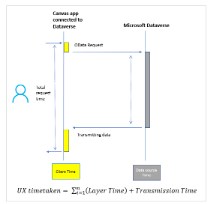
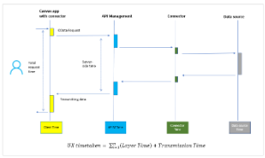

## Understand when to integrate cloud flows with Power Apps

There are a range of capabilities available through Power Platform that enable makers to create business logic for their Power Apps.  Below are the primary methods along with guidance to determine which one to use: 

## Power Apps with Power Fx

Power Fx is the low code functional programming language shared by Excel and Power Platform.  Combined with Power Platform connectors, makers can access data as well as create custom app logic. Power Fx supports the following characteristics:  

**Live** - Canvas Power Apps "recalc" just as Excel spreadsheets do. As the end user interacts with the app, Power Fx is in the background making data requests and keeping the state of the app up to date with Dataverse.   

**Delegation** - Power Fx automatically "delegates" what it can to the server.  Functions such as Filter(), Lookup(), and Search() can enable an app to access to data using server side filtering, so that only sufficient data is brought into the app to support the experience and functional logic. Where delegation is not possible, functions execute in the local JavaScript context (i.e. in the local browser). 

**Optimized for Dataverse** - Dataverse is the native data storage service for Power Apps and as such there are fewer layers involved in using Power Fx in conjunction with Dataverse (which means low latency access).  In addition, Power Fx supports the various many to one and one to many relationships available in Dataverse. 

**Offline** - Dataverse data can be taken offline with a mobile player for use in the field. Changes on both sides are synced when reconnected. Business logic defined in the app is run even when offline. 

## Power Automate

A low code workflow service built on top of the Power Platform connector ecosystem. Power Automate adds the following capabilities when building Power Apps: 

**Asynchronous** - A Power Automate cloud flow is inherently asynchronous.  This means that when a flow is initiated, it is leveraging a queuing system to manage the various subtasks.  The asynchronous nature of Power Automate means that it is well suited for longer running complex sequences of logic. 

**Detailed logging** - All flows create a record of what happened when they executed, called the "Run History". This provides traceability and ensures there's an auditing record for what happened and why. 

**Multi-connector** - Although it is possible to create multi-connector Power Apps logic, due to the live nature of Power Apps, as you increase the number of connectors performance will degrade. These complex multi-connector scenarios are a great place to leverage Power Automate which can offload these cases from live execution in the app.  

## Dataverse Plugins with Power Fx

Written in C#, [Dataverse plugin](/power-apps/developer/data-platform/plug-ins)s are a common way that professional developers have expressed business logic for years. As a new low code option, [Power Fx can now be used to create plugins](/power-apps/maker/data-platform/low-code-plug-ins-powerfx), in preview now and will GA within a few months. It brings delegation and Dataverse optimizations as well as these characteristics: 

**In the transaction** - Power Fx plugins run in the Dataverse transaction that is updating the database. Even if there is a problem updating a secondary table, all the changes are rolled back, always keeping the database in a consistent state.  

**Error reporting** - Reporting an error all the way back to the end user in an app or flow is as simple as calling the Error() function. The end user will see the error as a result of their action, they can take immediate corrective action, and retry the operation. 

**Common choke point** - There is no getting around the plugin. Common update business logic can be written and maintained in one place for all apps, flows, and other Power Platform end points. 

**Efficiency** - Plugins can make multiple connector and database calls in succession without the storage and networking overhead of each step if they were in a Power Automate flow. 

**Increased security -** Dataverse virtual network support allows you to protect your outbound connections to resources within your private network. In this way, you can securely manage your egress traffic from the Power Platform according to your network policy.  In addition, data can be insulated and protected from clients by wrapping access in a server-side plugin. 

## When you should use Power Fx Vs Power Automate in Power Apps

**Power Fx in the app should be the default mechanism used for building Power App business logic** - Like any tool however there are sweet spots and break points where it makes sense to leverage other tools in the toolbox.   

### Low Latency Use Cases

If **low latency** in a Power App is the focus, the live nature of a Power Fx function means that you have the **best ability to deliver low latency business logic via Power Fx**.  Achieving low latency depends significantly on the complexity of the task and size of the dataset involved.  It is therefore important to highlight, that although you can achieve low latency through Power Fx, what you're trying to do and how it's been designed will have a significant bearing on the performance realized.  Additional guidance available [here](https://powerapps.microsoft.com/en-us/blog/performance-considerations-with-powerapps/). 

For common data access scenarios, Dataverse combined with Power Fx is going to be the fastest approach. 

### Complex sequences & multi-connector **

For **complex sequences** of actions, across multiple connectors, **then Power Automate is an asynchronous mechanism to offload processing from the Power App**. In addition, the asynchronous nature of Power Automate allows the Power App to initiate a workflow and enable the experience to move on without waiting for a response.  

### Centralized business logic

**If the business logic is gating changes to the database**, for example validation before adding a record, then **Dataverse plugins with Power Fx** **is the best answer**. No other solution is a part of the Dataverse transaction and can return an error all the way back to the end user who initiated the original change, allowing them to make corrections, and retry, while keeping the database consistent throughout. Plugins provide a unified choke point to ensure the same business logic is enforced for all apps (Canvas and Model-driven), flows, and other end points. 

Similar to Power Automate, Dataverse plugins with Power Fx also provide a central location for defining custom actions that don't necessarily change the database. This facilitates sharing of Power Fx based business logic across all Power Platform end points. 