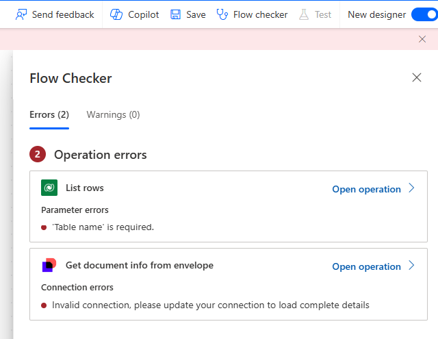

# Manage cloud flow behaviour with Flow Checker

The **Flow Checker** in Power Automate is a built-in tool designed to help users ensure the quality and correctness of their cloud flows. By providing real-time analysis and feedback on potential issues, it enhances the reliability and functionality of flows. This tool is invaluable for both new and experienced users, as it streamlines the development process with actionable insights.

## Key Benefits of Flow Checker

1. **Error Detection**: The Flow Checker identifies errors that prevent the flow from running, such as missing or incorrect inputs, misconfigured actions, and connectivity issues. This helps users quickly pinpoint and resolve critical problems.

2. **Warnings and Suggestions**: It provides warnings and best practice suggestions to optimize the flow's performance and maintainability. These recommendations might include improving logic, updating deprecated actions, or enhancing overall flow efficiency.

3. **Real-Time Feedback**: As you build or modify your flow, the Flow Checker offers real-time feedback. This immediate insight allows you to address issues as they arise, ensuring a smoother development process.

4. **Detailed Explanations**: Each error or warning comes with a detailed explanation and guidance on how to resolve the issue. This makes it easier for users to understand the problem and implement the necessary fixes.

## How to Use Flow Checker

- **Accessing Flow Checker**: You can access the Flow Checker from the flow editor in Power Automate. 
- **Reviewing Issues**: When you run the Flow Checker, it will list any detected errors and warnings. Each item will include a description and suggested actions.
- **Implementing Fixes**: Follow the detailed guidance provided for each issue to make the necessary corrections. This might involve adjusting inputs, reconfiguring actions, or updating connections.

By leveraging the Flow Checker, you can ensure your cloud flows are robust, efficient, and error-free, ultimately leading to more reliable and maintainable automation solutions.

Learn more: [About Flow Checker](/power-automate/error-checker).