# Monitoring and alerting

Regularly monitoring Power Automate flows is vital for businesses to ensure the smooth and efficient operation of their workflows. This practice enables organizations to promptly identify and resolve any emerging issues or bottlenecks that could hinder the automation process. Through proactive monitoring, businesses can implement necessary measures to enhance overall performance. Moreover, monitoring aids in the detection and mitigation of potential security vulnerabilities or compliance concerns, safeguarding the secure management of sensitive data.

Furthermore, monitoring offers valuable insights into usage patterns and performance metrics, empowering businesses to optimize their workflows for heightened productivity and cost-effectiveness.

## Automation Center

The Automation Center in Power Automate is a central hub for managing and overseeing all your automation efforts. It provides a comprehensive interface to create, monitor, and optimize your automated workflows across the entire organization. This feature helps streamline operations, enhance productivity, and ensure that all automation tasks are running efficiently.

Learn more: [Automation center overview](/power-automate/automation-center-overview).

## Use Process Mining (Preview)

The process mining capability enables you to obtain useful insights and enhance your cloud flows. Users can see how your flow performs, find out where it slows down or can be improved, and track any changes in performance. By using the process mining capability to examine your flow's run history with process mining methods, you can produce these insights from the flow details page directly.

Learn more: [Improve cloud flows with process insights](/power-automate/process-mining-cloud-flow-process-insights)

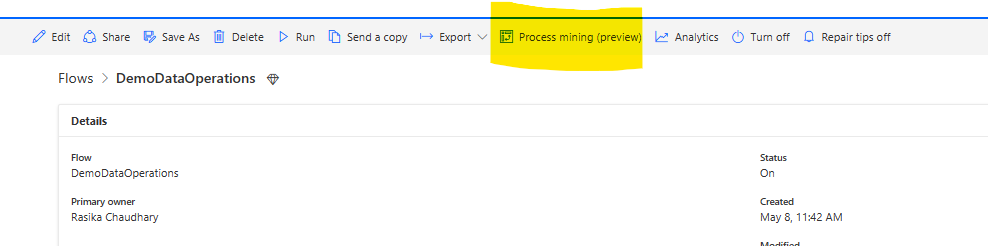

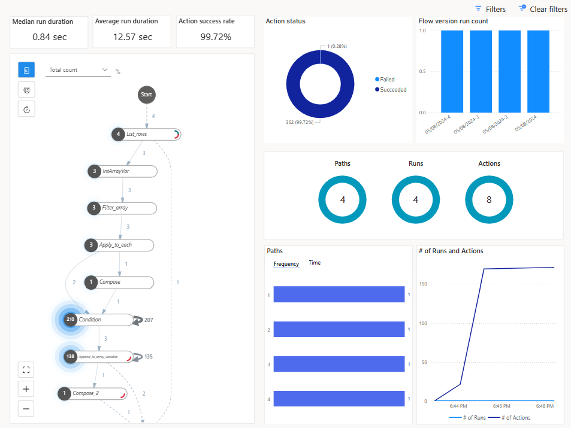

The Runs and actions section also gives information about the total action count that a flow run took. This is important to understand if your flow has a possibility of running into daily action bursts throttling limits. 

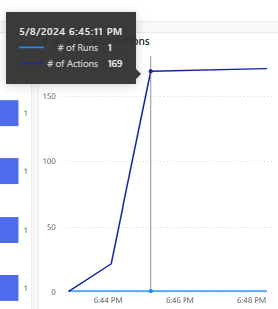

## Power Automate Analytics

Power Automate Analytics refers to the suite of tools and features available for analyzing and gaining insights into the performance, usage, and effectiveness of your Power Automate workflows.

Power Automate analytics reports are available at the tenant level as well as individual cloud flows level.

## Cloud Flow Analytics

Power Automate offers built-in analytics capabilities that allow you to monitor flow runs, track execution history, and analyze flow performance. Leverage analytics dashboards and reports to gain insights into flow execution patterns and identify bottlenecks. 

Microsoft Cloud Flow Analytics is a service offered by Microsoft that provides insights and analytics into the usage and performance of Microsoft Power Automate. You can access Cloud Flow Analytics using the menu button "Analytics" from each Microsoft Flow detail page. 

Following details will be shown under this: 

Flow usage (including number of actions requests from the cloud flow runs)

Detailed flow error analysis (type of error, count and last occurrence)

History of 30 days

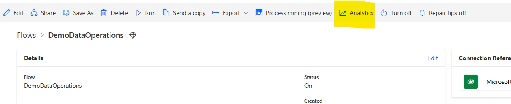

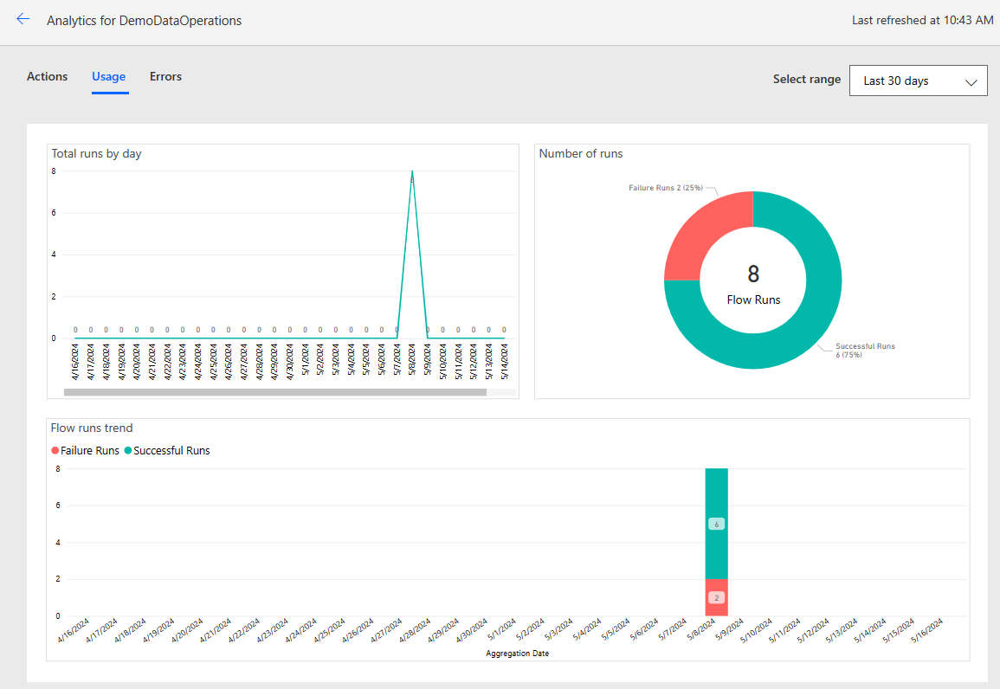

## Power Automate Admin Analytics

Environment admins can access analytics for Power Automate in the Microsoft [Power Platform admin center](https://admin.powerplatform.microsoft.com/analytics/flow). The reports provide insights into runs, usage, errors, types of flows created, shared flows, and details on connectors associated with all the different flow types like automated flows, button flows, scheduled flows, approval flows, business process flows. 

Covers following details :

Reports of flow usage based on environments, environment type and region

Flow inventory, including flow state

Maker activity (but only the user ID)

Number of failed runs (no information which flow failed)

28 days history

For more details on Admin analytics refer [here](/power-platform/admin/analytics-flow)

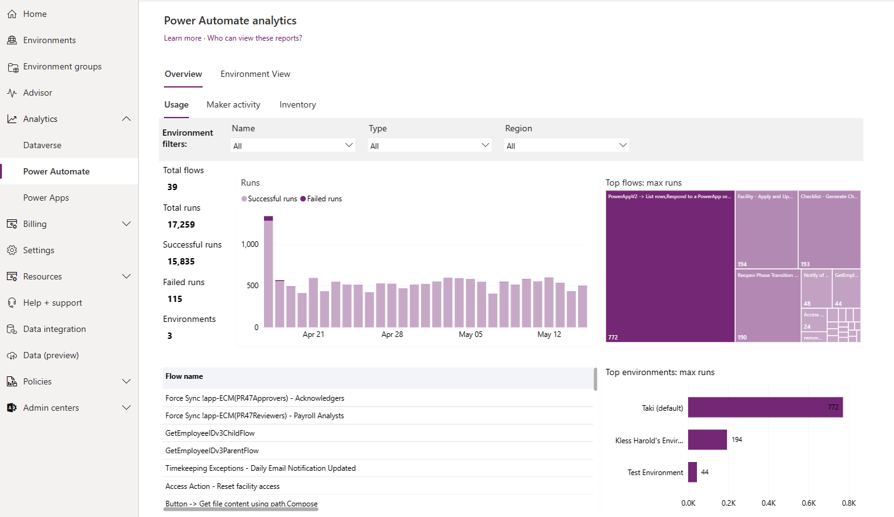

## Power Automate Management connectors

Power Automate service also provides ways to automate some of the management activities for Flows via 2 connectors 

Power Automate Management connector

Power Automate for Admins

This connector provides actions for managing flows, such as creating, updating, and deleting flows, as well as retrieving flow metadata and run history. It allows you to programmatically interact with flows within your Power Automate environment. Admins can run some of these actions which are suffixed with "As Admin". More details on this connector can be found [here](/connectors/flowmanagement/)

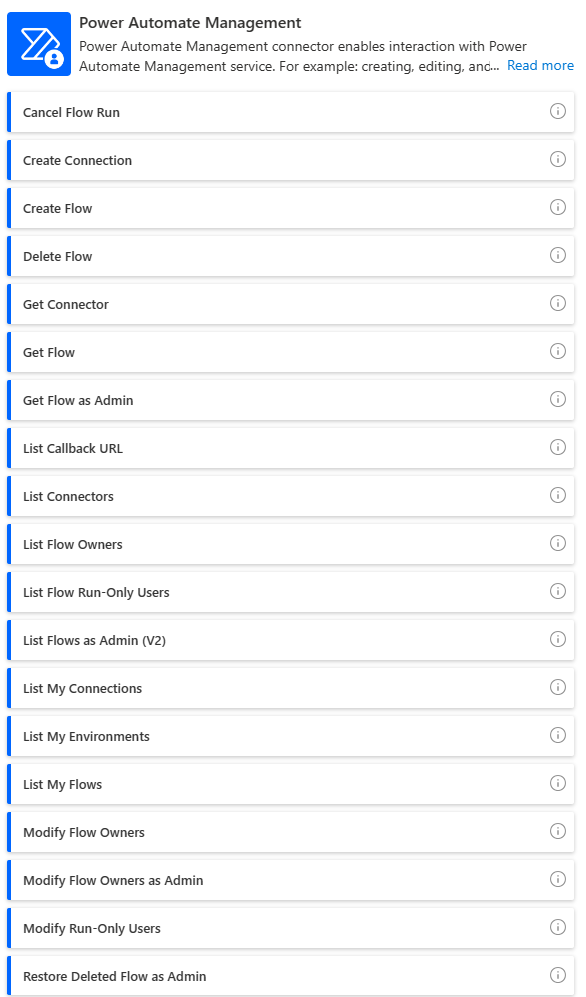

Power Automate for admins connector on the other hand are used mostly by administrators giving them the ability to enable/disable flows, change flow owners etc. More details on this connector could be found [here](/connectors/microsoftflowforadmins/) 

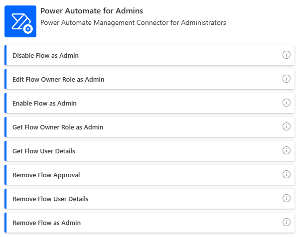

## Power Automate App Insights

Power Automate App Insights has been one of the most recent additions to telemetry data that can be accessible to users. Customers can now leverage Azure App Insights to diagnose and monitor their workflows running on Power Automate. In addition to this, users can use this telemetry to build dashboards, out-of-the-box and custom alerts, performance diagnostics and custom analysis via log analytics. 

For Power Automate the flow runs, triggers and action-;eve; data can be lined with app insights at an environment level. However, data from multiple environments can log into same app insights resource. 

Cloud flow runs telemetry get stored in **requests** table and trigger and action level data gets stored in the **dependencies** table.

For more details, refer to this [article](/power-platform/admin/app-insights-cloud-flow) 

To transfer data to app insights, select Data Export under Analytics and configure as follows:

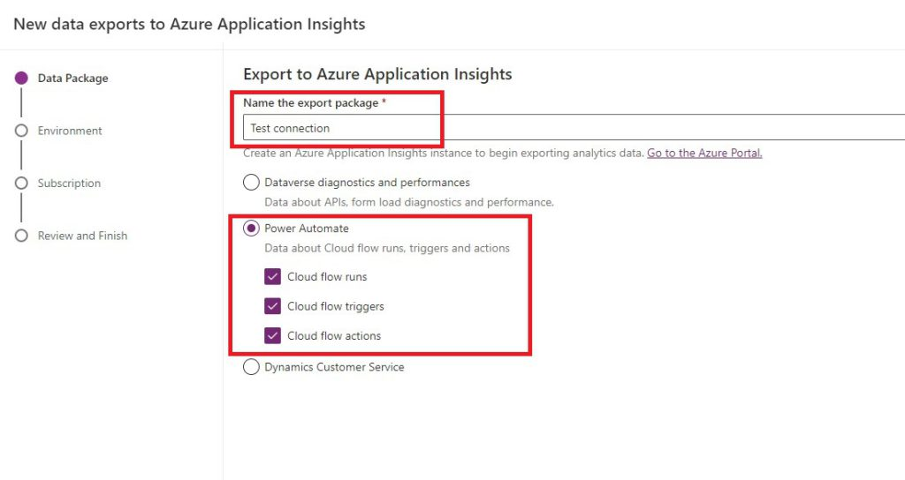

To monitor cloud flow executions, review the Metrics section and apply the following: 

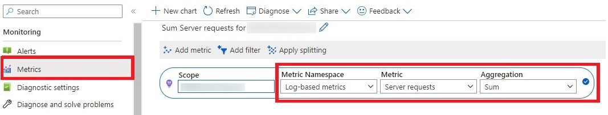

You can further add environment and flow level filters

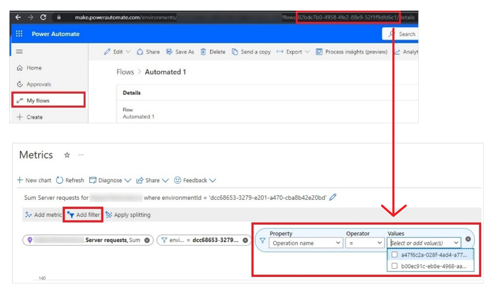

For monitoring trigger and actions, under Metrics, filter for environment and then add Signal category for Property filter and select Cloud flow triggers and Cloud flow actions

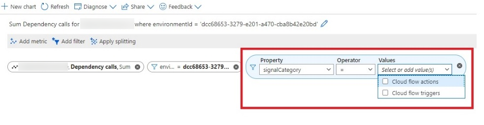

##' Flow Run history in Dataverse

This preview feature (as of June 2024) will allow the flow run details to be stored in Dataverse within the FlowRun table. This will empower Automation center to generate meaningful data about cloud flows execution. 

By default, the execution data would be stored for 28 days period but the default time range can be changed from the admin center. 

Here is some additional information for this feature: 

[Known limitations for retaining flow run history in dataverse](/power-automate/dataverse/cloud-flow-run-metadata)

[FAQ](/power-automate/dataverse/cloud-flow-run-metadata)
