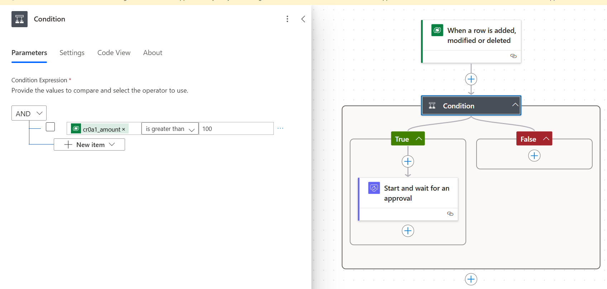
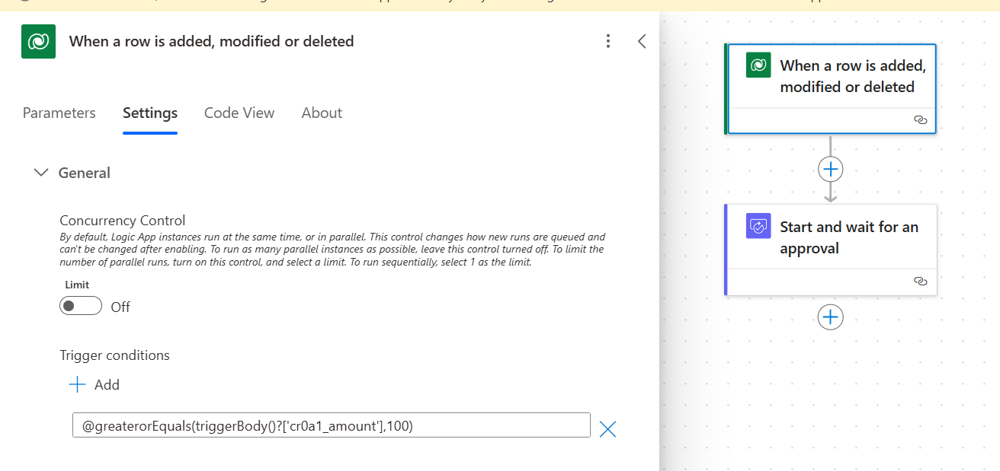

# Optimize Power Automate triggers

## Set trigger conditions

A common issue for many users who work with Power Automate is that their flow runs whenever a new row or an existing row is modified in the data source. However, we only need the flow to execute when a specific condition is satisfied. Setting triggers correctly can enable your flow to run only when necessary.

Consider a scenario where any user who submits an expense more than $5,000 need to get approved by their management. If the trigger conditions are not specified, the flow will run for every expense that is submitted and flow author will have to specify additional conditions to filter the expense greater than $5,000. With trigger conditions, the flow only triggers when the expense is more than $5,000.

In this example, the flow triggers when a row is added, modified or deleted and a condition checks if the amount is greater than 100 and starts the approval if the condition is met. This flow is started every time data in the table is added, modified or deleted.

In this example, a trigger condition on the "When a row is added, modified or deleted" action checks if the amount is greater than 100 and then starts the approval. This flow only starts when the value in the amount field is greater than 100. 

> [!NOTE]
> The OData filter property in Power Automate is a powerful feature that allows you to define precise conditions for when a flow should be triggered based on changes in Dataverse data - you can specificy a condition and the names of the columns on which the flow can trigger. This helps in optimizing flow performance and ensuring that flows run only when necessary.

## Configure concurrency control

In some scenarios, your flow might interact with data sources that have limited throughput. In such cases, configuring the trigger’s concurrency control can help manage the flow's execution more effectively. By default, a cloud flow trigger executes as many runs as possible simultaneously when its conditions are met. However, you can change this behavior by adjusting the Concurrency Control settings, allowing you to limit the number of concurrent runs from a minimum of 1 up to 100. Any additional runs are queued automatically.

### When to Use Concurrency Control

1. **Limited Throughput Resources**: If your automation depends on an on-premises resource that doesn't support parallel executions, configuring concurrency control can prevent overloading the resource.

1. **Preventing Race Conditions**: To avoid race conditions where a dirty-read might occur due to parallel executions, limiting concurrency ensures that only one instance of the flow runs at a time, maintaining data integrity.

## How to Configure Concurrency Control

1. **Accessing Concurrency Control Settings**: In the Power Automate portal, open the flow you want to configure. Go to the trigger settings by selecting the trigger card. Expand the **Settings** section to find the **Concurrency Control** option.

1. **Setting the Concurrency Limit**: Enable the **Concurrency Control** option.  Specify the maximum number of concurrent runs you want to allow. You can set this number between 1 and 100.

1. **Applying the Settings**: Save the changes to apply the concurrency control settings to your flow.

### Important Considerations

- **Irreversible Action**: Once applied, concurrency control settings cannot be undone. To remove concurrency control, you need to create a new flow. Therefore, proceed with caution.
- **Best Practices**: It is generally best to leave the concurrency control at its default setting. If you need to apply concurrency control, consider doing so on a flow with the least number of actions. For example, you might organize actions that require such control into a dedicated child flow, applying the control only to the child flow.

## Flow turn-off behavior

A **trigger** is an event that initiates a cloud flow in Power Automate. For example, if you want to receive a notification in Microsoft Teams whenever someone sends you an email, the event of receiving an email acts as the trigger that starts this flow.

### How Do Triggers Work?

There are two main types of triggers in Power Automate. Once you create a flow, the trigger registers itself to either poll the service it connects to or listen for events from the service. Here’s how it works:

1. **Polling Triggers**: 
    - These triggers periodically check (or "poll") a service to see if a specific event has occurred. For instance, a SQL trigger might poll a SQL server at regular intervals to check for new or updated records.
    - If you set up a SQL trigger, it will poll the SQL server at defined intervals to check for changes that meet your specified conditions.
    - When the flow is turned on again, all unprocessed or pending events are processed. If you don't want to process pending items when you turn your flow back on, delete and then recreate your flow.
2. **Webhook Triggers**: 
    - These triggers listen for specific events in real-time. When the event occurs, the service sends a notification to Power Automate to start the flow. For example, an Outlook trigger listens for incoming emails and triggers the flow as soon as a new email arrives.
    - If you set up an Outlook trigger, it will listen to the Outlook service and trigger the flow immediately when a new email is received.
    - When the flow is turned on again, it processes new events that are generated after the flow is turned on.

### Polling triggers

Once a polling trigger is registered, it periodically checks the service every X minutes to retrieve details of any new or modified records/events based on the filters applied to the trigger. The frequency of these checks depends on the user's license.

1. **Timestamp Tracking**:  The trigger tracks the timestamp of its last poll. Every X minutes, it polls the service again based on this timestamp.
1. **Example Scenario**: 
  - If the trigger is set to activate when a new SQL record is created, it will poll the SQL service every minute (or the specified interval). It retrieves information on any records created since the last poll.
   - If new records are found, the flow is triggered. If no new records are found, the run is skipped.
   - You can view these polling checks in the run history page under the checks section.
1. **Handling Flow Stops**:
   - When a flow is stopped (e.g., on September 13th at 12:30 PM), the trigger notes this timestamp.
   - When the flow is restarted (e.g., on September 14th at 1:30 PM PT), it polls the service for all events created between the last poll time and the current time (i.e., between September 13th at 12:30 PM and September 14th at 1:30 PM).
   - This behavior ensures no data is missed, even if the flow is stopped temporarily due to errors or throttling.
1. **Important Considerations**:
   - Turning off the flow does not deregister the trigger; it only pauses the polling. This design ensures that data is not missed when the flow is restarted.
   - To completely reset the polling behavior, you need to create a new copy of the flow. This re-registers the trigger when the flow is turned on for the first time, and you should delete the existing flow to avoid conflicts.

### Webhook triggers

Webhook triggers operate differently from polling triggers. Instead of periodically checking a service, webhook triggers register with the service to receive notifications when specific events occur.

1. **Registration**: When a webhook trigger is created, it registers with the service to indicate that it wants to receive notifications for certain events.
1. **Event Notifications**: Webhooks are simple HTTP callbacks used to provide event notifications. When the specified event occurs, the service sends an event notification to the webhook trigger with all the details of that event.
1. **Flow Activation**: Power Automate allows you to use webhooks as triggers. When the webhook trigger receives the event notification, it activates the flow, which then performs the specified actions.

Learn more: [My trigger is firing for old events](/power-automate/triggers-troubleshoot?tabs=classic-designer#my-trigger-is-firing-for-old-events)
