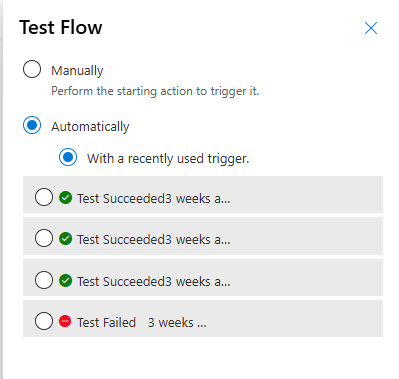
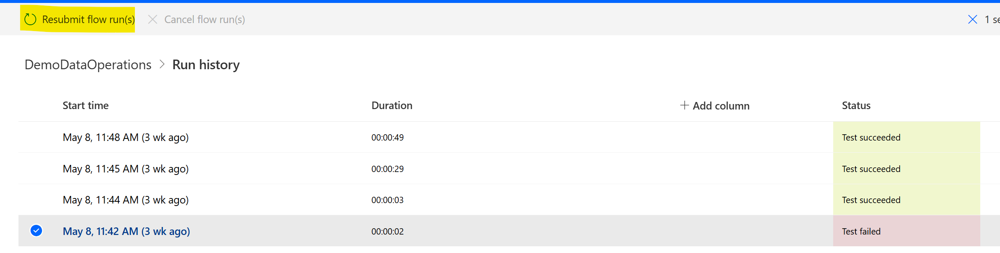

# Cloud flow testing

Effective testing of Power Automate cloud flows is essential for ensuring their reliability, performance, and correctness. Here are some of the mechanisms that you could use to test your flows.

### Design Phase testing

Consider using Flow checker and Test Flow tool during this phase. 

In the Test pane, there are now three options for testing your flow:

- Manually trigger the test yourself by doing the action that triggers the flow. For example, you can go to your inbox and send yourself a test email. Or, you can go to SQL and insert a row.
- Use data from previous runs to perform the test.

### Static result testing (Mock Data)

Use mock data for testing actions that interact with external systems to avoid unintended changes to production data.

## Resubmitting cloud flow runs

Sometimes Cloud Flow might stop working unexpectedly or fail due to the Server or an asynchronous process that didn't meet some requirements while running. In this case, you need to rerun the Flow, which you can do by choosing the **Run History** and selecting **Resubmit**.

We also have the ability to [resubmit or cancel runs in bulk](../../how-tos-bulk-resubmit.md).

### Considerations for resubmitting runs

- **Error Handling:** Ensure your flow has proper error handling and retry policies in place. This can help mitigate issues that caused the initial failure and provide better insights into why a run might fail again.

- **Data Duplication:** Be aware of potential data duplication or other side effects that could result from resubmitting a run. For example, if your flow includes actions that create records or send emails, resubmitting the run might repeat these actions.

- **Input Data:** Verify that the input data required for the flow run is still valid and available. Changes in the data or the environment (for example, deleted files or records) can affect the outcome of the resubmitted run.

- **Flow Updates:** If you made changes to the flow since the original run, consider whether the changes might affect the resubmission. It’s best to resubmit using the version of the flow that was in place at the time of the original run to ensure consistency.
