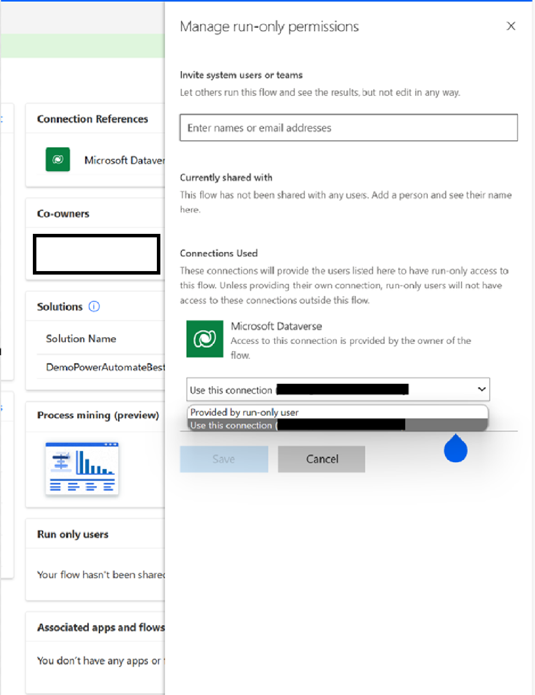

# Understand access to flows

## Ownership of Flows (Service Principal vs User) 

When managing Power Automate flows, the choice between using a Service Principal Name (SPN) or a user account as the flow owner is critical. Using an SPN for flow ownership offers consistency and security, as SPNs are not tied to individual users, ensuring that flows continue running smoothly even if personnel changes occur. This setup reduces the risk of disruptions and allows for stricter control over permissions, as SPNs can be granted only the necessary access.

### Service Principal Name (SPN) ownership

Advantages of Service Principal Name (SPN) ownership:

- **Consistency**: SPNs are not tied to an individual user, which ensures that flows continue to run regardless of personnel changes (e.g., if a user leaves the organization).
- **Security**: SPNs can be configured with the minimum required permissions, reducing the risk of unauthorized access.
- **Scalability**: SPNs are better suited for managing automated tasks across large environments, especially in scenarios involving multiple flows or environments.
- **Compliance**: Using SPNs can help maintain compliance, as they provide a clearer audit trail of actions taken by the flow, independent of specific users.

### User account ownership

Advantages of user account ownership:
- **Ease of setup**: Flows can be created and owned by users with minimal setup, making it easier for users to develop and manage their own flows.
- **Human interaction**: If the flow involves tasks that require human approval, decision-making, or interaction, using a user account might be more appropriate.
- **Personalized context**: Flows owned by users can run in the context of that user, utilizing their permissions and settings

## Best Practices

For critical or long-running flows, use a Service Principal Name (SPN) to ensure the flow remains stable and independent of specific users.

For user-specific or interactive flows, use a user account when the flow needs the specific context of a user or involves user interaction.

## Co-Ownership of Flows

Adding a [co-owner](/power-automate/create-team-flows) to a cloud flow is the most common way to share a cloud flow. Any owner of a cloud flow can perform these actions:

- View the run history.
- Manage the properties of the flow (for example, start or stop the flow, add owners, or update credentials for a connection).
- Edit the definition of the flow (for example, add or remove an action or condition).
- Add or remove other owners (but not the flow's creator), including guest users.
- Delete the flow.

Only add co-owners for flow collaborations as needed. In most cases, if flow needs to be shared, share the flow with run-only permissions, which will restrict the users to view flow run history or make any changes to the flows.  This will also allow users to specify whether the flow will use the connections of the user invoking the flow or the inbuilt connections of the user or account creating the flow. Learn more: [Share a cloud flow](/power-automate/create-team-flows)

## Configuring security roles for appropriate access

In addition to assigning users as co-owners, certain users can access flows based on their security roles on Workflow tables or their role as environment admins.

Generally, users with full access to Workflow tables can edit any flow and view any run history. Likewise, environment admins will always have full access to edit workflows and view all the data that flows through them.