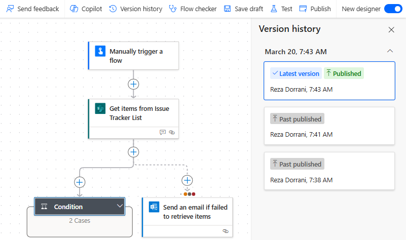

# Understand the benefits of using solution-aware cloud flows

Cloud flows that are created within or added to a [solution](/power-platform/alm/solution-concepts-alm) are known as solution-aware cloud flows, or simply solution cloud flows. These flows are designed to be portable and manageable, making it easy to move them from one environment to another. This capability supports robust Application Lifecycle Management (ALM) practices. Additionally, you can add multiple flows to a single solution, enhancing organization and management.

Learn more:

- [Create a cloud flow in a solution](../../create-flow-solution.md)
- [Known limitations](/power-apps/maker/data-platform/solutions-overview) 

## Use pipelines in Power Platform to deploy solutions

Using pipelines in Power Platform to deploy solutions offers easily deployed solutions to test and production. Once pipelines are in place, makers can  initiate in-product deployments directly within their development environments. Makers do so directly within their development environments. Learn more: [Overview of pipelines in Power Platform](/power-platform/alm/pipelines)

Non-solution cloud flows are flows that are created outside the solutions. Their deployment needs to be managed individually.

## Connection references vs connections

### Understanding Connection References and Connections in Power Automate

**Connection references** and **connections** refer to different aspects of how flows interact with external services and data sources. Understanding the distinction between these two terms is important for effectively managing and deploying flows, particularly within the context of solution-aware and non-solution-aware cloud flows.

- **Connection References**: These are pointers used within flows to refer to specific connections. They allow flows to be more portable and manageable, especially when moving flows between different environments.

### Connections (nonsolution aware cloud flows)

Connections are configurations that establish a link between Power Automate and external services, such as Office 365, SharePoint, Dynamics 365, SQL, or any other connector. A connection includes authentication details (like API keys, OAuth tokens, or user credentials) required to access the external service.

When you create a flow, you need to create or select a connection to the service you want to interact with. Connections are user-specific, meaning they're tied to the credentials of the user who creates them.

If you change a connection for a cloud flow, every action associated with the connection needs to be updated.

### Connection references (solution-aware cloud flows)

Connection references are an abstraction layer that simplifies the management of connections within a Power Platform solution. They act as placeholders or pointers to actual connections, making it easier to manage and update connections in solution-aware scenarios.

Connection references are used in solution-aware cloud flows, which are part of a broader Power Platform solution, for example solutions integrated with Power Apps, Dataverse, or other components. They enable the separation of the flow's design from the specific user connections, facilitating easier deployment and updates across different environments (development, testing, production).

Because connection references are a wrapper for connections, when requiring updating connection for actions within a solution aware cloud flow, only the connection reference needs to be updated. All the actions within the flow automatically refer to the updated connection in the connection reference.

### Limit for number of flows owned by a user

With nonsolution cloud flows, a user can own a max of 600 flows. The limit doesn't apply to flows created within solutions.

Learn more: [Limits and configuration](../../limits-and-config.md)

## Flow versioning

Flow versioning is available only to solution-aware cloud flows where users can create draft of flows as they continue to evolve the flow logic and publish once complete. Versioning information, for example metadata of a flow, gets stored in Dataverse.

Versioning allows the flow maker to keep track of changes, revert to previous versions if necessary, and ensure that flows are stable and reliable.

Learn more: [Flow versioning](https://learn.microsoft.com/power-automate/drafts-versioning)

## Environment variables

Environment variables enable the basic application lifecycle management (ALM) scenario of moving an application between Power Platform environments. In this scenario, the application stays exactly the same except for a few key external application references (such as tables, connections, and keys) that are different between the source environment and the destination environment. The application requires the structure of the tables or connections to be exactly the same between the source and the destination environments, with some differences. Environment variables allow you to specify which of these different external references should be updated as the application is moved across environments

Only solution-aware cloud flows (ALM-friendly) support the use of environment variables.

Learn more: [Environment variables](/power-apps/maker/data-platform/environmentvariables)

## Manage cloud flow run history in Dataverse

With cloud flow run history in Dataverse, you can apply the extensibility of [Dataverse](/power-apps/maker/data-platform/) to track the results of your cloud flow executions at scale..

Only solution cloud flows, with their definitions in Dataverse, can have their run history stored in Dataverse.

As part of this feature, each cloud flow execution has an entry in the table [FlowRun](/power-apps/developer/data-platform/reference/entities/flowrun). This feature is using Dataverse’s nonrelational database, [elastic tables](/power-apps/maker/data-platform/create-edit-elastic-tables), to store the cloud flow run history.

Cloud flow run history in Dataverse is used by the [automation center](/power-automate/automation-center-overview) to provide comprehensive monitoring and troubleshooting experiences for automation processes across Power Automate.

By default, flow run data is stored for 28 days (2,419,200 seconds). To modify the duration of how long the executions can be stored, update the [Time to live (in seconds) for the flow run in the Organization table](/power-apps/developer/data-platform/reference/entities/organization#BKMK_FlowRunTimeToLiveInSeconds) in an environment backed with Dataverse. Depending on your environment’s storage capacity, you can adjust the length of storage for these run records

Learn more: [Manage cloud flow run history in Dataverse](/power-automate/dataverse/cloud-flow-run-metadata)

## ALM best practices for Power Automate

ALM (Application Lifecycle Management) enables organizations to safely move artifacts within a solution across environments such as Dev, Test and Prod

**Unmanaged solutions** are fully editable and allow developers to modify and customize the components within a solution. 

**Managed solutions** on the other hand are sealed and do not allow any modifications once deployed to target environments. 

While moving solutions from one environment to another, here are some of the key deployment practices that should be followed:

### Solutions best practices**

Solutions can be used as a logical boundary to keep related flows together. Consider keeping parent and child flows together in one solutions who may require to use same connection reference. 

Environment variables allow you to dynamically change configurations across different environments (e.g., development, staging, production) without modifying the code. These variables act as placeholders for data that can be set or updated externally, making it easier to manage and deploy the application.

Azure Key Vault, a secure storage service, complements this by securely storing sensitive information like secrets, keys, and certificates. Integrating Azure Key Vault with Power Automate ensures that sensitive data is stored and retrieved securely. This integration allows Power Automate to access the secrets directly from Azure Key Vault, reducing the risk of exposure and enhancing the overall security posture of the application.

### Deployment best practices

To ensure safe ALM, make sure to not allow any unmanaged customizations in the Test and Production environments by deploying only managed solutions. 

Any mission critical flows should only be edited in a dev environment and then moved to test and then production environments. Within the production environments, ensure that flows should be owned by service principals.

Additionally, any changes to production environments should always go through ALM processes. 

### Use Pipelines for deployment

[Pipelines](/power-platform/alm/pipelines) offer numerous advantages for managing and deploying solutions within your organization:

1. **Streamlined Application Lifecycle Management (ALM)**: Pipelines automate and simplify the ALM process, making it easier to manage solution development, testing, and deployment. This reduces the effort and domain knowledge required to implement effective ALM practices.

1. **Centralized Management**: Admins can centrally govern both citizen-led and pro-dev-led projects, ensuring consistent and secure deployment practices across the organization. This centralized approach helps maintain control and oversight. 

1. **Improved Productivity**: By automating deployment processes, pipelines significantly enhance productivity for makers, developers, and admins. This allows business solutions to be delivered faster and with higher quality.

1. **Cost Efficiency**: Pipelines reduce the total cost of ownership by minimizing the manual effort required for deployment and ongoing maintenance. This leads to cost savings and more efficient resource utilization.

1. **Enhanced Compliance and Security**: Pipelines support secure production environments with approval-based delegated deployments. They also provide out-of-the-box analytics and audit logs, ensuring compliance and security throughout the deployment process.

Additionally, pipelines can be customized to meet the unique needs of your organization. Here are some ways to extend pipelines:

1. **Custom Approvals**: Add custom approval steps to your pipelines to ensure that deployments meet specific business requirements before proceeding.

1. **Service Principal Deployments**: Use service principals for deployments to maintain security and control. This allows makers to request deployments without needing elevated access within target environments.

1. **Integration with DevOps Tools**: Integrate pipelines with tools like Azure DevOps and GitHub to enhance your CI/CD processes. This integration allows for seamless management and deployment of solutions.

1. **Custom Business Logic**: Insert custom steps into the pipeline progression to execute specific business logic. This can include pre-export validation, pre-deployment checks, and other custom actions.

Learn more: 

- [Overview of pipelines in Power Platform](/power-platform/alm/pipelines)
- [Extend pipelines in Power Platform](/power-platform/alm/extend-pipelines)
