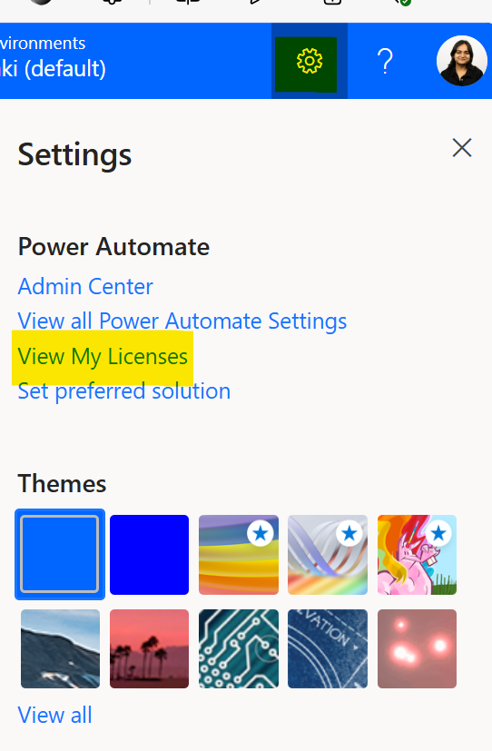
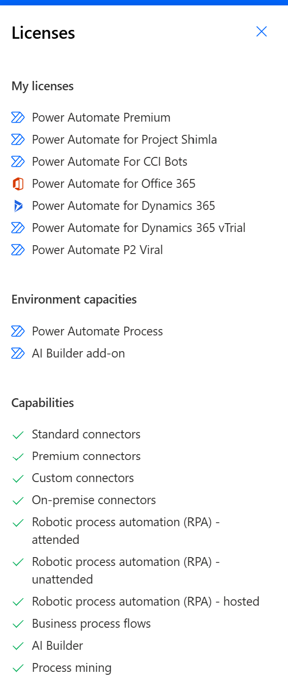
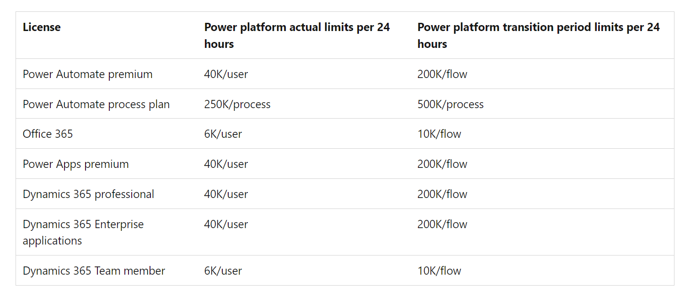
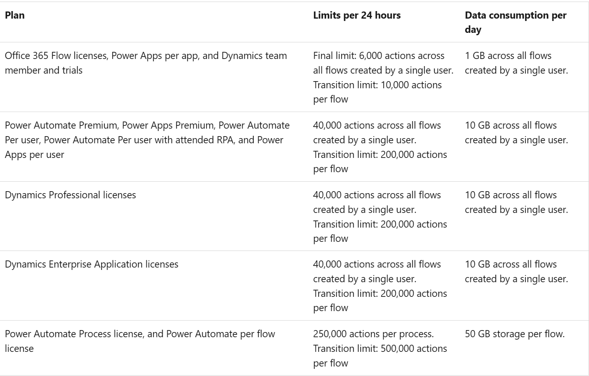
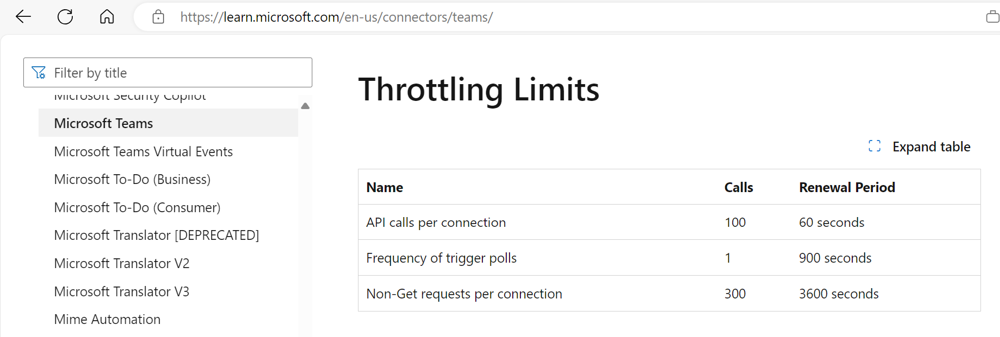
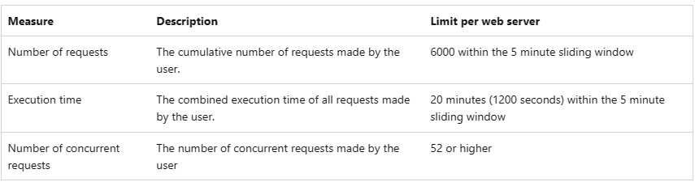
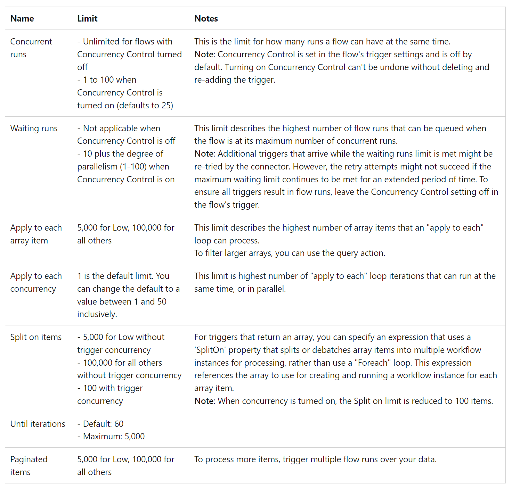
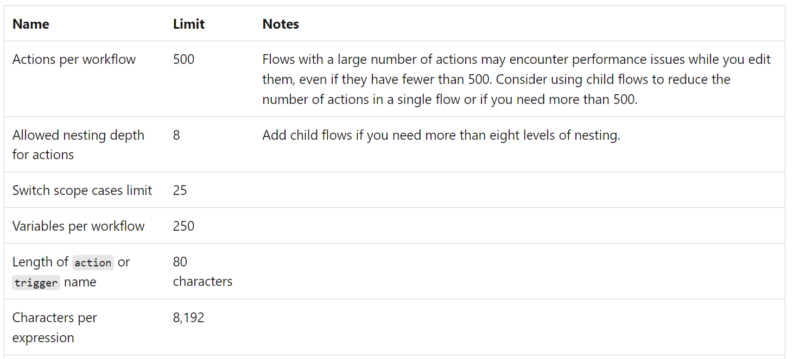
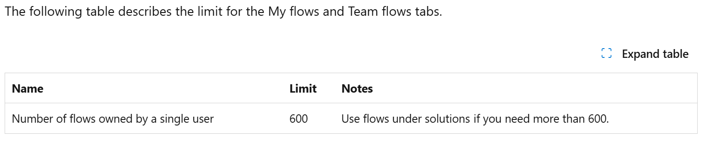

# Understand Platform limits and avoid throttling

Understanding Power Automate and Power Platform limits can help users design scalable Power Automate Flows. 

These limits can determine flow's performance and help avoid throttling (slowing down) or turning off of flows due to request limits violations. Any flow that gets throttled continuously for 14 days gets turned off. These flows can be turned on anytime. Refer to [Retention Limits](/power-automate/limits-and-config) for more details.

To know more about the platform and power automate limits, refer to the following learn documents:

[API requests limits and allocations](/power-platform/admin/api-request-limits-allocations)

[Power Automate Limits and configurations](/power-automate/limits-and-config)

## How to check your license plans

Some of the platform or API limits, depend on the license plan that the user has. The easiest way to identify your license is via Settings - > View My Licenses      

An alternative option can be to press CNTRL + ALT+ A from the power automate portal to get deeper plan level details. 

## API request limits

Requests in Microsoft Power Platform consist of various actions that a user makes across various products. At a high level, below is what constitutes an API request in Power Automate

 All API requests to connectors, process advisor analysis, HTTP actions, and built-in actions from initializing variables to a simple compose action. Both succeeded and failed actions count towards these limits. Additionally, retries and other requests from pagination count as action executions as well. For more information, see [What counts as Power Platform request?](/power-platform/admin/power-automate-licensing/types)

Based on license plan, there are limits to the number of actions a cloud flow can run in day. These limits are different from connector throttling limits. You can see the number of actions your flow runs by selecting **Analytics** from the flow details page and looking at the **Actions** tab.

Even when the flow uses fewer Power Platform requests, you can still reach your limits if the flow runs more frequently than you expect. For example, you might create a cloud flow that sends you a push notification whenever your manager sends you an email. That flow must run every time you get an email (from anyone) because the flow must check whether the email came from your manager. The limit applies to all runs across all your flows in a 24-hour period. Here are some guidelines to estimate the request usage of a flow.

One or more actions run as part of a flow run. A simple flow with one trigger and one action results in two "actions" each time the flow runs, consuming two requests.

Every trigger/action in the flow generates Power Platform requests. All kinds of actions like connector actions, HTTP actions, built-in actions (from initializing variables, creating scopes to a simple compose action) generate Power Platform requests. For example, a flow that connects SharePoint, Exchange, Twitter, and Dataverse, all those actions are counted towards Power Platform request limits.

Both succeeded and failed actions count towards these limits. Skipped actions aren't counted towards these limits.

Each action generates one request. If the action is in an apply to each loop, it generates more Power Platform requests as the loop executes.

An action can have multiple expressions but it's counted as one API request.

Retries and extra requests from pagination count as action executions as well.

Here is a quick overview of API Limits at the platform level based on user License. 

**Note:** currently all customers are in a Transition period, where API limits are not fully enforced and are higher. This transition period will end  after Power Platform admin center reports are GA. Organizations have six months to analyze their usage and purchase licenses that are appropriate before strict enforcement on license limits begins. Learn more about transition period [here](/power-platform/admin/power-automate-licensing/types)

**Transition period Comparison:**

**Additional Data consumption details:**

**Key Things to remember**

User limits are applied across all flows

Automatic flows which they created

Manual flows which they executed

Flow/Process limits are applied to the particular flows

Per-Process can apply to group of related flows

Per flow applies to a single flow

Pay-Go environments

Flows don't have daily quota as you pay for consumption

## API throughput limits on connectors

In addition to platform limits, each connector service has its own limits. Connector throttling in Power Automate refers to the mechanism by which connectors enforce rate limits or usage quotas to prevent abuse and ensure fair resource allocation. When a connector is throttled, it restricts the number of requests or operations that can be made within a specific timeframe.

When a flow runs into connector level throttling limits, the service will return a "429 (Too Many Requests)" error code, with error text like "Rate limit is exceeded. Try again in 27 seconds"

Each [connector](/connectors/connector-reference/connector-reference-powerautomate-connectors) will have its own throttling limit. Here is an example of Teams Connector - 

## Dataverse API Limits

Dataverse as a connector service has defined its own [Service protection limits](/power-apps/developer/data-platform/api-limits). The service protection API limits are evaluated per user. When called by a flow the "user" is whoever is associated with the action. Usually this is the flow owner but can be the invoking user if using invoking user context in the action.

## Flow Concurrency Limits

Designing scalable, efficient flows includes understanding of the concurrency, looping and debatching limits to help avoid unnecessary delays. Here are the limits for a single run:

## Action Burst Limits

Action Burst Limits refer to the maximum number of actions that can be triggered within a specific period, typically measured in a rolling window of time. Currently there is a per-flow cap of 100,000 actions per 5 minutes. 

Any bursts of triggering or loops can lead to over exceeding this limit, causing slowing down/throttling of flows. 

Best way to address this would be to distribute the load between multiple flows. 

Use trigger conditions

Use best practices documented above in this whitepaper for designing for each loop. 

## Additional Limits

### Flow Design limits

While designing flows, users can run into some limits that are defined at the design/definition level. Consider redesigning your flows, if you run into any of these limits:

### Flow Creation limits

### Flow Timeout limits

