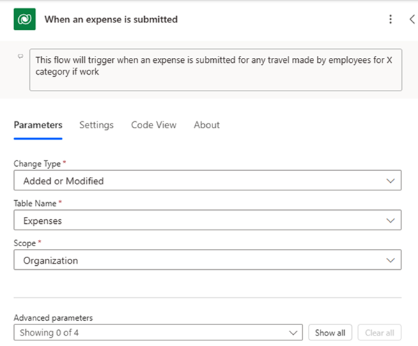

## Consistent naming for flow components

Maintaining consistent naming conventions for the components within your Power Automate flows is important for ensuring clarity, organization, and ease of management. By adopting a standardized approach to naming, you can enhance collaboration among team members, simplify troubleshooting, and streamline the development and maintenance of your workflows.

> [!NOTE]
> These are recommendations and may change as per individual organization requirements.

Here are some guidelines to follow:

- **Descriptive and meaningful names**: Give meaningful names to your flows before saving. Additionally, choose names that accurately describe the purpose or function of each component. Avoid generic or ambiguous names that could lead to confusion. For example, instead of naming a trigger `Trigger1`, use a descriptive name like "New Email Received" to clearly indicate its purpose.

- **Use CamelCase or underscores**: Use CamelCase (capitalizing the first letter of each word except the first one) or underscores to separate words in your component names. Using CamelCase or underscores improves readability and makes it easier to distinguish between different parts of the name. For instance, you might name an action "SendEmailNotification" or "send_email_notification" for consistency.

- **Prefixes or tags**: Consider using prefixes or tags to categorize components based on their type or functionality. For example, you could use prefixes like "Trg_" for triggers, "Act_" for actions, or "Var_" for variables. Prefixes or tags help you quickly identify the role of each component within the flow.

- **Consistency across flows**: Maintain consistency in naming conventions across all your Power Automate flows to facilitate navigation and standardization. Consistent naming ensures that team members can easily understand and work with different flows without having to decipher unique naming styles.

- **Document naming conventions**: Document your naming conventions in a style guide or documentation to ensure that all team members are aware of the standards to follow. Documenting your naming conventions promotes uniformity and reduces the likelihood of inconsistencies or misunderstandings.

- **Add comments**: Adding comments to the actions makes it easy to understand the flow implementation logic.

