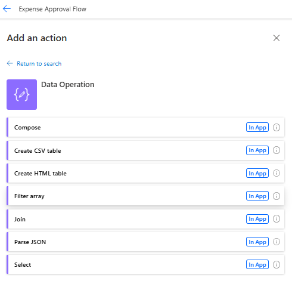
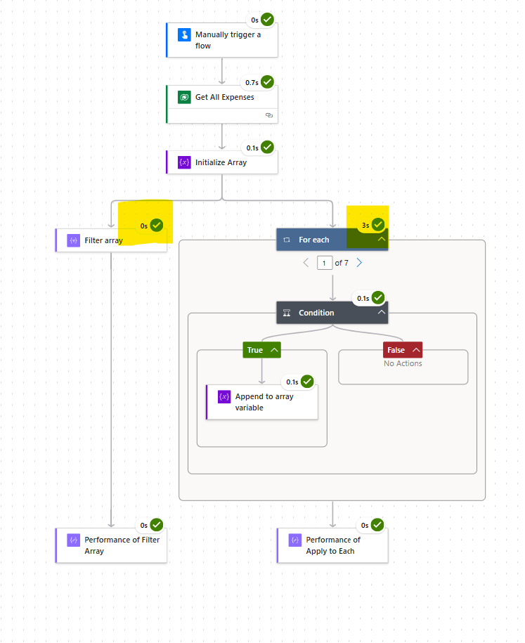
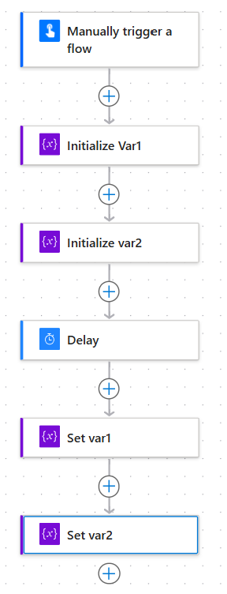
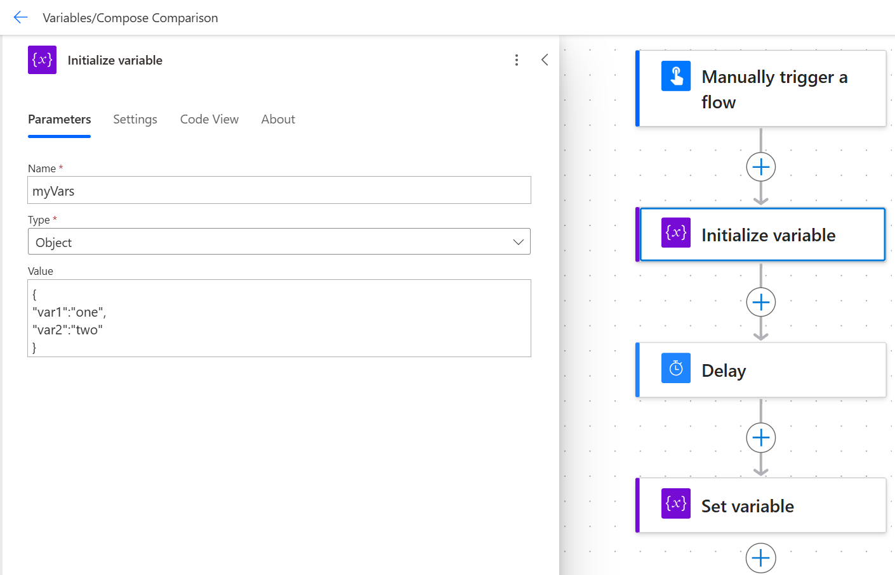
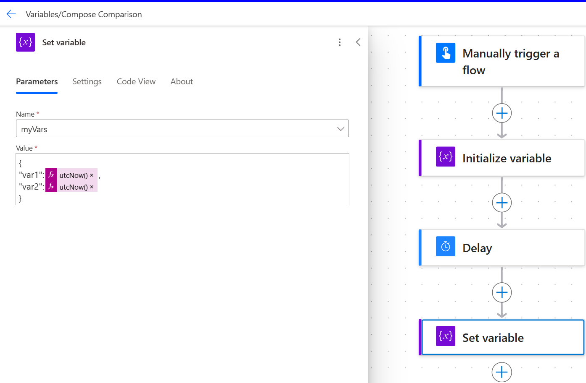

# Working with data operations

Data operations in Power Automate refer to the manipulation, transformation, and management of data within your automation flows in an efficient way. 

Actions like Filter Array, Select and Join actions can help avoid any unnecessary loops to process data. 

For example, whenever there is a need to append to variables to make a final array in order to do any filtering, if the element doesn't come from information from external data source, a lot of time they can be simplified by data operations like filter or select. 

Here is how the flow execution looks like when using append variable within a loop compared to Filter Array. In the example below to filter an array of 100 records, the Filter action took a few milliseconds compared to Append to array within a loop which took 48 seconds and added more actions and complexity to the flow. 

## Variables vs vompose

<!-- REDO this section -->

Compose are not update-able at run-time. It is useful for write-once, read-many type of usage. If we need to write or update in many places in the flow, variables will be much more appropriate. Similarly, using compose to create variables can also perform faster than initializing+ Declare variables. 

When working with a set of variables that are updated within the same logical blocks in the flow, you can use JSON variables instead of individual variables. This help reduces the number of actions in the flow. 

Consider the above: Instead of working with Var1 and Var2 as separate variables, we can use 1 Object Variable to manage both values.

