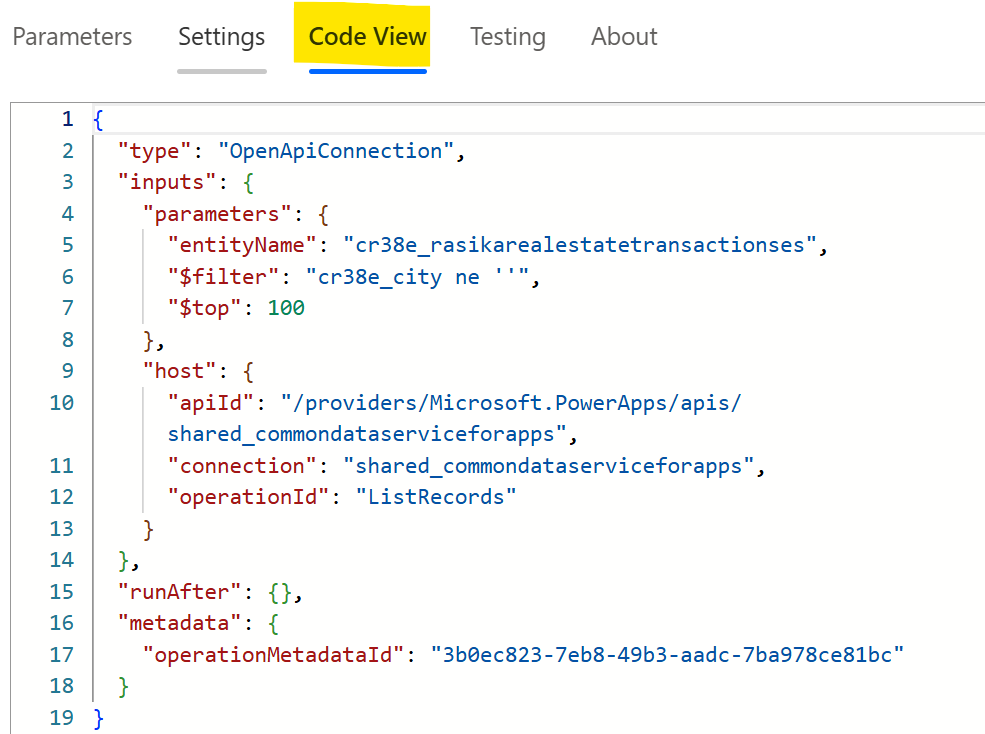
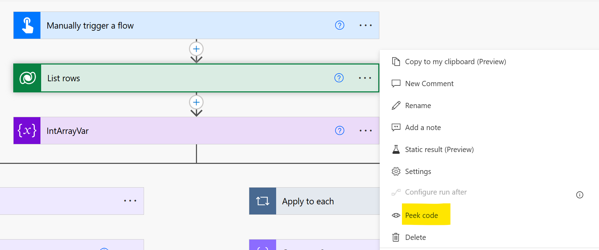
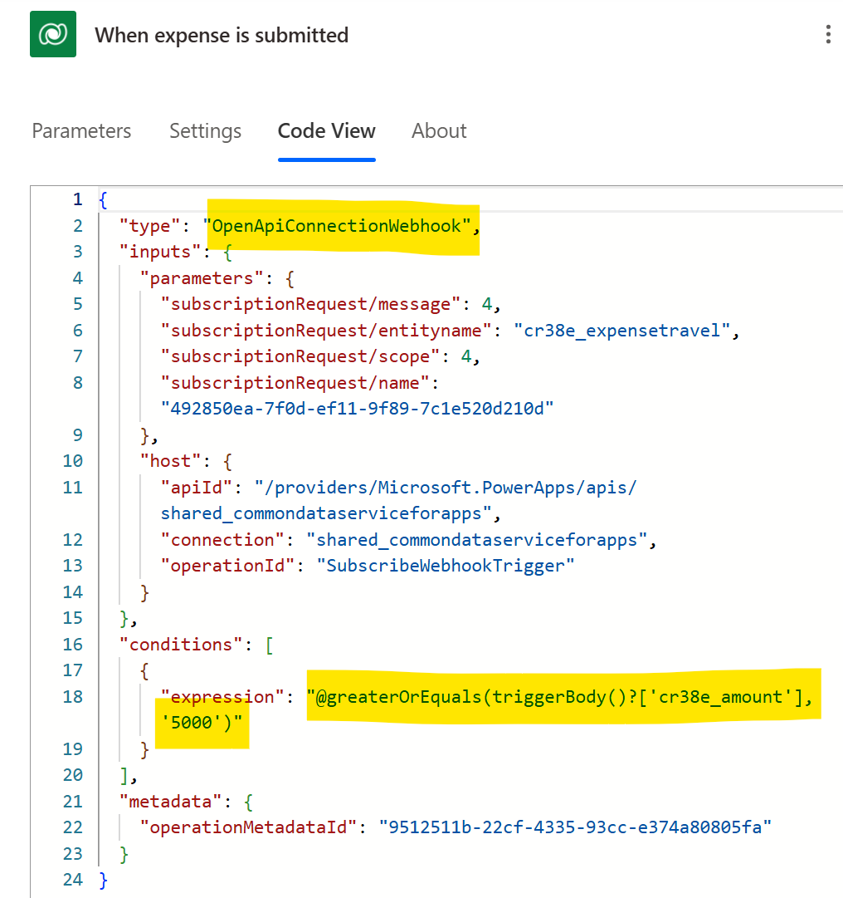
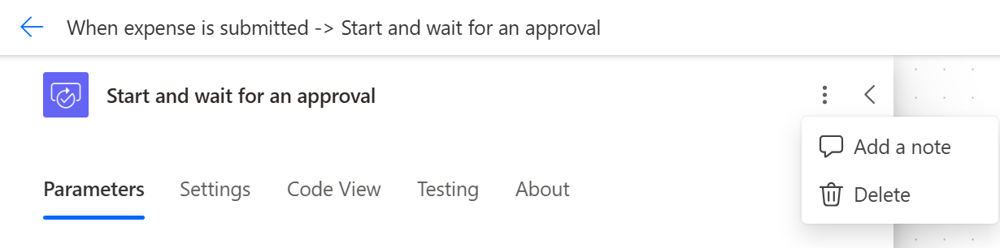
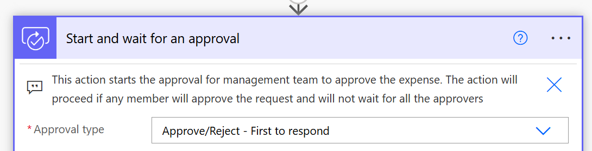
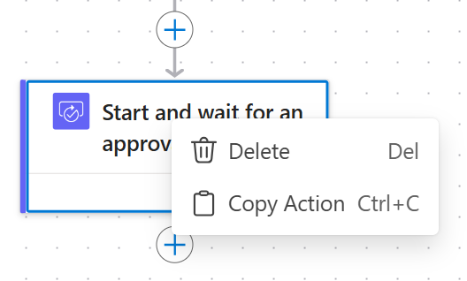
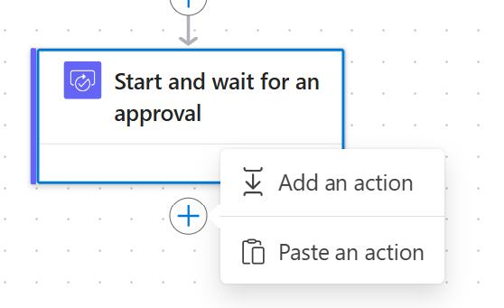
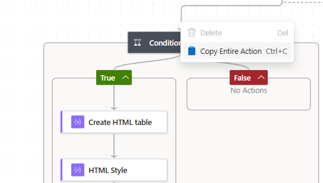

# Use code view, add notes, and copy&paste action

## Peek code/Code View

**Peek code or Code view** is a feature that allows users to view the underlying JSON representation of the actions and triggers within a flow. This feature is particularly useful for advanced users who want to understand the exact structure and configuration of their flows, troubleshoot issues, or manually edit specific details that are not easily accessible through the standard visual interface. 

In the new designer use Code view to view trigger/action code

In classic designer, use peek code to view the JSON code

Additionally, code view/peek code can be used to view trigger polling frequency, trigger type,  Odata queries even JSON representation of the dynamic content etc. 

## Add a note

Adding notes or comments in Power Automate cloud flows is a helpful way to document the purpose, logic, and specific details of various actions and triggers within the flow. This practice is beneficial for both individual users and teams, as it improves the readability and maintainability of the flows.

## Copy Paste actions

Copy paste of actions is a useful way to reuse the same action multiple times within a flow or across different flows. This helps in simplifying the process of creating and modifying flows and saves time and multiple clicks. 

The new designer in power automate gives the ability to copy and paste entire conditions or scope actions as well. 

