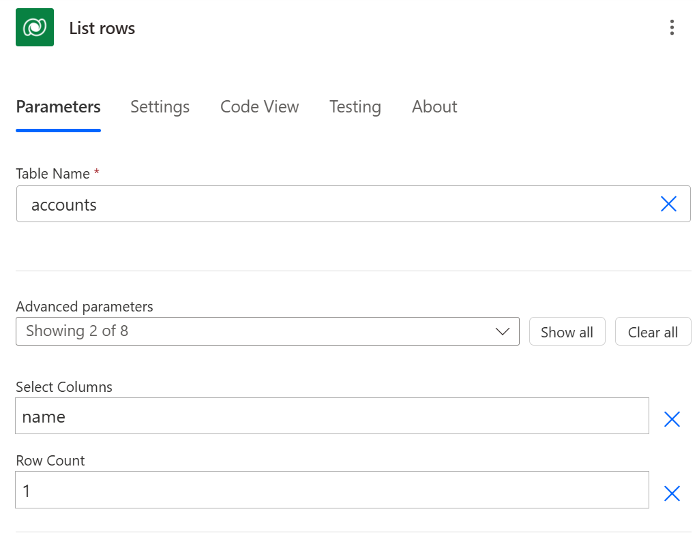
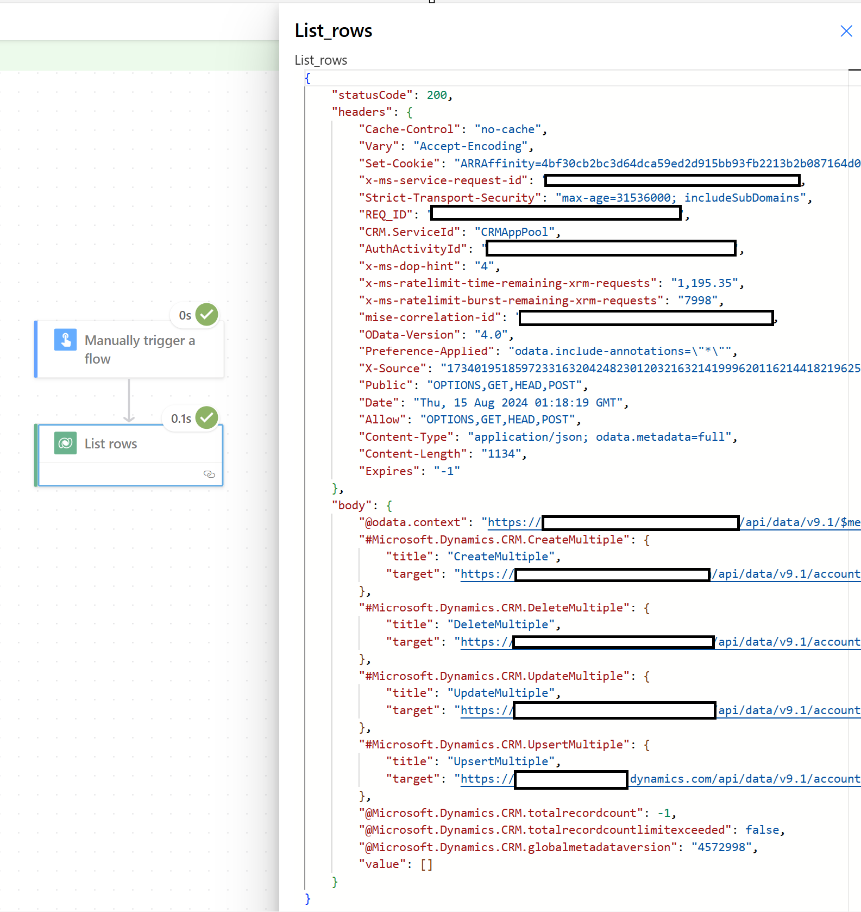
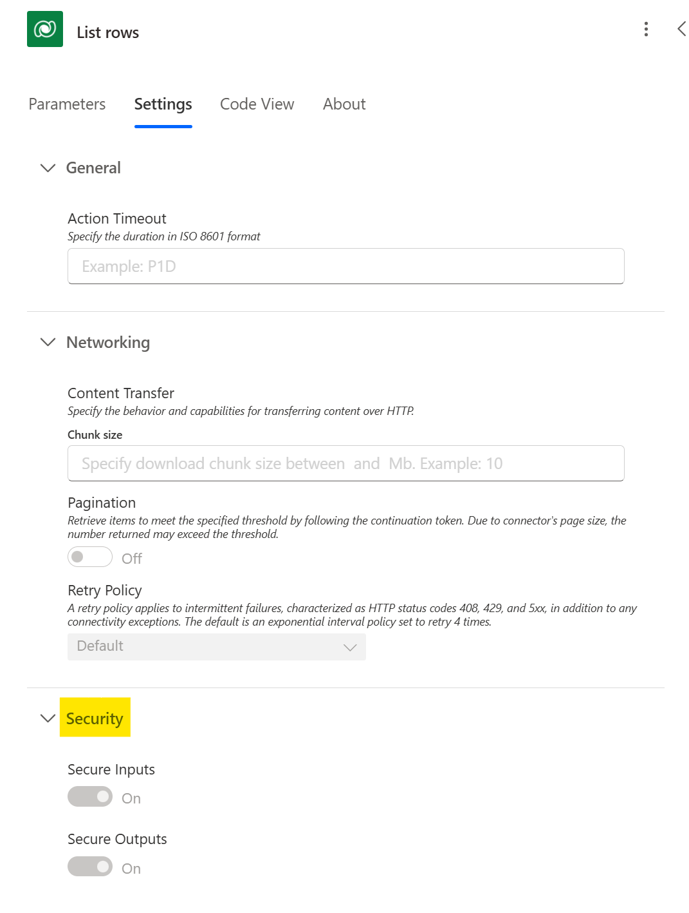
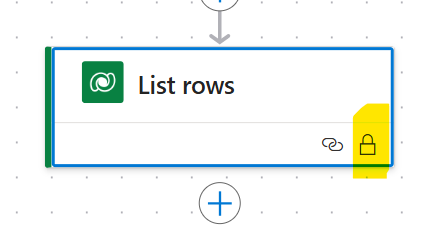
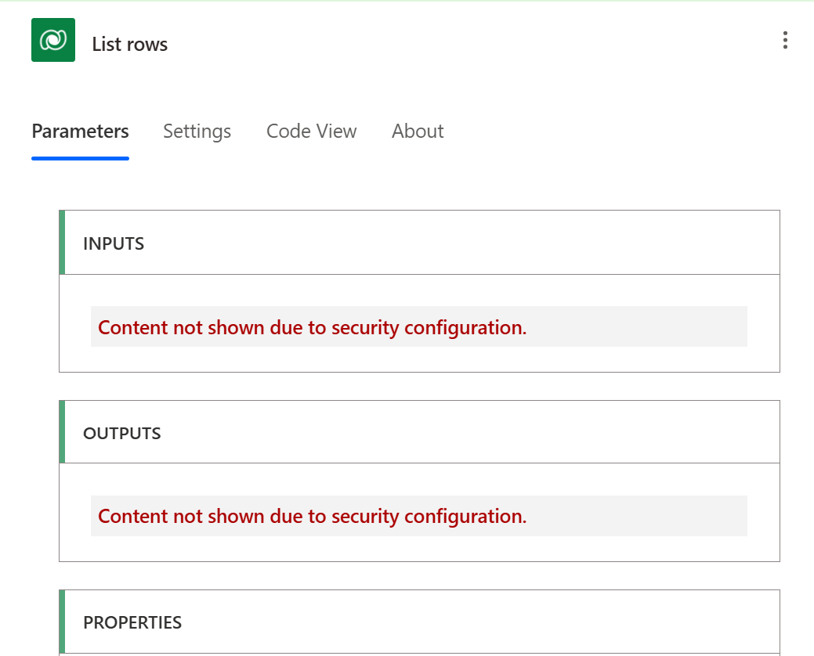
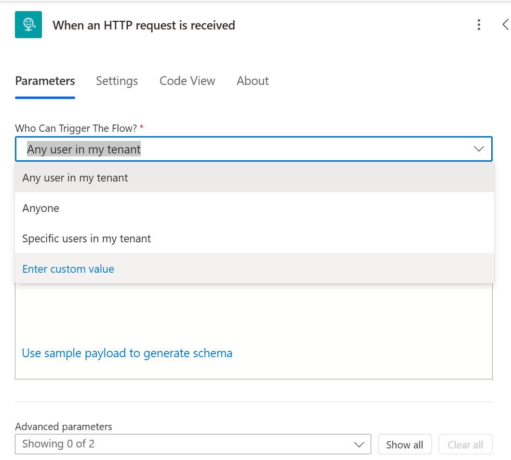

# Using secure inputs and outputs, and securing HTTP request triggers

## Using Secure Inputs/Outputs

Currently, Power Automate gives users ability to view flow run history and deep dive into a trigger or action's inputs and outputs information. 

However, with the use of Secure Input and Output settings, you can prevent users from seeing any sensitive information. 

Overall, some of the best practices to secure your data within Power Automate, include: 

Avoid hardcoding sensitive information directly into your flows or variables. Instead, use Secure Inputs/Outputs to store and retrieve this data securely.

Consider integrating Power Automate with Azure Key Vault for enhanced security and centralized management of secrets.

Azure Key Vault allows you to store and manage sensitive information securely, and Power Automate can retrieve secrets from Key Vault at runtime using managed identities or service principals.

## Securing HTTP Request Trigger 

You can use the **When an HTTP request is received** trigger to trigger workflows by sending a request to an HTTP request to the endpoint generated from the flow. You can restrict what users can trigger in this workflow by ensuring that only authenticated users can trigger this workflow.

One of the approach will be to use AAD token. This token can be defined to restrict specific users/principals in a tenant, or any user within a tenant. More information can be find [here](/power-automate/oauth-authentication) 

The second approach will be to use IP-Pinning. Environment admins can configure IP set or range that are allowed to interact with Power Platform resources. 

This is currently in preview. More information can be found here - [IP firewall in Power Platform environments](/power-platform/admin/ip-firewall)