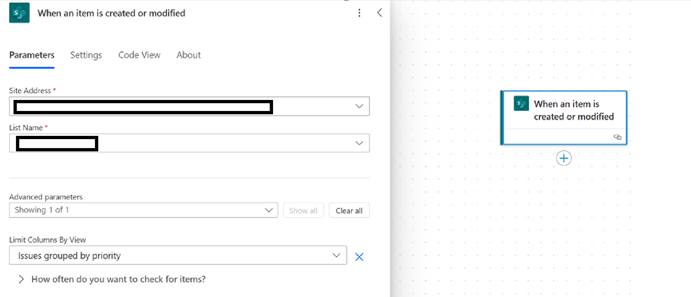
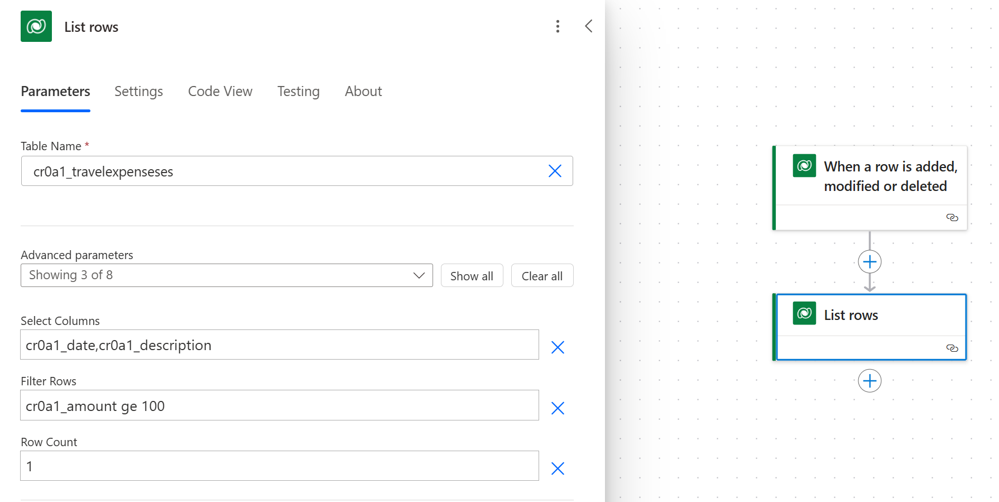
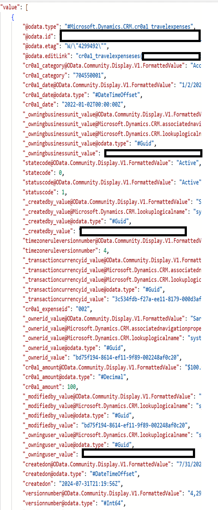
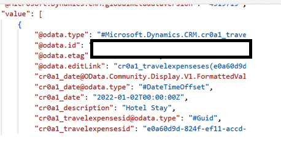

# Working with relevant data

In Power Automate, using only relevant data is essential for maintaining efficiency and accuracy in your automated workflows.

[Content throughput limits](/power-automate/limits-and-config#throughput-limits) refer to the amount of data that's read from or written to the run history of the cloud flow, and impact how much data can be processed during a specific time period. Throughput limits vary by [performance profile](/power-automate/limits-and-config#performance-profiles).

It is therefore important to limit the data we process in the cloud flow to only the relevant data. This can be achieved at both the trigger and action levels. Typically, you can specify OData expressions, top count, and relevant column names at these levels to filter the data effectively.

## Triggers

At the trigger level stage, you can define conditions that must be met for the data to be read and processed in the cloud flow. Using OData expressions, you can filter data based on specific criteria, ensuring only pertinent data is brought in.

Data sources like SharePoint allow you to specify views to get only relevant columns and filtered records. In trigger, users can specify the view which are relevant to their use case and get only relevant data and selected columns.

## Actions

At the action level, you can further refine the data by specifying which columns are necessary and setting a top count to limit the number of records processed. This helps in managing data volume and focusing on the most relevant information.
By implementing these strategies, you can optimize data handling and improve the efficiency of your processes.

When using Power Automate to get data from Dataverse, you have several options to limit the data processed in your cloud flow:

- **Select Columns**: Specify which columns to retrieve from the Dataverse table. This helps reduce the amount of data processed by only including the necessary fields. For example, if you only need the Name and Email columns, you can exclude all other columns from the query.
- **Filter Rows**: Use OData filter expressions to define criteria that the data must meet to be included. This allows you to fetch only the relevant rows. For instance, you can filter rows where the Status is Active or where the CreatedDate is within the last 30 days.
- **Row Count**: Limit the number of rows returned by specifying a maximum count. This is useful for controlling the volume of data processed, especially when dealing with large datasets. For example, setting a row count of 100 will ensure that only the first 100 rows that meet your criteria are processed.

You can either use one or a combination of these options to minimize the data.

<!-- TODO replace with code view -->
:::row:::
    :::column:::
    **Result without Select Column**
    :::column-end:::
    :::column:::
    **Result with Select Column** 
    :::column-end:::
:::row-end:::
:::row:::
    :::column:::
    
    :::column-end:::
    :::column:::
    
    :::column-end:::
:::row-end:::

When using Power Automate to get data from SharePoint, you have several options to limit the data processed in your cloud flow:

- **Filter Query**: Use OData filter queries to specify conditions that the data must meet to be included. This helps in fetching only the relevant items based on criteria like date ranges, specific values, etc.
- **Top Count**: This option allows you to limit the number of items returned by the action. For example, setting a top count of 100 will ensure that only the first 100 items that meet your criteria are processed1.
- **Limit Columns by View**: You can choose to limit the columns returned by selecting a specific view. This reduces the amount of data processed by only including the columns defined in that view2.

By using these options, you can optimize your flows to handle only the necessary data, improving performance and efficiency.

<!-- TODO replace with code view -->
