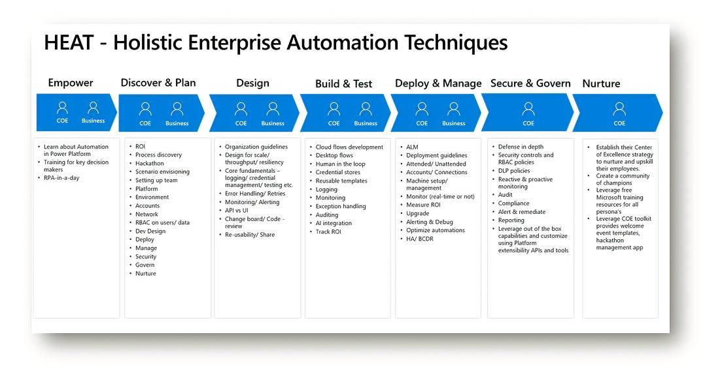
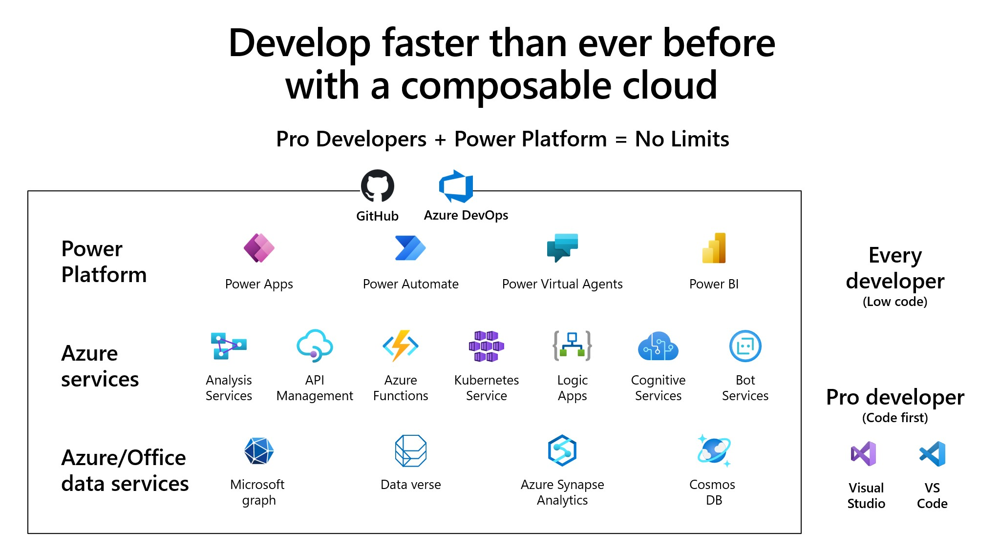
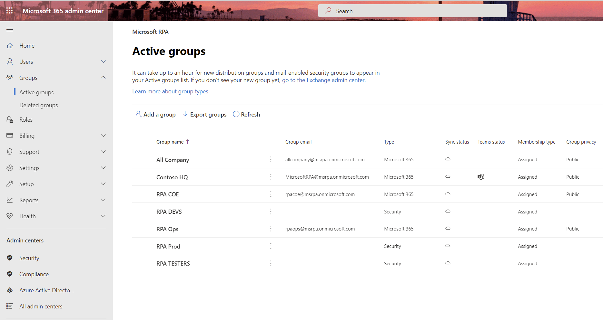
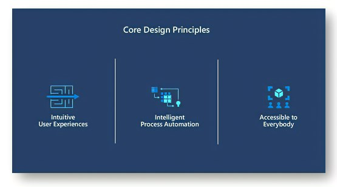
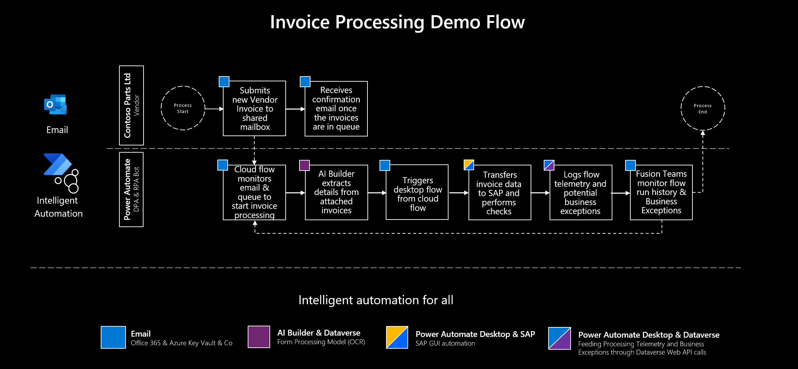
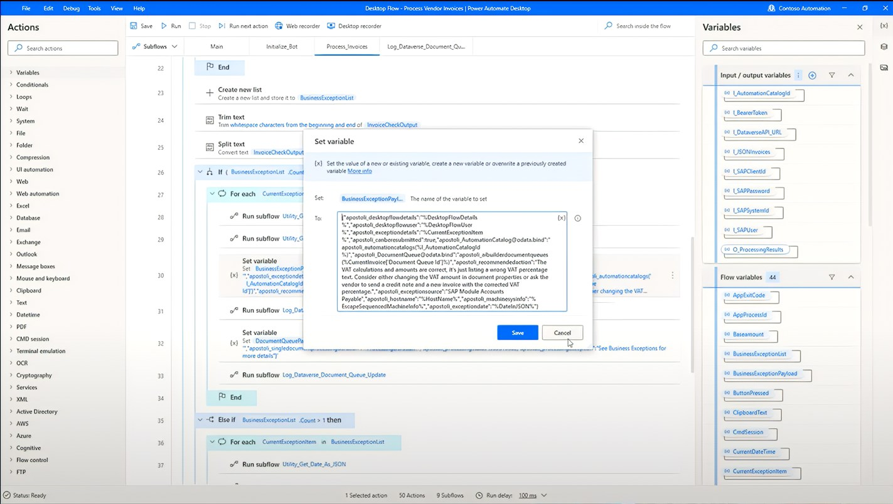
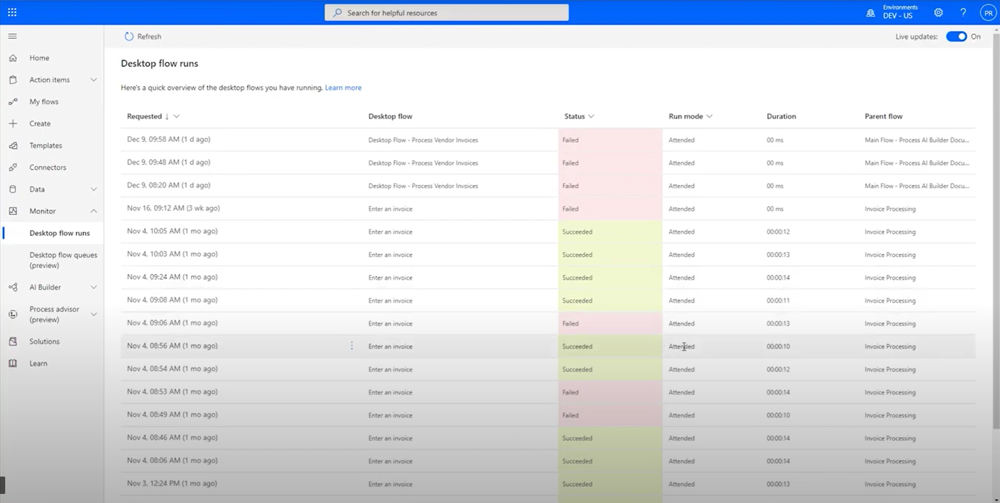
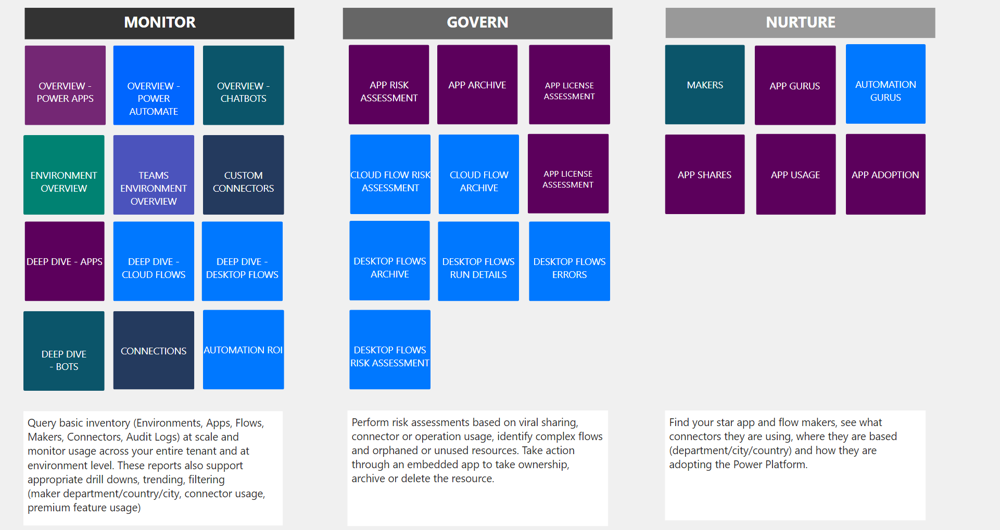

# HEAT – Holistic Enterprise Automation Techniques for RPA

Based on our learnings from customers for building robust automation solutions on Power Automate we have captured the **lifecycle of an automation project** and best practices in each of the stages.

Whether you are an **automation** or **RPA** or **professional developer** looking to develop automation solutions or Automation COE (Center of Excellence) looking to enable and govern automation/ RPA adoption at scale, these resources are for you.

We have recorded a special series on our video channel "Automate It" [https://aka.ms/rpapnp](https://aka.ms/rpapnp) where we go into each of these stages in more details.

Watch video, "[Introducing HEAT](https://youtu.be/OmQpIjC2Vlc)"

## Empower

The start of any successful automation project it to ensure that the key stakeholders understand the automation capabilities of the platform. In this stage, users new to Power Automate can **learn about the automation capabilities in Power Automate**.

Watch the video, "[Power Automate & Power Platform](https://www.youtube.com/watch?t=345&v=OmQpIjC2Vlc&feature=youtu.be)".

Here are some resources for getting started with RPA in Power Automate.

- [Power Automate Overview](https://flow.microsoft.com/)
- Learn RPA in a day [Overview](https://www.youtube.com/watch?v=7LhJ36ioeyY&list=PLi9EhCY4z99UlSA7ykeZtSLraL8qlhFeq&index=9) | [Download](https://aka.ms/rpainadaypackage)
- [Automate It – Where to use RPA](https://www.youtube.com/watch?v=QybEIbqZVQg)
- [Microsoft Learn: Step-by-step modules on Power Automate Desktop](https://docs.microsoft.com/en-us/learn/browse/?expanded=power-platform&products=power-automate&terms=%22power%20automate%20desktop%22)

## Discover and Plan

In this stage, COE's/ Business collaborate on what processes to automate based on the **ROI**, setup the **development team** & the **Power Automate environment**.

While automation enables organizations to become more efficient, the decision on which processes to automate is still often a challenge. It is impossible to automate every process, so COE's can use the **Innovation Backlog app** to manage the backlog and pick an automation based on ROI. **Process Advisor** enables organizations to gain deep insight on a variety of tasks.

Power Automate provides environments of different types (production, sandbox, trial) that can be created.  Each environment has a defined set of users who are role-based. Admins can bring their own compute infrastructure to install Power Automate Desktop and the necessary software.

Watch the video, "[Empower, Discover & Plan](https://www.youtube.com/watch?v=94Lq15PNDDg&list=PLi9EhCY4z99UlSA7ykeZtSLraL8qlhFeq&index=13)"

Resources on ROI, process discovery and setting up Power Automate environment:

- Discover which process to automate using [Process Advisor](https://flow.microsoft.com/en-us/process-advisor/)
- Use the [Innovation Backlog app](https://docs.microsoft.com/power-platform/guidance/coe/use-innovationbacklog) for curating and managing ideas
- Power Platform Guidance [documentation](https://docs.microsoft.com/power-platform/guidance/coe/use-innovationbacklog)
- Power Automate Desktop [Prerequisites](../../desktop-flows/setup)
- [Power Automate IP address configuration](../../limits-and-config)
- [Service administrator roles (Microsoft 365 Global / Power Platform/ Dynamics 365/ Azure/ Power BI admin)](https://docs.microsoft.com/power-platform/admin/use-service-admin-role-manage-tenant#service-administrator-permission-matrix)
- [Assign](../../../articles/organization-q-and-a#power-automate-rpa-license) Power Automate RPA attended user plan through [Microsoft 365 admin center](https://admin.microsoft.com/)
- [Manage](https://docs.microsoft.com/power-platform/admin/capacity-add-on) unattended RPA add-on capacity in [Power Platform admin center](https://aka.ms/ppac)

## Design

Building robust automation solutions require well-defined design principles that will build the foundation for **scale, security, and compliance!**

Watch the video, "[Design Phase](https://www.youtube.com/watch?v=ur1-y0lrexU&list=PLi9EhCY4z99UlSA7ykeZtSLraL8qlhFeq&index=14)"

Some other design principles (not a comprehensive list) to consider are:

- Design for scale / throughput/ resiliency
- Core fundamentals – logging/ credential management/ testing etc.
- Error Handling / Retries strategy
- Using API vs UI for automation
- [Choosing Which Account type to use in your Automations? Service Account/ Principal etc.](https://www.youtube.com/watch?v=rhaGnfcnvuA&list=PLi9EhCY4z99UlSA7ykeZtSLraL8qlhFeq&index=5)
- [Automate It – Designing Stateless RPA flows](https://www.youtube.com/watch?v=KkJqekwX5qQ&list=PLi9EhCY4z99UlSA7ykeZtSLraL8qlhFeq&index=7)

## Build and Test

This is the heart of the automation lifecycle where a developer would build the automation. As part of this stage, we build and enterprise grade Invoice Processing automation solution. This intelligent automation solution processes invoices in **SAP** and showcases some of the **key enterprise concerns** around **logging, auditing, tracking** each invoice processing, **human in the loop**, calculate **ROI** and more.

Watch the video, "[Build & Test](https://www.youtube.com/watch?v=qvzBNfnjbpA&list=PLi9EhCY4z99UlSA7ykeZtSLraL8qlhFeq&index=15)"

Some key concepts covered in this video are:

- [RPA Playbook for SAP GUI Automation](https://flow.microsoft.com/en-us/blog/rpa-playbook-for-sap-gui-automation-with-power-automate-api-flows-ui-flows-and-power-automate-desktop/)
- [Microsoft Dataverse Auditing](https://www.youtube.com/redirect?q=https%3A%2F%2Fdocs.microsoft.com%2Fpowerapps%2Fdeveloper%2Fcommon-data-service%2Fauditing-overview&v=qvzBNfnjbpA&redir_token=QUFFLUhqa0FSNUNwbnVrTm1kNWtZVUJkdE01QlRYSnk2UXxBQ3Jtc0treFNLcWdZQXNVR2pVendObENidUltMG9ZTC1SYzVDZEFWN3NiX2REVWNySndzWHJ1TllWT0l1Q3piQVY3WXpBaG1zdmtxdlJacXRqaVNOczZWYnV0dWdnT3lqWjhqa0lwQWpVdmpKc0lWSk93U2draw%3D%3D&event=video_description)
- ​Microsoft AI Builder
- [Power Automate Desktop with SAP video](https://www.youtube.com/watch?v=u1-8oKytJAU)
- [Using Sensitive Text in Power Automate Desktop + Azure Key Vault](https://powerusers.microsoft.com/t5/Webinars-and-Video-Gallery/Using-Sensitive-Text-In-Power-Automate-Desktop-Azure-Key-Vault/td-p/790556)
- [Central logging](https://youtu.be/sQqzjagiL9E)
- [Sharing Desktop flows](../../desktop-flows/manage#share-desktop-flows)
- [Automate It: Power Automate Desktop Monitoring Dashboard](https://www.youtube.com/watch?v=zME5ZaKx2bk&list=PLi9EhCY4z99UlSA7ykeZtSLraL8qlhFeq&index=18)
- Human in the loop (Handle Business exceptions from SAP, AI Builder and more)
- Calculate ROI at the item level (each invoice)
- Monitoring/ auditing/ alerting at the item level (each invoice)

## Deploy, Monitor and Manage

Power Automate provides a rich set of capabilities enabling admins and developers throughout the deployment cycle for a given automation, detailed information on the success/failure of each individual run, and the ability to schedule, **queue and prioritize an automation**.

Developers can setup **CI/ CD with test integration** to deploy automation and prevent against accidental changes which would break the automation in production.

Power Automate also helps users manage their automations. All execution data is available in Dataverse, with out of the box reports and views that visualize this data. Power Automate **provides real-time information** on individual bots and the machines/clusters these run on. This allows more detailed visibility into the full automation health, bot health, and the infrastructure health.

Watch the video, "[Deploy & Manage](https://www.youtube.com/watch?v=VukO0gHj7YU&list=PLi9EhCY4z99UlSA7ykeZtSLraL8qlhFeq&index=16)"

Some resources around this area:

- [ALM with RPA in Power Automate](https://youtu.be/eOrYit9rWMo)
- [ALM with Power Platform using Azure DevOps or GitHub](https://docs.microsoft.com/power-platform/alm/)
- [ALM Accelerator for Power Platform](https://aka.ms/aa4pp)
- [Run Desktop flows as attended/ unattended](../../desktop-flows/run-pad-flow#run-ui-flows-unattended-or-attended)
- [Monitor desktop flow runs](../../desktop-flows/monitor-desktop-flow-runs)
- [Prioritize desktop flow using queues](../../desktop-flows/monitor-desktop-flow-queues)
- Deployment Guidelines
- [On Premises Data Gateway Monitoring Status](https://www.youtube.com/watch?v=963KPiL2PZk&t=1053s)
- [Automating on Premises Data Gateway Installs](https://www.youtube.com/watch?v=WJ_AJxUSiYU)
- [Automate It – Clustering your Gateways](https://www.youtube.com/watch?v=2SOXPUsJfb0&list=PLi9EhCY4z99UlSA7ykeZtSLraL8qlhFeq&index=6)

## Secure, Govern and Nurture

In this stage, the RPA COE's can leverage the in-built security controls to establish guard rails to scale RPA across their organization. They can leverage **Azure Active Directory** a key foundation which allows admins to create and manage access controls on users/ resources centrally. Power Automate provides **rich governance and security controls** to ensure you can run your business-critical processes in a trusted & compliant manner.

The platform provides a rich set of **auditing logs** which lets admins keep track of what happened in the system. The deep integration with Azure, Microsoft 365 allows IT admins to define **reactive and proactive policies** and procedures to track the users / automation activity.

COE's can establish their Center of Excellence strategy to **nurture and upskill** their employees. They can create a community of champions, train them, run hackathons and evangelize their success stories. Power Automate providers a rich set of **free learnings** resources (documentation, videos, tutorials, labs, courses, certifications, whitepapers, etc.). The COE Starter toolkit provides welcome event templates, hackathon management app, newsletters, training content, ROI calculator to accelerate adoption within your enterprise.

Watch the video, "[Secure, Govern & Nurture](https://www.youtube.com/watch?v=5_3s8floInk&list=PLi9EhCY4z99UlSA7ykeZtSLraL8qlhFeq&index=17)"

Some helpful resources on around this topic:

- [Microsoft Power Platform adoption best practices](https://docs.microsoft.com/power-platform/guidance/adoption/methodology)
- [Admin and governance best practices – Microsoft Power Platform](https://docs.microsoft.com/power-platform/guidance/adoption/admin-best-practices)
- [Governance considerations – Power Platform | Microsoft Docs](https://docs.microsoft.com/power-platform/admin/governance-considerations)
- [Power Platform Compliance and data privacy](https://docs.microsoft.com/power-platform/admin/wp-compliance-data-privacy)
- [Microsoft Power Platform Trust Center](https://aka.ms/dynamics_365_international_availability_deck)
- [Establishing a Data loss prevention (DLP) strategy](https://docs.microsoft.com/power-platform/guidance/adoption/dlp-strategy)
- [Audit Power Automate flow events through Microsoft 365 Security & Compliance Center](https://flow.microsoft.com/blog/security-and-compliance-center/)
- [Microsoft Power Platform nurture best practices](https://docs.microsoft.com/power-platform/guidance/adoption/nurture-best-practices)
- [Microsoft Power Platform Center of Excellence (CoE) Starter Kit](https://docs.microsoft.com/power-platform/guidance/coe/starter-kit)
- [Automate It – The CoE Starter Kit & Managing your RPA](https://www.youtube.com/watch?v=ed9hRtL38Kg&list=PLi9EhCY4z99UlSA7ykeZtSLraL8qlhFeq&index=11)

## Start Automating Today

- [Download Power Automate Desktop](https://flow.microsoft.com/en-us/desktop/)
- [Power Automate documentation](https://docs.microsoft.com/power-automate/)
- [Get help with Power Automate Desktop on Forums](https://powerusers.microsoft.com/t5/Power-Automate-Desktop/bd-p/MPADesktop)
- [Watch Automate It series](https://aka.ms/automateit)
