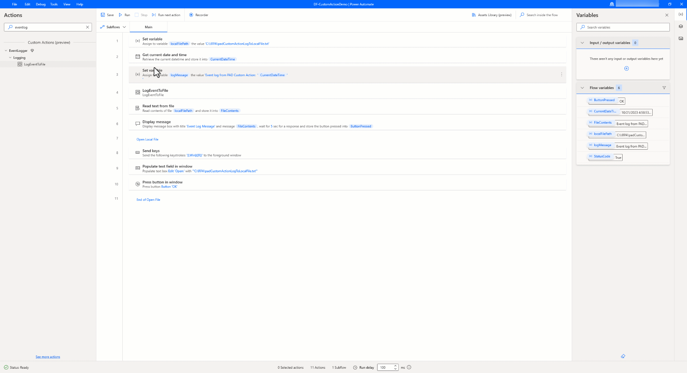
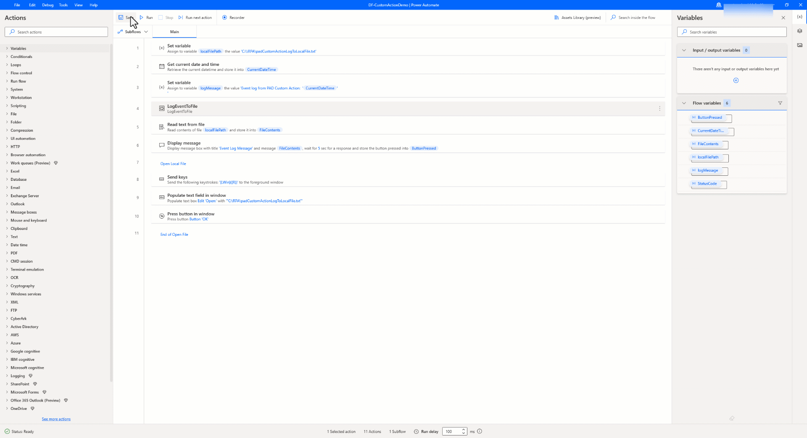

# How to build custom actions in Power Automate for desktop

Enhance productivity, reusability, and extensibility with custom actions in Power Automate for desktop. This article discusses how [custom actions in Power Automate for desktop](../../../desktop-flows/custom-actions.md) can help makers create their own reusable actions that can be used across multiple flows. Makers create custom actions by composing a sequence of steps or functions into a new action. Custom actions are created using the Power Automate for desktop actions SDK, which provides a set of APIs that allow makers to create custom actions using .NET language C#. Custom actions can also be shared with other users through the custom actions section in Power Automate (make.powerautomate.com). In this article, find detailed walkthroughs of how to create, build, deploy, use, and update custom actions.

> [!IMPORTANT]
> While the essential features utilized in creating custom actions are supported, the provided solutions, assets, and sample scripts mentioned here serve as an example implementation of these features and don't include support.

## Overview

Custom actions capability in Power Automate for desktop allows you to create your own reusable actions that can be used across multiple desktop flows. Custom actions save you time and effort by allowing you to reuse complex or frequently used actions without having to re-create them each time you build a new flow. Makers can apply their existing skills and knowledge to create custom actions that integrate with other systems and services. Additionally, pro-developers can wrap the existing functions or code libraries to make a new custom action that results in increased reusability of organizational assets.

You create custom actions by composing a sequence of methods or functions into a new action. Once you create a custom action, use it in any desktop flow by dragging and dropping it onto the Power Automate desktop designer canvas.

Custom actions can be shared with other users through the custom actions section in Power Automate, which provides a central repository for sharing and discovering custom actions. This means that users can benefit from the expertise and knowledge of others in the organization and can easily find and use custom actions created by other makers.

Overall, custom actions in Power Automate for desktop provide a powerful way to extend the functionality of the product, streamline the flow-building process, and foster collaboration and innovation within the organization.

## Prerequisites

- Latest version of Power Automate for desktop – [Install Power Automate](../../../desktop-flows/install.md#install-power-automate-using-the-msi-installer)
- C# authoring tool such as [Visual Studio Community/Professional/Enterprise 2022](https://visualstudio.microsoft.com/vs/) with the .NET desktop development workload
- Custom actions SDK – [NuGet Gallery | Microsoft.PowerPlatform.PowerAutomate.Desktop.Actions.SDK](https://www.nuget.org/packages/Microsoft.PowerPlatform.PowerAutomate.Desktop.Actions.SDK/)
- Digital certificate:
  - Generate a self-signed certificate – [Generate Self-Signed Certificates Overview – .NET](/dotnet/core/additional-tools/self-signed-certificates-guide#with-powershell)
  - Enterprise deployment – Your organization’s trusted certificate from certificate authority – [Digital signatures and certificates – Office Support](https://support.microsoft.com/office/digital-signatures-and-certificates-8186cd15-e7ac-4a16-8597-22bd163e8e96)
- SignTool:
  - [Using SignTool to sign a file – Win32 apps](/windows/win32/seccrypto/using-signtool-to-sign-a-file)
  - [SignTool](/windows-hardware/drivers/devtest/signtool)
- Windows PowerShell Script (.ps1) – [Create custom actions – Power Automate](../../../desktop-flows/create-custom-actions.md#packaging-everything-in-a-cabinet-file)
  
## Create your own custom action

1. Open Visual Studio to create a new project using template of **Class Library (.NET Framework)**.
   :::image type="content" source="media/padca-1.png" alt-text="Screenshot of Create C# project dialog box." lightbox="media/padca-1.png" border="true":::

1. Configure your new project with a project name, file location, and set the **Framework** as **.NET Framework 4.7.2**.
   > [!NOTE]
   > Make sure to follow the naming conventions. More information: [Custom module name conventions](../../../desktop-flows/create-custom-actions.md#custom-module-name-conventions)

   :::image type="content" source="media/padca-2.png" alt-text="Screenshot of Create C# class library details." lightbox="media/padca-2.png" border="true":::

1. In Visual Studio, select **Tools** > **NuGet Package Manager** > **Package Manager console**.

   :::image type="content" source="media/padca-3.png" alt-text="Screenshot of .NET Package Manager." lightbox="media/padca-3.png" border="true":::

1. Open a PowerShell window and install NuGet package **PowerAutomate.Desktop.Actions.SDK** using this PowerShell command.

   ```powershell
   Find-Package Microsoft.PowerPlatform.PowerAutomate.Desktop.Actions.SDK
   NuGet\Install-Package Microsoft.PowerPlatform.PowerAutomate.Desktop.Actions.SDK
   ```

1. Follow the steps in [Create custom actions](../../../desktop-flows/create-custom-actions.md) to create the Class file for your custom action.

## Information you can use as reference for your action

Reference solution archive: [.NET Module Solution](https://github.com/jpad5/pad-customaction-logevent/blob/main/ModulesLogEvent.zip)

**Action**: Write a message to a local file.

**Input parameters**: File name, message to write to the file.

**Output parameters**: Status code – true if successful and false if not successful.

**Class Definition**:

```csharp
using System;
using System.IO;
using Microsoft.PowerPlatform.PowerAutomate.Desktop.Actions.SDK;
using Microsoft.PowerPlatform.PowerAutomate.Desktop.Actions.SDK.Attributes;

namespace ModulesLogEvent
{
    [Action(Id = "LogEventToFile" , Order = 1, Category = "Logging")]
    [Throws("LogEventError")]
    public class LogEventToFile : ActionBase
    { 
        [InputArgument]
        public string LogFileName { get; set; }

        [InputArgument]
        public string LogMessage { get; set; }

        [OutputArgument]
        public bool StatusCode { get; set; }
    
        public override void Execute(ActionContext context)
        {
            try
            {           
                    // To append all of the text to the file
                    File.AppendAllText(LogFileName, LogMessage);
                    StatusCode = true;  
            }
            catch (Exception e)
            {
                if (e is ActionException) throw;

                throw new ActionException("LogEventError", e.Message, e.InnerException);
            }
        }
    }
}
```

### Resources

This table lists the descriptions and friendly names for parameters in a *Resources.resx* file.

|Name     |Value    |Comment  |
|---------|---------|---------|
| LogEventToFile_Description    | Custom action to log message to the supplied file    | Action description        |
| LogEventToFile_FriendlyName     | LogEventToFile    | Action name               |
| LogEventToFile_LogFileName_Description   | Input parameter of text type    | Action input description  |
| LogEventToFile_LogFileName_FriendlyName  | LogFileName   | Action input name         |
| LogEventToFile_LogMessage_Description    | Input parameter of text type  | Action input description  |
| LogEventToFile_LogMessage_FriendlyName   | LogMessage   | Action input name       |
| LogEventToFile_StatusCode_Description    | Output parameter of boolean type  | Action output description |
| LogEventToFile_StatusCode_FriendlyName   | LogMessage        | Action outputName         |
| ModulesLogEvent_Description              | Module to manage log events     | Module description        |
| ModulesLogEvent_FriendlyName             | LogEvent       | Module name               |

## Build the package and deploy your custom action

Create the package and deploy to Power Automate.

1. Acquire the digital certificate so the custom action DLL file can be signed.
   > [!IMPORTANT]
   > Self-signed certificates are only for test purposes and aren't recommended for production use. For organizational deployment of custom actions in your environment, we recommend you use a trusted digital certificate that follows your organizational guidelines.

   > [!TIP]
   > To streamline the process of developing and using custom actions for Power Automate for desktop across your organization, you can bundle a trusted digital certificate with the Power Automate for desktop installer that is distributed through SCCM/Appstore. > This will enable the certificate to be installed automatically on both makers and unattended runtime machines that require Power Automate for desktop, without any need for additional actions.

   For this example, a self-signed certificate is used.

   1. Create a self-signed certificate using this  script.

      ```powershell
      $certPFXFileName="C:\PADCustomAction\PADCustomActionCert.pfx";
      $certCERFileName="C:\PADCustomAction\PADCustomActionCert.cer";
      $certStoreLocation="Cert:\LocalMachine\AuthRoot";
      $certname = "PADCustomActionSelfSignCert"
      ##Create certificate
      $cert = New-SelfSignedCertificate -CertStoreLocation Cert:\CurrentUser\My -Type CodeSigningCert  -Subject "CN=$certname" -KeyExportPolicy Exportable -KeySpec Signature -KeyLength 2048 -KeyAlgorithm RSA -HashAlgorithm SHA256
      $mypwd = ConvertTo-SecureString -String <YOUR CERT PASSWORD GOES HERE> -Force -AsPlainText
      ##Export certificate
      $certPFXFile = Export-PfxCertificate -Cert $cert -FilePath $certPFXFileName -Password $mypwd
      $certCERFile = Export-Certificate -Cert $cert -FilePath $certCERFileName -Type CERT -Verbose -Force
      ```

   1. Import the certificate into certificate store using this command.

      ```powershell
      ##Import certificate
      Import-Certificate -CertStoreLocation $certStoreLocation -FilePath $certCERFile
      ```

   1. Validate that the imported certificate appears under **Trusted Root Certification Authorities** > **Certificates** in Certificates Microsoft Manager Console (MMC) snap-in.

1. Finalize the custom module created by signing the DLL file using a trusted certificate. Use Visual Studio’s developer command prompt to use the Signtool for this activity.

   ```powershell
   Signtool sign /f "C:/PADActions/PADCustomActionCert.pfx" /p <YOURCERTPASSWORD> /fd SHA256 "C:/PADActions/PADCustomActionEventLog/Modules.LogEvent.dll"
   ```

1. To deploy the custom action, build the package the contents into a cabinet file (.cab) by using this PowerShell script.

   ```powershell
   .\BuildCAB.ps1 "C:/PADActions/PADCustomActionEventLog" "C:/PADActions/PADCustomActionEventLog" PADCustomActionEventLog.cab
   ```

   [Go to the sample script file BuildCAB.ps1](https://github.com/jpad5/pad-customaction-logevent/blob/main/BuildCAB.ps1)

1. Sign the generated cabinet file using Signtool.

   ```powershell
   Signtool sign /f "C:/PADActions/PADCustomActionCert.pfx" /p <YOURCERTPASSWORD> /fd SHA256 "C:/PADActions/PADCustomActionEventLog/PADCustomActionEventLog.cab"
   ```

1. Go to the Power Automate custom action section to upload the custom action that you created. Provide the name, description, and cabinet file and then select **Upload**.

   :::image type="content" source="media/padca-12-1-new.png" alt-text="Screenshot of importing custom action package (CAB file) in Power Automate portal" lightbox="media/padca-12-1-new.png" border="true":::

   You receive a notification when the action is successfully uploaded.

Following these steps, the custom action module is packaged into a cabinet file and signed with a trusted certificate. Additionally, the custom action cabinet file is uploaded to the custom action library in Power Automate.

More information: [Upload custom actions](../../../desktop-flows/upload-custom-actions.md)

## Use your custom action activity in desktop flow using Power Automate for desktop

1. Create a new desktop flow, and then select the **Assets Library** in the designer.

   :::image type="content" source="media/padca-14-new.png" alt-text="Screenshot of Navigate to Asset Library in Power Automate for desktop" lightbox="media/padca-14-new.png" border="true":::

1. Inspect the custom action available in the assets library. Notice the action previously created and uploaded to the custom actions section of Power Automate.

   Select **Add** to add this custom action to the **Actions** section of the designer.

   :::image type="content" source="media/padca-15-new.png" alt-text="Screenshot of Add custom action from Asset Library" lightbox="media/padca-15-new.png" border="true":::

1. Validate that the custom action is added successfully. Search for it on the **Actions** search bar in Power Automate for desktop's designer.

   :::image type="content" source="media/padca-16-1.png" alt-text="Screenshot of Search for custom action in Power Automate for desktop" lightbox="media/padca-16-1.png" border="true":::

1. Drag the custom action or double-click it to add to the desktop flow.

1. Provide the input parameters and additional steps to test the custom action.

   :::image type="content" source="media/padca-19.png" alt-text="Screenshot of Input parameters for custom action" lightbox="media/padca-19.png" border="true":::

   Sample desktop flow using the custom action.

   :::image type="content" source="media/padca-18.png" alt-text="Screenshot of Using custom action in Desktop flow" lightbox="media/padca-18.png" border="true":::

1. Test the flow to see the custom action working in real time.

   

> [!NOTE]
> Import the certificate used to sign the cabinet file to the machine used to build desktop flows with custom actions and to each of the runtime machines that will run the desktop flows.

Following these steps, a custom action was created, the module packaged into a cabinet file, signed with a trusted certificate, uploaded to the custom action library in Power Automate, a desktop flow to use the custom action created and tested for a successful run.

## Update and redeploy the custom action

Update the functionality of the custom action  to reflect the updated capability by following these steps.

1. Update the class file in Visual Studio solution with new action functionality.  More information: [Updated .NET Module solution](https://github.com/jpad5/pad-customaction-logevent/blob/main/ModulesLogEvent-v2-updated.zip)

   Modified the signature of the class file to take in a third input parameter as shown.

   ```csharp
   using System;
   using System.IO;
   using Microsoft.PowerPlatform.PowerAutomate.Desktop.Actions.SDK;
   using Microsoft.PowerPlatform.PowerAutomate.Desktop.Actions.SDK.Attributes;

   namespace ModulesLogEvent
   {
    [Action(Id = "LogEventToFile" , Order = 1, Category = "Logging")]
    [Throws("LogEventError")]
    public class LogEventToFile : ActionBase
    { 
        [InputArgument]
        public string LogFileName { get; set; }

        [InputArgument]
        public string LogMessage { get; set; }

        [InputArgument]
        public string LogLevel { get; set; }

        [OutputArgument]
        public bool StatusCode { get; set; }
    
        public override void Execute(ActionContext context)
        {
            try
            {
                    // To append all of the text to the file
                    File.AppendAllText(LogFileName, LogLevel + ": " + LogMessage);
                    StatusCode = true;
            }
            catch (Exception e)
            {
                if (e is ActionException) throw;

                throw new ActionException("LogEventError", e.Message, e.InnerException);
            }
        }
     }
   }
   ```

1. Use similar steps described earlier where you sign the DLL file, create the cabinet file, sign the cabinet file, and upload the cabinet file to custom actions section in Power Automate. More information: [Build the package and deploy your custom action](#build-the-package-and-deploy-your-custom-action)
   > [!NOTE]
   > Before uploading the updated custom action cabinet file, make sure to analyze the impact of this change as desktop flows with this action will be updated with new capabilities.

   :::image type="content" source="media/padca-20-new.png" alt-text="Screenshot of updating the custom action in Power Automate Portal" lightbox="media/padca-20-new.png" border="true":::

1. Update the desktop flow as required.

   To validate the update capability, we added a third input parameter to the custom action. Notice that custom action activity is marked as Error in the designer, and it needs to be updated with new input parameter.

   :::image type="content" source="media/padca-24.png" alt-text="Screenshot of refactoring the desktop flow" lightbox="media/padca-24.png" border="true":::

   :::image type="content" source="media/padca-25-new.png" alt-text="Screenshot of updated custom action with additional input parameters" lightbox="media/padca-25-new.png" border="true":::

1. Test the flow to see the updated custom action working in real time.

   

In this section, you updated the underlying functionality of the custom action, built the package, deployed to Power Automate, refactored the desktop flow, and validated the functionality by running the desktop flow with updated capabilities of the custom action in Power Automate for desktop.
