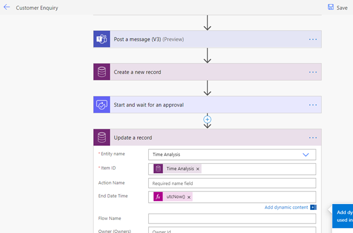

# Adding analytical data to Microsoft Dataverse

To identify bottlenecks in an automation, you can set up actions
within the automation that log the start time of each activity or step. You
can do this by creating a table that records the step name, start time, and
end time.

This way, you can keep track of how long it took for each end-to-end run of
automation to be completed, and possibly find ways to make your
automation even better.

If you store this data in Dataverse, you can use Power BI to identify which part of the process took the longest time to complete.

> [!div class="nextstepaction"]
> [Next step: Decision-making flowchart for your design](decision-making-flow.md)

[!INCLUDE[footer-include](../../includes/footer-banner.md)]