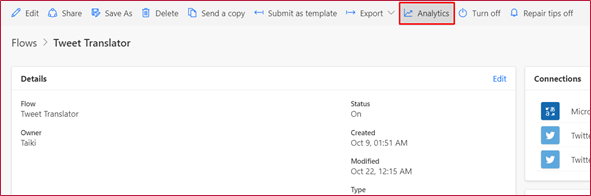
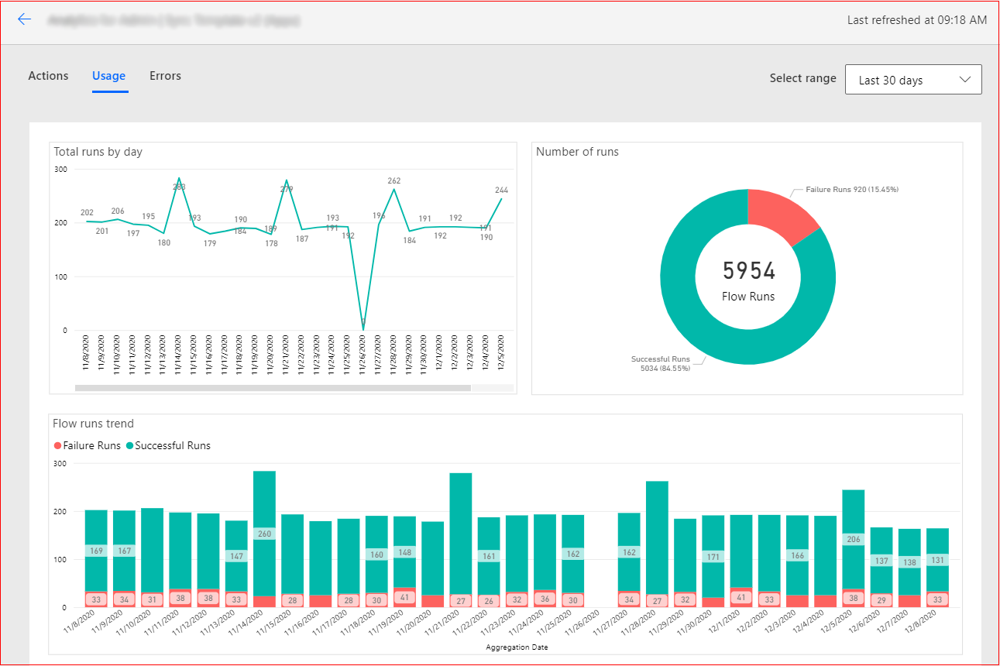
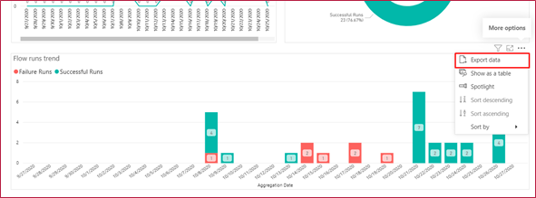
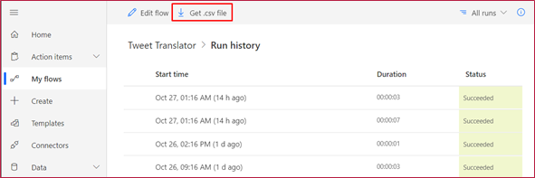
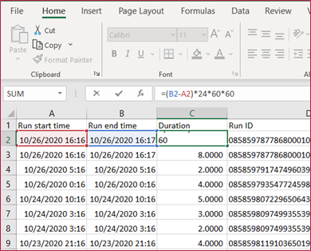
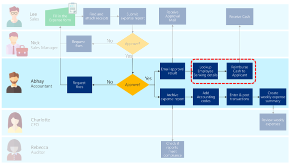
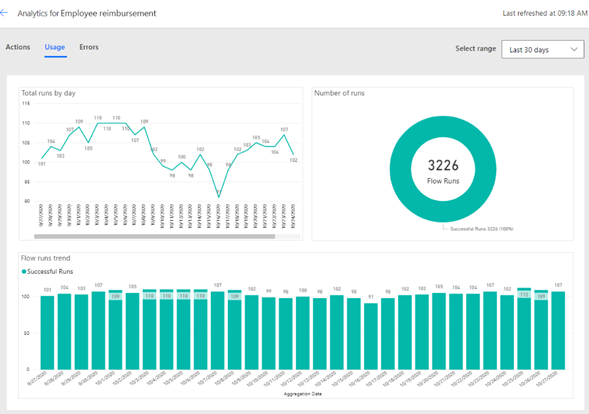

# Assessing the business impact of the automation

After you've successfully deployed your automation, you can assess its impact
by comparing your original business process against your new process, using the
success metrics you defined. Your automation results are stored for 30 days,
during which you can view them to analyze the total number of actions and runs
in a day.
<!--markdownlint-disable MD036-->
**To view flow analytics**

1. Go to **My flows**.

2. Select the flow you want to analyze.

3. Select **Analytics**.

   

4. Select the **Usage** tab.

   

## Get the number of flow runs

The **Usage** tab shows you how many times in a day the flow has been used to automate a
particular business process.

**To export run data to an Excel workbook**

1. Hover over the graph that shows the data you want to export.

2. Select **More Options**.

3. Select **Export data**.

   

4. Select the file format you want (Excel workbook or CSV).

5. Select **Export**.

## Get the flow run duration

**To see the duration of each flow run**

1. Go to **My flows**.

2. Select the flow you want to analyze.

3. In the 28-day run history, select **All runs**.

4. If you want to export the information, select **Get .csv file.**

   

The CSV file includes start time and end time of each run. You can use Excel to
recalculate the duration and do additional analysis (such as finding the average duration).
To get the duration in seconds, use the following formula:

&nbsp;&nbsp;&nbsp;(**Run end time** cell &minus; **Run start time** cell) &times; 24 &times; 60 &times; 60

To get the average duration, obtain the total the number of durations, and 
divide it by number of runs (no. of rows).

Now that you have the number of runs and duration of the runs, you'll be able
to find out how much time your automation has saved by comparing it with the
previous manual process.

## Example scenario

Let's take the scenario from cash reimbursement as an example.

Previously, Abhay's accounting team had to key in accounting
codes, enter transactions, and post transactions in the accounting system based on the
information they received in the approval email attached to the expense report. Let's say that in the automation planning phase,
Abhay measured how long this takes and recorded that it
took three minutes to look up the employee's banking details and another five minutes to
reimburse the applicant from the online banking website.

Based on the flow run analytics, Abhay can see that the automation ran between 91 to
110 times a day, for an average of 107 runs.

The [duration of the automation](#get-the-flow-run-duration) obtained is 40 seconds on average. Therefore, the time reduced per run is:

&nbsp;&nbsp;&nbsp;Time before automation (3 minutes &plus; 5 minutes) &minus; time after automation (40 seconds) = 440 seconds

Because the automation ran 3,226 times in 30 days, total time saved is:

&nbsp;&nbsp;&nbsp;Reduced time (440 seconds) &times; number of runs (3,226 times) = 1,419,440 seconds =
394.28 hours

> [!div class="nextstepaction"]
> [Next step: Diagnosing performance issues](discover-performance-issues.md)

[!INCLUDE[footer-include](../../includes/footer-banner.md)]