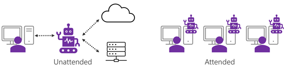
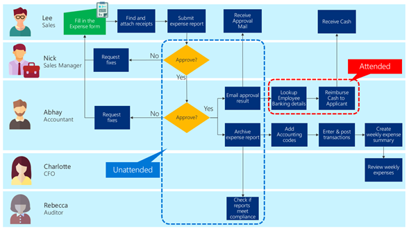

### Attended
With any of the automation methods you use, the automation is going to be either
attended or unattended.

#### Attended (human initiated) scenarios

This is a scenario where automations are executed when users are in-front of the
computer. It is suited for scenarios where you want to automate tasks and
processes at an individual level. The automations are often triggered manually
whenever the user wants to run them. The process may include steps that require
human interactions or decisions between steps.

#### Unattended (fully automated) scenarios

This is a scenario where a designated computer or a server will be set up to run
the automation on behalf of a user. The whole automation process is run fully by
Power Automate, and no interaction or decision is made by a human (with the
exception of
[approval](https://docs.microsoft.com/power-automate/modern-approvals) flows, in
which the person doing the approving is considered to be technically a “3rd
party” to the automation). The automation process can be triggered automatically
from another system or service or on a schedule.

| **Attended**                                                                               | **Unattended**                                              |
|--------------------------------------------------------------------------------------------|-------------------------------------------------------------|
| Requires human interactions or decisions                                                   | No human interaction or decisions required                  |
| Manually triggered                                                                         | Automatically triggered                                     |
| Login is not required because the automation assumes that the system is already logged in. | Windows Login is automated with predefined user credentials |

You can use a combination of attended and unattended automation in your
solution.

In the expense report example, the approval process could be automated with
unattended automation. The cash reimbursement might be better suited to attended
automation because Abhay may want to check the details of the bank transaction
as a final confirmation.

