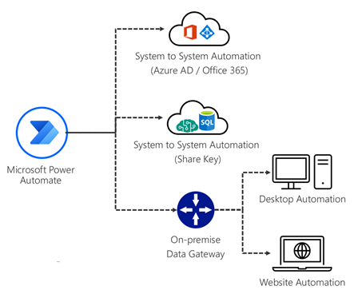
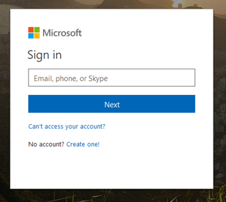
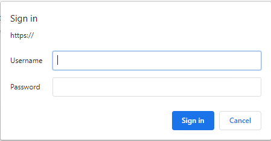
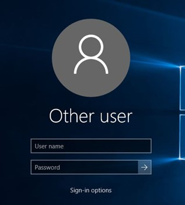

# Authentication and security

Your automation will probably access data and systems that are protected
by requiring users to sign in. Different automation scenarios require Power
Automate to use different authentication methods.

Before you set up your automation, you should ask yourself how you currently
sign in to the systems or computers to do the tasks manually. Below are some
examples of different types of authentication (sign-ins) that can be used when
automating with Power Automate.

To set up the automation, make sure you have the necessary authentication
(sign-in) information ready. You'll need this information when you're [making a new connection](../../add-manage-connections.md) to set up your automation, setting up to [access data via an on-premises data gateway](../../add-manage-connections.md#connect-to-your-data-through-an-on-premises-data-gateway),
or when using [desktop flows](../../desktop-flows/introduction.md).

## On-premises data gateway

For desktop and website automation, an on-premises data gateway is required so that programs that are installed on the on-premises computers (for example, browser extensions and Power Automate Desktop) can be accessed from the Power Automate cloud-based
service. More information: [Install an on-premises data gateway](/data-integration/gateway/service-gateway-install)

## Authentication by using Microsoft 365 and Microsoft Entra ID

This is the authentication for any automation that you use with Microsoft
services. When the automation is run, it runs on behalf of the user
who's running the automation and not the user who set up the automation originally.

## Authentication by using a username and password

This type of authentication is used for systems and services that have an
independent system other than what's used with Microsoft 365 and Microsoft Entra ID, with a separate username and password. Sign-ins for services such as Google, Facebook, and
Twitter all have their own methods for authentication. Some enterprise systems provide
[single sign-on (SSO)](/azure/active-directory/manage-apps/what-is-single-sign-on).

In the expense reporting example, the online banking system has its own sign-in ID and password.

## Authentication by using an on-premises system or Windows sign-in

This type of authentication will be required if you're planning to automate with the Power Automate Desktop application or desktop flows. It's separate from Microsoft 365 or Microsoft Entra ID. If a computer is connected to a corporate
network, it's highly likely that it uses Windows Server Active Directory.

## Authentication by using a shared key

This authentication is usually used for online services and is used for
system-to-system (API) automation where the services are shared across the
company. This is typically provided and set up by your IT department, where the
connector is shared with you.

> [!div class="nextstepaction"]
> [Next step: Defining inputs and outputs](define-input-output.md)

[!INCLUDE[footer-include](../../includes/footer-banner.md)]