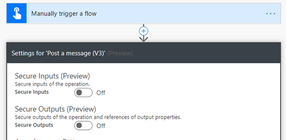
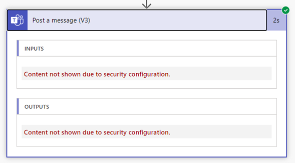

# Defining inputs and outputs

In any automation, there will be an input and an output. Before you start automating processes
with Power Automate, you need to define what these are. 

The following example shows how you can define the inputs and outputs.

In the expense approval scenario, Abhay must take the following steps to reimburse
an applicant who submits an expense form:

1.  Abhay receives an approval request for an expense report.

2.  Abhay decides whether to approve or decline the request.

3.  If the request is approved, Abhay sends an email to the employee to let them know.

The following table shows the information required in this scenario.

| Information required       | Input or output?    | Purpose                                                     |
|----------------------------|---------------------|-------------------------------------------------------------|
| Employee's name            | Input               | To send an email if the expense is approved                     |
| Employee's email           | Input               | To send an email if the expense is approved                     |
| Employee's employee number | Input               | To search in the employee management system for the banking number. |
| Approval result            | Output              | To send an email if the expense is approved                     |
| Approver's name            | Output              | To send an email if the expense is approved                     |
| Approver's email           | Output              | To send an email if the expense is approved                     |
| Approval date and time     | Output              | To send an email if the expense is approved                     |

This might look overwhelming, but the majority of the inputs can be retrieved
automatically. For example, the employee's name and email can be retrieved if
the automation is triggered manually by the employee.

## Securing inputs and outputs

If you're handling sensitive data such as sign-in IDs, passwords, and banking
information, you can use the secure inputs and outputs feature in
Power Automate.

By default in Power Automate, you can see inputs and outputs in the run history for a flow. When you enable secure inputs and outputs, you can
protect this data when someone tries to look into the inputs and outputs and instead display the message "Content not shown due to security
configuration."

> [!div class="nextstepaction"]
> [Next step: Handling sensitive text](../../desktop-flows/run-desktop-flow.md#use-sensitive-text-inputs)

[!INCLUDE[footer-include](../../includes/footer-banner.md)]