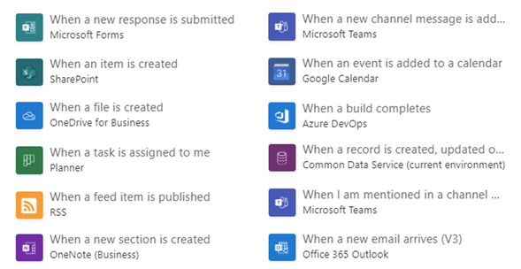
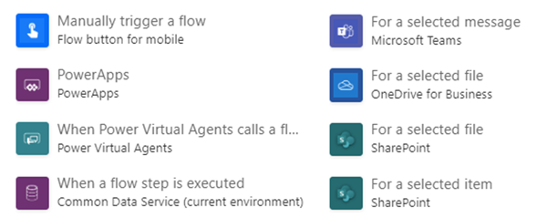
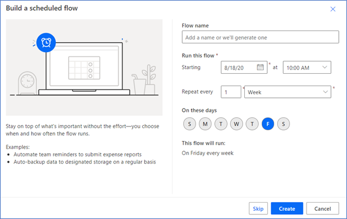

# Determining which automation method to use

After the process design is complete, the next step is architectural design, where
you focus on how you'll automate that process.

First you determine what kind of connector you can use (if any), and then choose a trigger to start the automation.

## Choose an automation method

Ideally, all the systems you want to automate will have Power Automate connectors.
Check the [list of connectors](/connectors/custom-connectors/) to see whether
connectors are available for the system you plan to automate. After you
find the connector, make sure that the actions you need are available for that
connector. For example, a connector for an email system will need actions for
"send," "reply," and "delete."

If there are no connectors available, you have the following options to choose from:
- **Create a custom connector**: This is the preferred method of automation if you're a developer or your organization has a developer who can create
custom connectors. A custom connector allows the automation to interact with the target system via a published API. This API should be resilient to system changes. More information: [Create a custom connector from scratch](/connectors/custom-connectors/define-blank)

- **Use the HTTP connector**: If you're a developer and have one-off scenarios where you need to connect to
systems that have no connectors available&mdash;but you don't want to set up custom
connectors&mdash;your next-best method is to use an HTTP connector. More information from Azure Logic Apps documentation: [Add an HTTP trigger](/azure/connectors/connectors-native-http#add-an-http-trigger)

- **Create a web browser automation**: If you can't find a connector, and if the system is a web browser&ndash;based
application or a website, you should consider web browser automation. 
Web browser automation mimics keyboard inputs and mouse movements as if a human were using the browser. You can [build a browser automation](../../desktop-flows/actions-reference/webautomation.md) process with Power Automate Desktop.

- **Create a desktop application automation**: If you can't find a connector, and if the system is a desktop application on
a PC, this is the automation method to use. Power Automate has capabilities that mimic human keyboard inputs and mouse movements. For desktop application automation, you [create a new Power Automate Desktop process](../../desktop-flows/create-flow.md) with Power Automate Desktop.

The following table compares the different methods.

| Method                         | Ease of use | Requires a development background?                   | Easily affected by system changes? | Requires setup or development time? |
|--------------------------------|-------------|---------------------------------------------------|-----------------------------------|-----------------------------------|
| Connector                      | Easiest     | No                                                | No                                | None                              |
| Custom connector               | Easy        | Yes                                               | No                                | Yes                               |
| HTTP connector                 | Easy        | Yes                                               | No                                | No                                |
| Web browser automation         | Easy        | No, but a basic knowledge of CSS and HTML is preferable | Yes                               | Yes                               |
| Desktop application automation | Easy        | No                                                | Yes                               | Yes                               |
 
In complex automation scenarios, you can combine all these methods.

## Choose a trigger to start the automation

With all the automation methods discussed earlier, you need to consider how to *trigger*
(start) these automations. The ways you can trigger an automation include:

- Automated triggers
- Instant or manual triggers
- Scheduled triggers

### Automated triggers

With an *automated trigger*, the system automatically starts the automation when
a condition is met. (Note that not all connectors include automated triggers.)

Examples of automated triggers include:

- When an email is received in Outlook
- When a new file is moved to OneDrive
- When a new row is created in Microsoft Dataverse
- When an item is modified in a custom SharePoint list

An example use case for the expense report might be to set an automated trigger
to start an approval flow when a new row is created in the Expense Approvals
table in Dataverse. This ensures, for example, that when a form is created with Power Apps, which creates a new row in Dataverse, an approval flow is automatically triggered.

### Instant or manual triggers

An *instant* or *manual* trigger is a type of trigger where a user needs to either manually start the automation, or the trigger is instantaneously started. This can be triggered directly from a [instant flow](../../mobile/mobile-create-flow.md), or a Microsoft service.

### Scheduled triggers

*Scheduled triggers* run at a specific date and time, and are
repeated periodically. They're useful for situations where you need to
automate a task that occurs daily, weekly, or monthly.

In the expense report example, the accounting team might use a scheduled trigger to send an automated email every Friday when the weekly BI report is ready.

> [!div class="nextstepaction"]

## Next step

[Attended and unattended scenarios](attended-unattended.md)

[!INCLUDE[footer-include](../../includes/footer-banner.md)]
