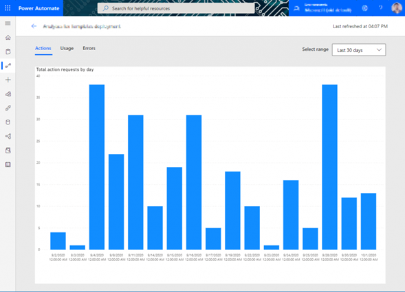
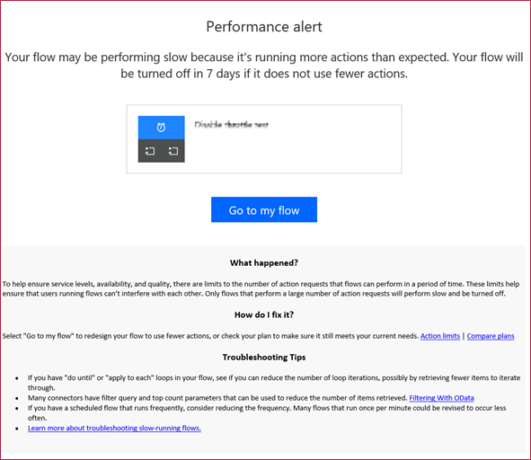

# Diagnosing performance issues

If you're experiencing delays or slowdowns during your flow execution, it might be
that you've reached your Power Automate limits for the day. More information: [Request limits and allocations](/power-platform/admin/api-request-limits-allocations)

## Action analytics

To review whether your automation has reached its limits, you can use action analytics to get better insight into how much
you're using your actions.

**To see action analytics**

1.  Go to **My flows**.

2.  Select the flow you want analytics for.

3.  Select **Analytics.**

4.  Select the **Actions** tab.

When your automation has slowed down, it's a good idea to revisit your flow
design and check for additional efficiency that can help reduce the number of actions
being executed.

For flows that are consistently getting delayed due to overages, flow owners
also receive a notification informing them about these overages with tips and
tricks about how to keep flow run execution from being delayed.

The following image shows an example of an email that was sent for a flow that was consistently running up against action limits.

## Limits from connected services

Similar to Power Automate, most web services and apps also tend to implement
service protection limits and abuse-detection algorithms.

A misconfigured flow can sometimes reach these limits, which usually manifest as errors \[429\] or timeouts \[5xx\] in your flow runs. It's important to note that
these limits vary based on the connector or service you're using within your
flow.

[!INCLUDE[footer-include](../../includes/footer-banner.md)]
