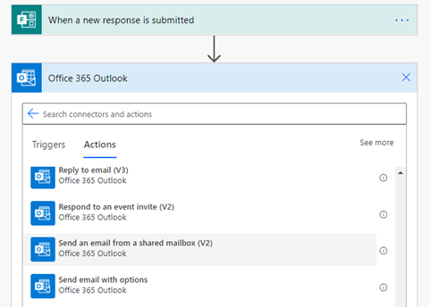

# Formalizing messages and alerts

When sending email notifications and Microsoft Teams messages, sometimes you might
not want to send them as yourself but you still want to ensure that people
who receive them can reach you.

## Use shared senders

Sending messages from Power Automate as yourself is fine in small cases, but
as the process gets more formalized, we recommend sending messages as a shared
sender. This helps recipients know the message was sent via automation rather
than as personal nag. It has the added benefit that people won't try to bug you
directly in response to something that's meant to be purely informational. For
the Microsoft Teams connector, we have a few "Post as the Flow bot" actions that
are well suited to this. Outlook has a "Send an email from a shared mailbox" action,
though you'll need to bring your own mailbox. This advice also applies to
updating tickets, creating records, and so on, but the specifics will vary by
connector.

## Add a signature

When using automation to send emails and post messages, you want people to know
where they're coming from. A shared mailbox helps the recipient realize that the
message isn't coming from you directly. However, in case the
automation breaks or starts triggering too quickly, you should
be easily reachable to correct the problem. This is especially important if the
automation works with people outside your organization or in external systems where the
recipient might not be aware of your flow. People might even want to contact you to
suggest ways to improve your flow! We use a signature like "Sent with
Power Automate. Contact \<your email\> with questions." You might also find it
helpful to link to the specific flow so that you can find it quickly if someone
forwards you the email.

> [!div class="nextstepaction"]
> [Next step: Reducing risk and planning for error handling](reducing-risk.md)

[!INCLUDE[footer-include](../../includes/footer-banner.md)]