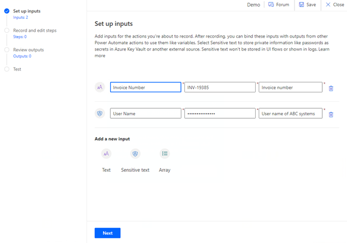

# Handling sensitive text

<!--Need to update the links to docs for sensitive text. I could only find in Legacy area.-->
If you need to securely store and pass sensitive text inside web browser or
desktop automation, you can [define the input as sensitive text](../../ui-flows/inputs-outputs-desktop.md)
and store it in [Azure Key Vault](https://docs.microsoft.com/azure/key-vault/general/overview). This is different from the secure inputs and outputs feature. Whereas secure inputs and outputs mask the
data that has entered a specific action, and can be applied to any action (if the action supports secure inputs and outputs), sensitive text is used to set up passing data to desktop flow
actions.

In this expense approval scenario, Abhay must take the following steps to reimburse
an applicant who submits an expense form:

1.  Abhay checks the employee management app in Power Apps to look up the
    applicant's banking information.

2.  Abhay signs in to the online banking system.

3.  Abhay copies the employee's banking information to the online banking system
    and copies the requested reimbursement amount from the expense report.

4.  Abhay submits the electronic banking request to send the money.

This scenario involves some highly sensitive information, such as bank account
details and the reimbursement amount. You can use secure input and secure
output to protect the information.

|  Information required      | Input or output?    |    Purpose                                                  |
|----------------------------|---------------------|-------------------------------------------------------------|
| Employee's name            | Input               | To send an email if expense is approved                     |
| Employee's email           | Input               | To send an email if expense is approved                     |
| Employee's employee number | Input               | To search in the employee management system for the banking number. |
| Bank account number        | Secure input        | To reimburse the employee                                   |
| Bank sort code             | Secure input        | To reimburse the employee                                   |
| Bank name                  | Secure input        | To reimburse the employee                                   |
|                            |                     |                                                             |
| Payment result             | Output              | To keep a record of the payment result                            |
| Payment amount             | Secure output       | To keep a record of the payment result                            |

> [!div class="nextstepaction"]
> [Next step: Transforming and formatting data](transforming-formatting-data.md)