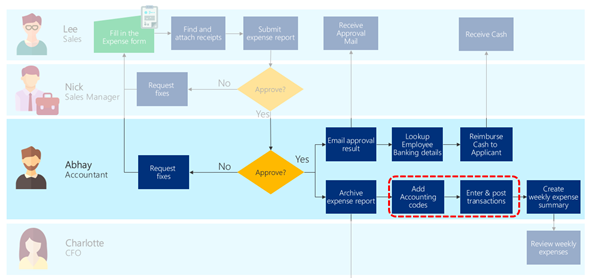
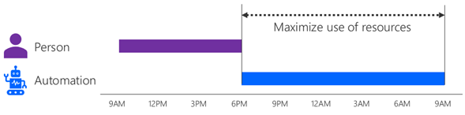
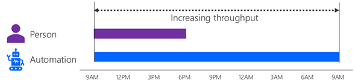
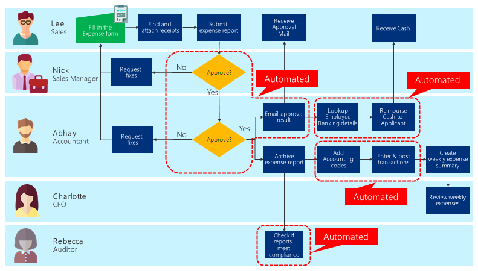

# Process design

When you design a process automation, the first step is to decide when and what
to automate. Looking at the business process you currently have, you should
first identify which part of the process to automate.

## Identifying automation areas

The types of benefits you can potentially gain by automation falls into these
categories:

- Consistently apply standardized business rules

- Reduce manual work on repetitive processes

- Reduce human error

- Streamline approvals

- Gain efficiency in high-volume transactions

- Efficiently move data between systems (reduce manual data entry)

- Maximize the use of available resources

- Increase throughput

## Apply standardized business rules

Business rules are the if/then logic that applies your business policies.
Automating them ensures that they'll be followed consistently every time.

In our sample expense reporting scenario, a business rule requires that if
an expense report amount exceeds \$10,000, it needs to also be approved by
the CFO. By automating the process, Abhay ensures that no high-dollar expense report
will slip by unnoticed.

## Automate repetitive processes

Automating repetitive processes can help your employees avoid mental and
physical burnout. Processes that are done the same way every time should be high
on your list to consider for automation.

For example, Abhay the accountant must collect expense forms and receipts from
everyone. The receipts might be a paper receipt from a restaurant or paper
invoices from vendors. Abhay has to manually scan these papers into a PDF file
and store it. Abhay also needs to enter what's written on the paper and post
it in the financial system for every expense report submitted.

## Reduce human error

Tasks like copying and pasting values from one system to another, or keying in
data from paper forms, are processes where human errors can occur.

An example case for the expense reporting scenario is where Abhay needs to
reimburse cash to the employee by looking up the employee banking details, then
accessing the banking system.

:::image type="complex" source="media/before-reminder-automation.png" alt-text="Possible areas of business process to automate for reducing human error.":::
   Diagram showing a business process flow for Abhay the accountant. Two steps in the process ("Lookup employee banking details" and "Reimburse cash to applicant") are circled in red to indicate the potential areas where Power Automate can reduce human errors by automating these steps.
:::image-end:::

## Streamline approvals

A different type of error occurs when people forget to perform their tasks. You can set up automation to remind them to work on the task or process that they've been
assigned.

For example, Lee has submitted an expense report but Nick hasn't
responded to the approval request for some time. An automation can be set up to
remind Nick to make a decision, and even provide a button to respond directly
from the reminder.<!--note from editor: Should there be a "before reminder automation" image in this section? -->

:::image type="complex" source="media/after-reminder-automation.png" alt-text="Possible areas of business process to automate for streamlining business process.":::
   Diagram showing a business process flow for Abhay the accountant. The approval process is altered so that a reminder for approvals is automated by setting up a trigger automation to check status. If approval is complete, the automation is ended; and if approval is not complete, a reminder is sent to the approver and the reminder automation will be run again to check until the approval is completed.
:::image-end:::

## Gain efficiency in high-volume processes

Another area you may want to automate are high-volume processes.
High-volume processes are processes that occur very frequently on a daily basis.
It is closely tied to repetitive processes but is slightly different. You may have a process that can only have a step or two that can be automated.
However, if a process must be done many times, even small improvements can have large impacts.

For example, if the expense reporting scenario holds for 1,000 salespeople, each
minute of improvement would equate to two working days' worth of time
saved. Analyzing the actual impact can be done by using the [analytics features](analyze-and-assess.md).

## Automate data entry

You might be manually entering data because you have two systems that don't
talk to each other. In our expense reporting scenario,
this is where Abhay inputs data into the accounting
system by reentering values from the submitted expense report.

## Maximize the use of available resources

Additional good automation candidates are those processes that can be run
independent of human interaction. This type of process isn't as easy to identify, so the best way is to imagine whether there are processes that can be completed outside your normal business
hours. Such an automation acts as a "multiplier" of your people and fully uses your
other resources (such as PCs).

You might also use automation for processes that take too much time compared
to a human interaction, but is tolerable if done during night time when there's
no rush for the automation to finish. For example, if a person starts their
day by processing orders that came in overnight, you might create
automation that processes the orders as soon as they come in, so that your team can start
fulfilling the orders first thing in the morning.

## Increase throughput

Similar to maximizing the use of available resources, automation also helps you
increase the throughput of a particular process. With this type of automation,
your current process can be performed by humans in parallel with the automation.

For example, Abhay the accountant may be the only person processing the expense
reports and their standard work hours may be between 9 AM to 6 PM. By setting up an
automation, you could also have Power Automate to process the expense reports as well, and therefore have both Abhay and the automation to process it, resulting
in a higher throughput.

## Example scenario

When all of the automation areas are applied, the example below shows how an
expense reporting business process can be covered by Power Automate with improvements to throughput, maximizing the available resources, automating data entries as well as streamlining approvals.

> [!div class="nextstepaction"]
> [Next step: Determining which automation method to use](determine-automation-methods.md)

[!INCLUDE[footer-include](../../includes/footer-banner.md)]
