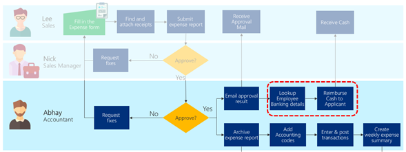
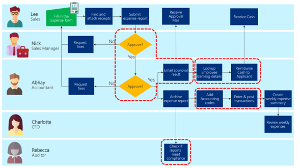

# Process design

When you design a process automation, the first step is to decide when and what
to automate. Looking at the business process you currently have, you should
first identify which part of the process to automate.

## Identifying automation areas

The types of benefits you could potentially gain by automation falls into these
categories:

-   Consistently apply standardized business rules

-   Reduce manual work on repetitive processes

-   Reduce human errors

-   Gain efficiency in high volume transactions

-   Efficiently move data between systems (reduce manual data entry)

-   Increase throughput

-   Maximize use of available resources

-   Streamline approvals

-   Reminders

## Apply standardized business rules

Business rules are the “if/then” logic that applies your business’ policies.
Automating them ensures they will be followed consistently every time.

In our sample expense reporting scenario, there may be a business rule that if
an expense report amount exceeds \$10,000, then it needs to also be approved by
the CFO. By automating the process, Abhay ensures no large-amount expense report
slips past un-noticed.

## Automate repetitive processes 

Automating repetitive processes can help your employees avoid mental and
physical burnout. Processes that are done the same way every time should be high
on your list to consider for automation.

For example, Abhay the accountant must collect expense forms and receipts from
everyone. The receipts could be a paper receipt from restaurants or paper
invoices from vendors. Abhay would have to manually scan these papers into a PDF
and store it. He also would need to enter what is written on the paper and post
it in the financial system for every expense report submitted.

## Reduce human errors 

Tasks like copying and pasting values from one system to another, or keying in
data from paper forms, are potential processes where human errors could occur.

An example case for the expense reporting scenario is where Abhay needs to
reimburse cash to the employee by looking up the employee banking details, then
accessing the banking system.

A different type of error is when people forget their tasks. Automation can be
set up to remind those people to work on the task / processes that they are
assigned.

An example scenario is if Lee has submitted the expense report but Nick has not
responded to the approval request for some time. An automation can be set up to
remind Nick to make a decision (and even provide a button to respond directly
from the reminder).

## Gain efficiency in high-volume processes

This type of process is closely tied to the repetitive processes. If a process
must be done at high volumes, small improvements still could provide large
impacts.

For example, if the expense reporting scenario were for 1000 salespeople, each
minute of improvement would be an equivalent of 2 working days’ worth of time
reduction.

## Automate data entry 

You might be manually entering data because there are two systems that do not
talk to each other..

In the example scenario, this would be where Abhay inputs data into the finance
system by copying values from the submitted expense report.

When all of the automations area are applied, the example below shows how an
expense reporting business process will be covered by Power Automate.

## Maximize use of available resources

Another good automation candidate are those processes that could be run
independent of human interaction.

This type of process is not as easy to identify, so the best way is to imagine
whether there are processes that can be completed outside your normal business
hours. The automation acts as a “multiplier” of your people and fully uses your
other resources (such as PCs).

You may also use automation for processes that would take too much time compared
to a human interaction, but is tolerable if done during night time when there is
no rush for the automation to complete. For example, if a person starts their
day by processing orders that came in online overnight, you could create
automation that processes the orders as they come in so that your team can start
fulfilling the orders in the morning.

## Increase throughput 

Similar to maximizing the use of available resources, but slightly different, is
increasing the throughput of a particular process. With this type of automation,
your current process co-exists with the automation in parallel.

## Example scenario

When all of the automations area are applied, the example below shows how an
expense reporting business process will be covered by Power Automate.

