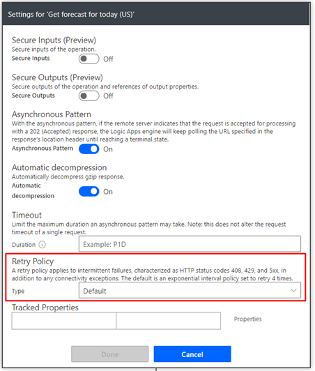
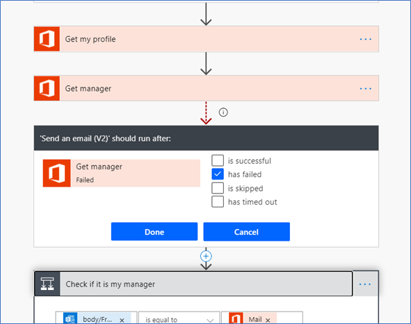
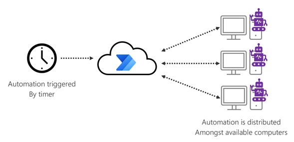

# Reducing risk and planning for error handling

Always assume your automation can fail.

No system is perfect. When you're designing your first set of
automated processes, it's easy to forget the importance of designing for when things
fail to work correctly.

You should always design your automation so that there's a plan B&mdash;to make
sure your business process can continue even if the automation doesn't work.
This isn't to suggest that Power Automate is an unreliable system, but
connecting with different systems increases the risk of failure, which can be
caused by reasons unrelated to Power Automate.

In general, you should consider using connectors whenever possible because they're
more robust and aren't as fragile or easily affected by screen design changes
as web and desktop application automation. If no connectors are available, but you do have web APIs or other methods of system integration, you
should consult your IT pro or development teams to help you set up [custom connectors](/connectors/custom-connectors/).

**Possible failures with automation by using connectors**

-   Shutdown of connecting systems due to maintenance

-   System unavailability due to software bugs

-   Changes to how systems are connected (API versions change)

**Possible failures with web application automation**

-   Screen design changes (so the bot can't tell how to proceed)

-   System unavailability due to regression

**Possible failures with desktop application automation**

-   Screen design changes (so the bot can't tell how to proceed)

-   Operating system updates

-   System unavailability due to regression

**Possible failures common with any automation**

-   Changes to passwords

-   Momentary network issues

## Retry policy

You can use this feature of Power Automate to set up policies that will
automatically retry an action if it fails. By default, this is set to retry four times, but you can change it if you need.

## Set up custom failure notifications

If actions still fail, standard capabilities in Power Automate notify the owners of the
automation with a message similar to the following image.

 listed had an unusual number of failures in the past week and may need your attention'")

However, if you'd like to send a custom notification, you can set it up by 
adding actions that run only if the previous steps have failed.

Normally, by default, all actions that are set up will run only if the previous
step was successful. You can change this behavior by setting the action to run only
when the previous step failed&mdash;so that, for example, an email is sent to a custom list of recipients after a failed action.

## Assign multiple owners

Having a single owner for a particular automation can be a risk from an
organizational and administrative perspective. If that owner is absent or
away from the office when a problem occurs, no one else can fix the issue. You
can prevent this by setting up multiple users or groups as owners, to make sure more than one person can edit the automation. More information: [Share a flow](../../create-team-flows.md)

## Reduce risk and increase throughput by setting up a cluster

For a business-critical automation, one of the ways to reduce
failures and risks is by setting up a cluster. A *cluster* is a group of computers
that you can use to run your automation. Power Automate provides [clustering capabilities](/data-integration/gateway/service-gateway-high-availability-clusters)
to run the automation concurrently. This is particularly useful for unattended
scenarios, where you have more than a single computer available to run your
automation.

> [!div class="nextstepaction"]
> [Next step: Adding analytical data to Microsoft Dataverse](adding-analytical-data.md)

[!INCLUDE[footer-include](../../includes/footer-banner.md)]