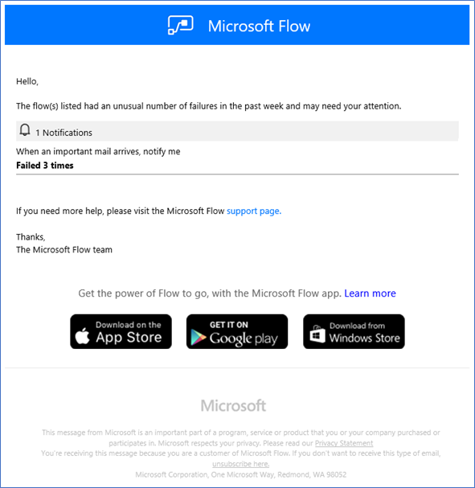
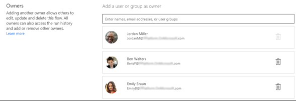

# Reducing risk and planning for error handling

Always assume your automations can fail.

There is no system that is perfect. When you are designing your first set of
automations, it is easy to forget the importance of designing for when things
fail to work correctly.

You should always design your automations so that there is a plan B – to make
sure your business process can continue even if the automation is not working.
This is not suggesting that Power Automate is an unreliable system, but
connecting with different systems increases the risk of failure, which may be
caused by reasons unrelated to Power Automate.

In general, you should consider using connectors whenever possible because it is
more robust and is not as fragile or easily affected by screen design changes
like web and desktop application automations. If there are no connectors
available but you do have web APIs or other methods of system integration, you
should consult your IT or pro-dev teams to help you set up [custom
connectors](https://docs.microsoft.com/connectors/custom-connectors/).

**Possible failures with automation using connectors**

-   Connecting systems shutdown due to maintenance

-   System unavailability due to software bugs

-   Changes to how systems are connected (API versions changes)

**Possible failures with Web application automation**

-   Screen design changes (and therefore bot cannot tell how to proceed)

-   System unavailability due to regression

**Possible failures with Desktop application automation**

-   Screen design changes (and therefore bot cannot tell how to proceed)

-   Operating system updates

-   System unavailability due to regression

**Possible failures common with any automation**

-   Changes to passwords

-   Momentary network issues

## Retry Policy

This feature of Power Automate allows you to set up policies that will
automatically retry the action. By default this is set to retry 4 times, but it
can be changed if required.

## Setup custom failure notifications

If your actions still fail, standard capabilities will notify the owners of the
automations with an email notifications like below:

However, if you would like a custom notification, you can also set it up by
adding actions that runs only if the previous steps have failed.

Normally, all actions that is setup by default will only run if the previous
step is successful, and you can change this behavior by setting it to only run
when it failed so that for example, an email is sent to a custom list of
recipients to send it to.

## Assign multiple owners

Having a single owner for a particular automation could be a risk from an
organizational and administration perspective, in case that owner is absent or
away from office when a problem occurs, but no one else can fix the issue. You
can prevent this by setting up multiple owners or groups to be assigned to make
sure several people can edit the automations.

More information on [sharing
flows](https://docs.microsoft.com/power-automate/create-team-flows)

## Reduce risks and increase throughput by setting up a cluster

If you have an automation that is business critical, one of the ways to reduce
failures / risks is by setting up a cluster. Cluster is a group of computers
which you can use to run your automation. Power Automate provides [clustering
capabilities](https://docs.microsoft.com/data-integration/gateway/service-gateway-high-availability-clusters)
to run the automation concurrently. This is particularly useful for unattended
situations where you have more than a single computer available to run your
automation.

