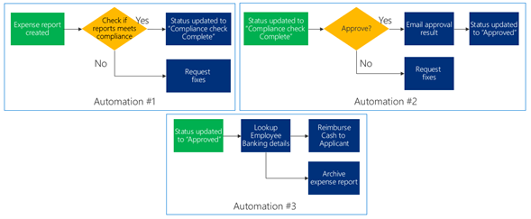

# Separate flows into smaller automations

When you are setting up an automation, try to architect your flows so that you
do not have a single automation that covers the entire process. There are number
of reasons why you should make them into multiple, smaller flows:

-   Maintenance is easier with smaller flows

-   Error handling is less sophisticated

-   You can build the automation with multiple people

No need to restart the automation from beginning if a step fails. In the example
below, there is one automation set up for an approval process, covering multiple
processes with a single automation.

If for example, the cash reimbursement process fails, the whole automation would
be considered a fail. If a requirement or specification for looking up employee
banking details changes, the whole process has to be suspended until the updates
are in place.

Instead, you could separate the automations modularly like below:

Automation \#2 in the example is dependent on the previous automation to
complete the process and set the status of the expense report to “Compliance
check complete”. If there is a problem with the mail system, for example, and
automation \#2 fails, the tasks in Automation \#1 will still be completed, and
only tasks from automation \#2 need to be restarted.
