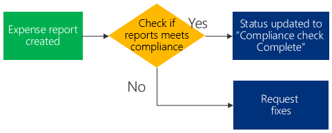

# Testing strategy

Once you have completed making your flows and automation, the next step is for you to test it out.

You should consider testing all possible patterns and outcomes when testing your
flows. This is because your flow may not only fail to work but also to run with
unexpected results, and testing all patterns will reduce this risk.

If you are a new to building automations in Power Automate, testing the
automation each time you add a new step is the best way to ensure you can catch
mistakes, rather than attempting to build the entire flow and then test it.

Let’s take a look at this example below:

You should draw out a table like below to make sure you have covered all
possible combinations that may potentially fail:

| Case No. | Step details                                  | Condition              | Expected result                                                | Actual result |
|----------|-----------------------------------------------|------------------------|----------------------------------------------------------------|---------------|
| 1-1      | Check if report meets compliance              | Compliance met         | Status updated to “Compliance check complete”                  |               |
| 1-2      | Check if report meets compliance              | Compliance not met     | Email sent to employee to fix email                            |               |
| 1-3      | Check if report meets compliance              | Compliance check fails | Notified flow maker and logged failure to “flow runs” feature. |               |
| 2        | Status updated to “Compliance check complete” | Status update fails    | Notified flow maker and logged failure to “flow runs” feature. |               |
| 3        | Email sent to employee to fix email           | Email send fails       | Notified flow maker and logged failure to “flow runs” feature. |               |

## Testing in “Live only” environments

Ideally, all tests should be done in test environments. However, there are
situations where you may not have the environment to test out separately from
live systems. In these cases, you can use the following methods:

**For lookups:** Use static text as the result to mimic a lookup

**For data entry:** Create a step to make new record, followed by another flow
to delete the same record.

**For sending data:** Set up a test environment on the system you would send the
data to if possible.

## Testing with users 

Once you have completed the systematic tests, you should also run a final check
with your users (probably the same people who were working on the process prior
to the automation). This ensures your automation does what is expected and
presents the same outcomes.
