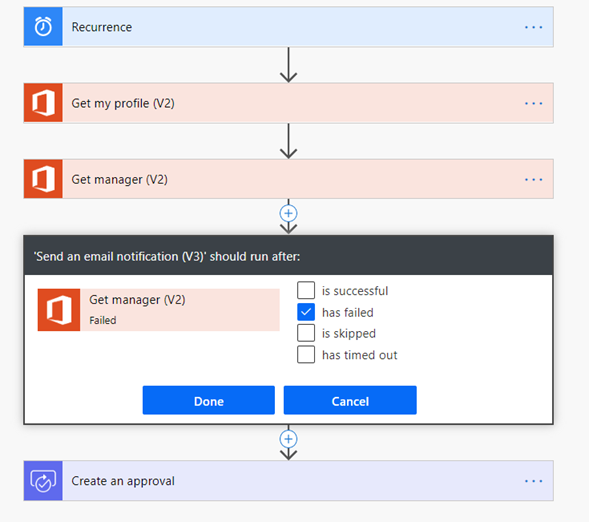

# Tools to test your automation

This article describes the tools you can use to check your flows for basic errors and detect
errors that occur when the automation runs.

## Flow Checker

This tool checks for issues and errors in the automation you've created. After you feel that you've completed setting up your automation, run the
Flow Checker to see if you've made any mistakes. More information:
[Find and fix errors with Flow Checker](../../error-checker.md)

## Repair tips

If your automation fails, repair tips are automatically sent to whoever created
or owns the automation. These tips contain actionable information
about the failure. More information: [Troubleshooting a flow](../../fix-flow-failures.md)

## Custom error notifications

If repair tips don't meet your need for error notifications&mdash;for example, if you need to inform more people than just the owner about any failures&mdash;you can set up custom error notifications by
setting an action that runs only when the previous step has failed.

In the example below, when the **Get manager (V2)** action fails to run, the
**Send an email notification (V3)"**action is executed.

> [!div class="nextstepaction"]
> [Next step: Deploying and refining phase](deploy-to-production.md)

[!INCLUDE[footer-include](../../includes/footer-banner.md)]