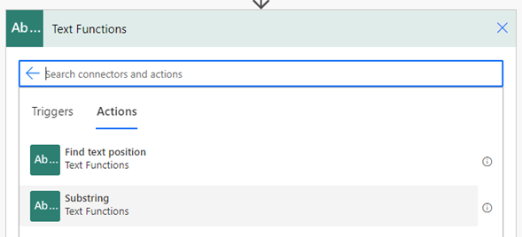
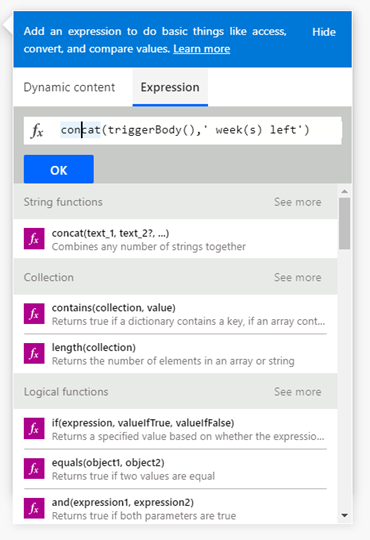

# Transforming and formatting data

It may well be that some of the data you retrieve from a system needs to be transformed
to be understood by other systems used later in the process. For
example, you might need to convert local time to Coordinated Universal Time (UTC), or convert one currency to another. To make your data understandable in another system, you can
convert it into a different format. Be sure to take data formats (and format conversions) into
account when you design your process automation architecture.

Here are some of the ways you can transform and format your data.

## Built-in actions

You can use built-in actions to convert values and strings to different formats.

## Expressions

Expressions are Excel-like equations you can use to convert and manipulate data. 

The lists of different expressions are listed below:

-   [String functions](/azure/logic-apps/workflow-definition-language-functions-reference#string-functions)

-   [Collection functions](/azure/logic-apps/workflow-definition-language-functions-reference#collection-functions)

-   [Logical comparison functions](/azure/logic-apps/workflow-definition-language-functions-reference#logical-comparison-functions)

-   [Conversion functions](/azure/logic-apps/workflow-definition-language-functions-reference#conversion-functions)

-   [Implicit data type conversions](/azure/logic-apps/workflow-definition-language-functions-reference#implicit-data-type-conversions)

-   [Math functions](/azure/logic-apps/workflow-definition-language-functions-reference#math-functions)

-   [Date and time functions](/azure/logic-apps/workflow-definition-language-functions-reference#date-and-time-functions)

-   [Workflow functions](/azure/logic-apps/workflow-definition-language-functions-reference#workflow-functions)

-   [URI parsing functions](/azure/logic-apps/workflow-definition-language-functions-reference#uri-parsing-functions)

-   [Manipulation functions: JSON & XML](/azure/logic-apps/workflow-definition-language-functions-reference#manipulation-functions-json--xml)

For the full list, go to [Reference guide to using functions in expressions for Azure Logic Apps and Power Automate](/azure/logic-apps/workflow-definition-language-functions-reference).

> [!div class="nextstepaction"]
> [Next step: Formalizing messages and alerts](formalizing-messages-alerts.md)

[!INCLUDE[footer-include](../../includes/footer-banner.md)]
