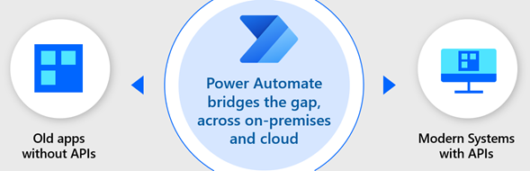
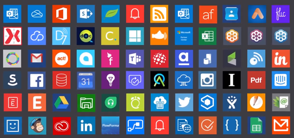

# Types of process automation

This video provides a quick overview of process automation with Power Automate
> [!VIDEO https://learn-video.azurefd.net/vod/player?id=4400df21-c4c8-446b-8e05-921d7ad0c85a]

There are two main types of automation available in Power Automate:

- API-based digital process automation: cloud flows

- UI-based robotic process automation (RPA): desktop flows

## Cloud-based digital process automation (DPA)

You can use Power Automate to automate processes in over 380 applications by using API-based
connectors provided out of the box. Additionally,
software engineers can create new, custom connectors to any application that has
an *API* available. Modern applications (including cloud-based services) use APIs
to provide programmatic access to data and functionality. The API declares a set
of rules for requests, and programmers use the API to interact with the
application.

Without writing any code yourself, you can use connectors to access data and use
a wide variety of application functionality in your automation. For example, you
can use the connectors for SharePoint and your email program to automate the process of adding a new item to a SharePoint list when you receive an email
that has a specific subject line.

## Desktop-based RPA

The next question you might have is: what if I have an application that Power Automate
doesn't have a connector for, and I can't create a custom connector
because the app doesn't have an API? This is where *robotic process automation*
(RPA) comes in. You can use RPA to create automation
even in older systems that don't have an API. With RPA, you
automate applications by teaching Power Automate to mimic the mouse movements
and keyboard entries of a human user, as if a robot were using the computer. In
other words, whereas digital process automation provides API connectors so you can *tell* the application
what to do, with RPA you *show* it what to do.

## DPA or RPA? Or both?

When using Power Automate to automate processes, we recommend that you use digital process automation for any applications that have API-based connectors available, because APIs are meant to be
stable even as the application changes over time. Software vendors work hard
to avoid making changes that break the way existing API rules work.

Conversely, RPA is susceptible to breaking when things change, such as when updates are applied to
a local computer's environment or the layout of an application's screens. Additionally, you must take great care to ensure that you've been
clear in your instructions to the robot. For example, if you selected cell B3 in a
worksheet, do you want the robot to select cell B3 every time? Do you want
it to select the first empty cell in column B? Do you want it to select the cell
in column B for the row where column A is set to a specific value? When using RPA,
it's easy to give instructions or assume that decisions have been made that aren't obvious just
from recording your mouse clicks and keyboard entries. It might take some iteration
to ensure that you've provided all the necessary instructions, including what to do
in case of errors.

Power Automate provides both digital process automation and RPA, to bridge what you can
automate between modern, API-based services and the websites and desktop
applications for which you don't have an API-based connector.

[!INCLUDE[footer-include](../../includes/footer-banner.md)]
