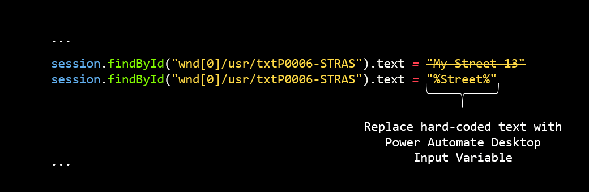

# Add variables to your VBScript

In this step of the RPA Playbook for SAP GUI Automation with Power Automate tutorial, before we switch over to Power Automate Desktop, let's review all the hard-coded value references in your VBScript and decide which ones to replace with dynamic input variables.

## Identify hard-coded values

Variables are used within desktop flow processes to store data for further processing, and their names are enclosed within percentage signs, **%**. Almost every action receives at least one variable as input or produces a variable as output. Every variable has a unique name. Variable names can contain letters, numbers, and underscore ( _ ) characters, and aren't case-sensitive.

Some variable naming examples include:

-   %NewVar%

-   %file\_path%

-   %Street%

The following image shows an example of replacing a hard-coded value with a variable.

:::image type="complex" source="media/replace-text-with-variables.png" alt-text="Screenshot of VBScript code showing a hard-coded field value being replaced with an input variable":::
   Screenshot showing a line of code that reads  session.findById("wnd[0]/usr/txtP0006-STRAS).text = "My Street 13" The next line of code has removed "My Street 13" and replaced it with "%Street%" .
:::image-end:::

<!---->

Your script should look like the following after you've introduced variables.

<!--![A screenshot of the VBScript code with all the variables replaces with the input variables  PA30   EmployeeId    EffectiveDate    Street    City    State    ZipCode  and  CountryCode   session findById  quot wnd 0  quot   maximize session findById  quot wnd 0  tbar 0  okcd quot   text    quot PA30 quot  session findById  quot wnd 0  quot   sendVKey 0 session findById  quot wnd 0  usr ctxtRP50G PERNR quot   text    quot  EmployeeId  quot  session findById  quot wnd 0  usr tabsMENU_TABSTRIP tabpTAB01 ssubSUBSCR_MENU SAPMP50A 0400 subSUBSCR_TIME SAPMP50A 0330 ctxtRP50G BEGDA quot   text    quot  EffectiveDate  quot  session findById  quot wnd 0  usr tabsMENU_TABSTRIP tabpTAB01 ssubSUBSCR_MENU SAPMP50A 0400 subSUBSCR_ITKEYS SAPMP50A 0350 ctxtRP50G CHOIC quot   text    quot 0006 quot  session findById  quot wnd 0  usr tabsMENU_TABSTRIP tabpTAB01 ssubSUBSCR_MENU SAPMP50A 0400 subSUBSCR_ITKEYS SAPMP50A 0350 ctxtRP50G SUBTY quot   text    quot 2 quot  session findById  quot wnd 0  usr tabsMENU_TABSTRIP tabpTAB01 ssubSUBSCR_MENU SAPMP50A 0400 subSUBSCR_ITKEYS SAPMP50A 0350 ctxtRP50G SUBTY quot   setFocus session findById  quot wnd 0  usr tabsMENU_TABSTRIP tabpTAB01 ssubSUBSCR_MENU SAPMP50A 0400 subSUBSCR_ITKEYS SAPMP50A 0350 ctxtRP50G SUBTY quot   caretPosition   1 session findById  quot wnd 0  tbar 1  btn 5  quot   press session findById  quot wnd 0  usr txtP0006 STRAS quot   text    quot  Street  quot  session findById  quot wnd 0  usr txtP0006 ORT01 quot   text    quot  City  quot  session findById  quot wnd 0  usr ctxtP0006 STATE quot   text    quot  State  quot  session findById  quot wnd 0  usr txtP0006 PSTLZ quot   text    quot  ZipCode  quot  session findById  quot wnd 0  usr cmbP0006 LAND1 quot   key    quot  Country  quot  session findById  quot wnd 0  usr ctxtP0006 STATE quot   setFocus session findById  quot wnd 0  usr ctxtP0006 STATE quot   caretPosition   2 session findById  quot wnd 0  tbar 0  btn 11  quot   press session findById  quot wnd 0  tbar 0  btn 3  quot   press](media/after-replacing-text-with-variables.png)-->

> [!div class="nextstepaction"]
> [Next step: Create a desktop flow that connects to SAP](creating-sap-desktop-flow-vbscript.md)
