# Create a desktop flow that connects to SAP

In this section, we'll create a new flow with Power Automate Desktop and use the previously prepared VBScript code in a **Run VBScript** action within the flow.

1. Select **New flow** in Power Automate Desktop.

2. Enter a name for the flow, and then select **Create**.

   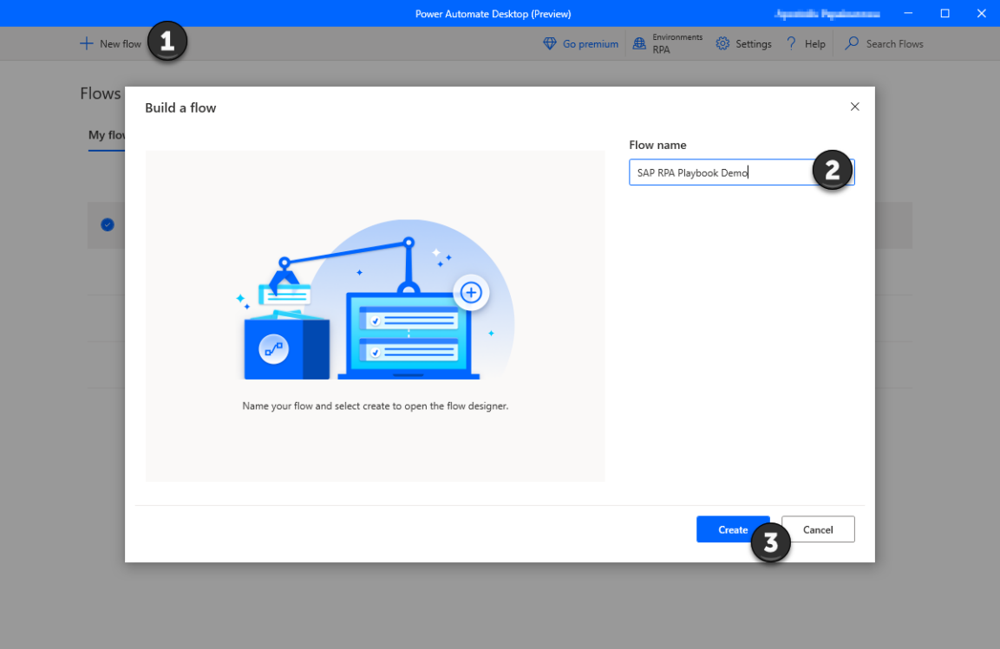

3. Select the Power Automate Desktop designer window, and then select **Variables**.

   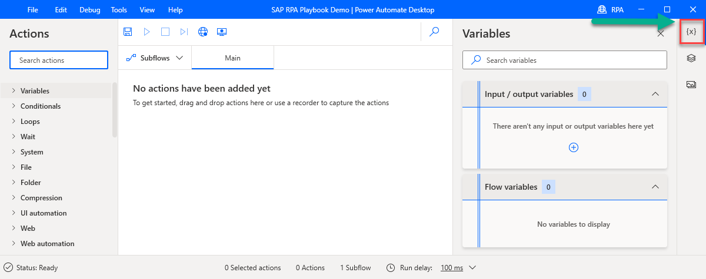

4. Select the plus sign (+), and then select **Input** to create several input variables. You'll pass these variables into the flow from a desktop flow.

   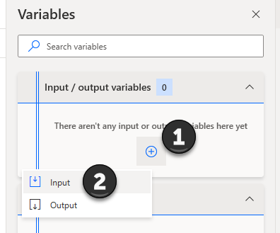

5. First, we'll create a few technical SAP variables, which will be needed in almost all SAP-based automation flows. For each variable, enter the **Variable name**, **External name**, and **Description**, and then select **Update**:

   -   SAPPassword

   -   SAPUser

   -   SAPClient

   -   SAPSystemId

   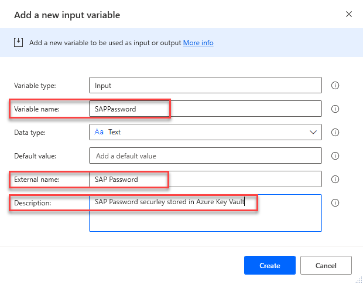

6. Create the following use-case–specific variables:

    -   EmployeeId

    -   AddressType

    -   EffectiveDate

    -   Street

    -   City

    -   State

    -   ZipCode

    -   CountryCode

   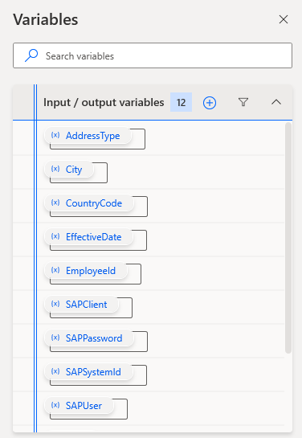

7. In the **Actions** pane, search for **Run application** and then drag it onto the design canvas to create our first process action.

   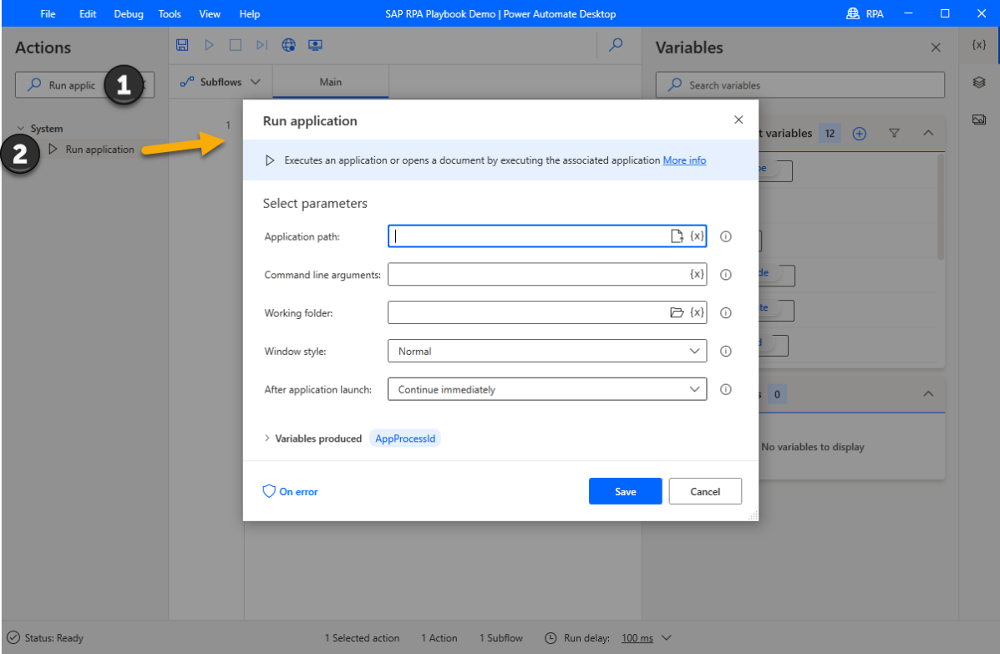

8. Enter the following information in the parameter list, and then select **Save**:

    - **Application Path:** C:\Program Files (x86)\SAP\FrontEnd\SapGui\sapshcut.exe

    -   **Command line arguments:** start -system=%SAPSystemId% -client=%SAPClient% -user=%SAPUser% -pw=%SAPPassword% -maxgui

    -   **Window style:** Maximized

    - **After application launch:** Wait for application to complete

   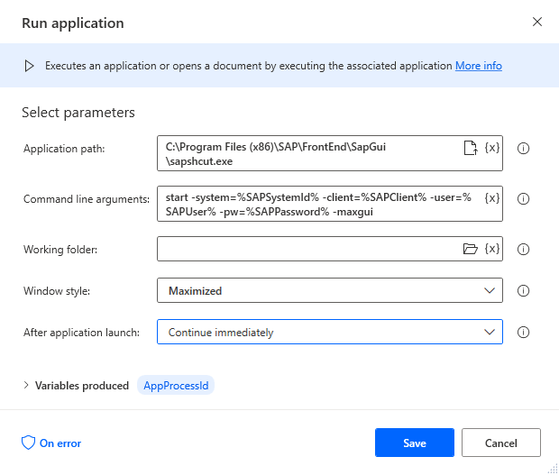

9. Now search for the **Wait** action, drag it onto the design canvas, enter **10** seconds wait time into the **Duration** field, and then select **Save**.

   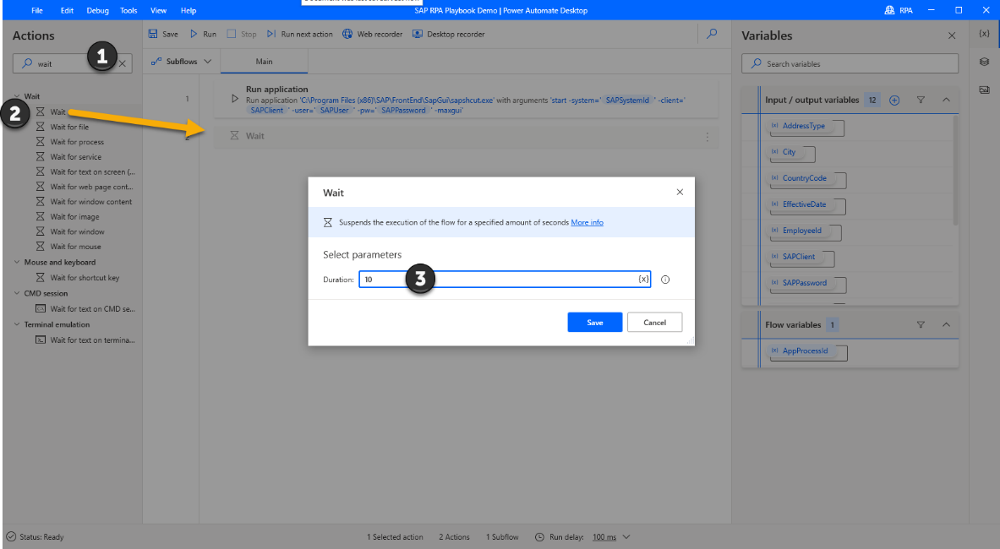

10. Search for the **Run VBScript** action, drag it onto the design canvas, and paste the previously generated and optimized VBScript into the **VBScript to run** field, and then select **Save**.

    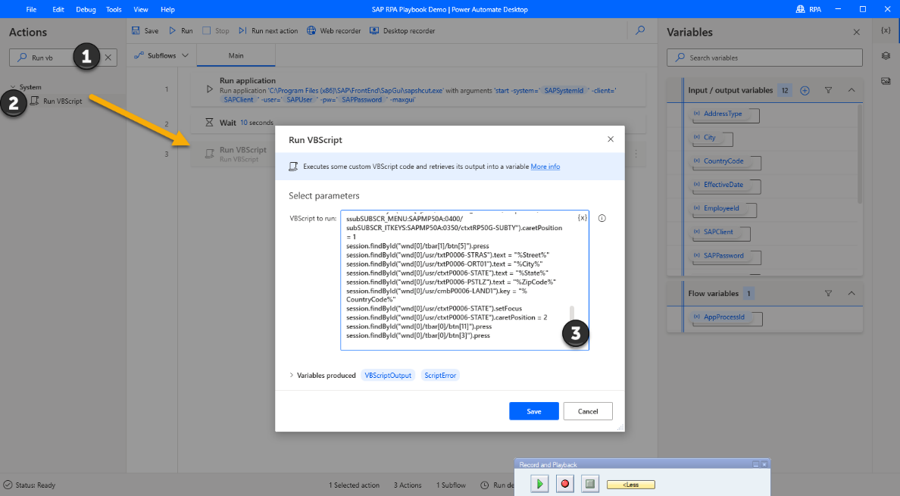

11. Open the **SAP Logon 760** (your version might differ) application, connect to an SAP system, and then sign in to **SAP Easy Access**.

12. In Power Automate Desktop, select the **UI elements** icon on the right pane, expand **Add UI element**, and then select **Add a screen**.

    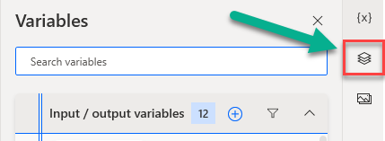

    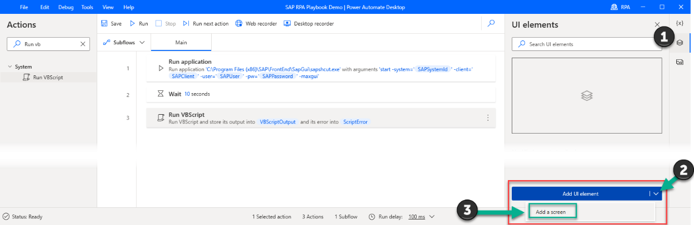

13. Bring **SAP Easy Access** to the foreground, and then hover over the outermost frame of the SAP Easy Access window until a red border labeled **Window** appears. While the border is active, hold down **Ctrl**, and then click to select the window.

    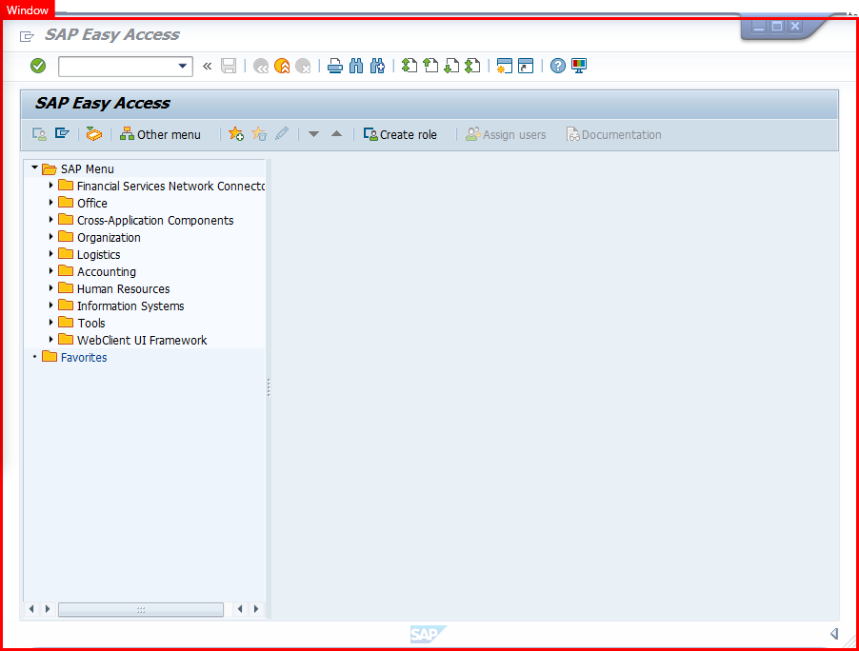

14. Repeat steps 12 and 13 for the **SAP Logon 760** (your version might differ) window. You should now see the following in the UI elements pane.

    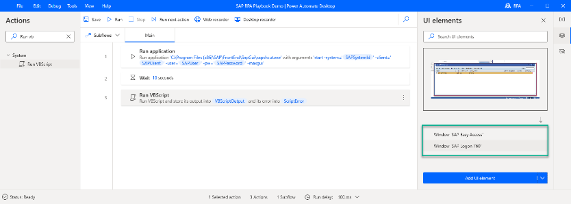

15. Search for the **Close Window** action, drag it onto the design canvas, and then in the **Window** dropdown menu, select **Windows 'SAP Easy Access'**.

    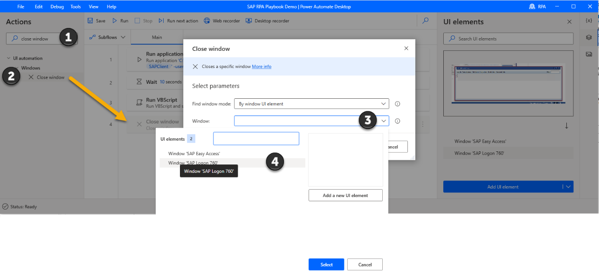

16. Repeat step 15, but this time select **Window 'SAP Logon 760'**.

17. Select **Save**. Your authoring canvas should look like this now.

    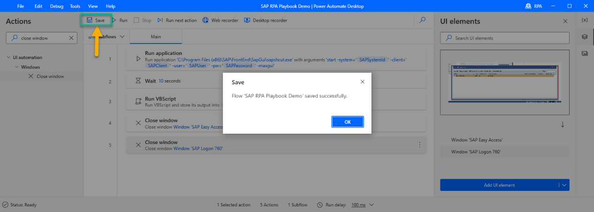

That's it! You've just configured your first SAP GUI automation desktop flow with Power Automate Desktop. In the next step, we'll set up a cloud flow that provides the input variables based on the employee's request.

> [!div class="nextstepaction"]
> [Next step: Create the cloud flow with the Power Automate portal](creating-cloud-flow-to-launch-desktop-flow.md)
