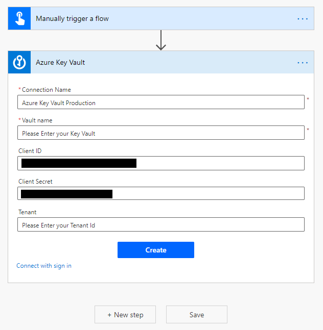

# Create the cloud flow with Power Automate 

Now, we'll create the cloud flow that employees use to request an updated address. This cloud flow passes the input variables to the desktop flow you created in the previous section.

We highly recommended that you create cloud flows, Desktop flows and other Microsoft Power Platform artifacts within solutions to allow for better portability, application lifecycle management (ALM), and encapsulation.

1. Navigate to <https://powerautomate.com> and sign-in with your Azure AD credentials.

2. Confirm that you are in the same environment as the one used to build the Desktop flow with Power Automate Desktop, select **Solutions** and **+ New Solution**.

   

3. Enter a **Display name**, select a **Publisher** and then select **Create**.

   

4. Open the solution by clicking its name.

   

5. Select **+ Add existing**, select the **Desktop flow** you've created in Power Automate Desktop and select **Add**.

   

   

6. Select **+ New** and select **Flow.**

   

7. Give your flow a name and select **Manually trigger a flow** as trigger.

   

8. Create several inputs by selecting **+ Add an input** and selecting the appropriate data type, for all the variables listed in step 9.

   

   

   

9. Add the following inputs to the flow trigger.

   

10. Select **New step**.

    

   >[!NOTE]
   >The following Key Vault action configurations are optional, so if you aren't using Key Vault today, or you just want to test your Desktop flow without it, feel free to skip them.

11. Enter **azure key vault** into the search bar.

    

12. If you don't have an existing Key Vault connection, you'll be prompted to create one. You can sign in either with an **Azure Active Directory user account** or a **Service Principal** (recommended).

    

13. Let's assume you want to connect with Service Principal.

    

14. After you establish the connection, add four **Get secret** Azure Key Vault actions to the canvas, select the secret, and then rename the actions appropriately.

    

15. Select the **…** next to the action name, select **Settings**, turn on **Secure Inputs** and **Secure Outputs**, and then select **Done**. Repeat this step for the other three **Get secret** actions.

    

16. Select the plus sign **(+)**, and then select **Add an action**.

    

17. Enter **scope** into the search bar, and then select the **Scope** action.

    

18. Drag all your Key Vault actions onto the **Scope** container, and then rename it to **Try**.

    

    

19. Search for, and then select the **initialize variable** action to add it under the trigger.

    

20. Enter **Bot failed** as the variable **Name**, **Boolean** as the data **Type,** and **false** as **Value**, and then select **OK** on the expression dialog.

    

21. Add two scope actions. Name them **Catch** and **Finally**.

    

22. On the catch scope, select the **…** next to its name, and then select **Configure run after**.

    

23. Select **has failed**, **is skipped**, and **has timed out**, and then select **Done**.

    

24. Open the setting of the finally block, and then select the settings as shown in the following images.

    

    

25. Search for, and then add the **set variable** action.

    

26. Select the **Bot failed** variable, enter **true** in the expression box, and then select **OK**.

    

    

27. Search for the **condition** action, and then add it within the finally block.

    

28. Select the **Bot failed** variable from the Dynamic content list and then assign it to the **Choose a value** field.

    

29. Set the expression to **false**, and then assign it to the **value** field.

    

30. Within the **If yes** section add a **Send an email (V2)** action.

    

    

31. Select the **User email** from the dynamic content list and add it to the **To** field, provide a **subject** and an email **body**.

    

32. Select **New step** within the try block. Search for **Desktop flows**, and then select the **Run a flow built by Power Automate Desktop** action to add it to the flow.
   
    

33. Select your data gateway and then enter a domain, username, and password for an account that has sufficient privileges to run your desktop flows. 

    >[!IMPORTANT]
    >Your on-premises data gateway must be deployed into the same region as your environment; otherwise, it won't appear in the drop-down list.

    

34. Select the **SAP RPA Playbook Demo** desktop flow and select **Attended – Runs when you're signed** in as the **Run mode**.

    

    

35. Select the **System Id** field, select **value** from the **Get SAP System Id** action output in the the dynamic content list.

    

36. Check the expected date time format in SAP and make adjustments if needed through the formatDateTime function. For example, use **formatDateTime(triggerBody()\['date'\],'dd.MM.yyyy')** to get to a German formatted date of 13.10.2020.

    

    

37. Supply the data for all other fields by selecting the appropriate property from the trigger dynamic content list for the cloud flow.

    

    

38. Select **Save** to save the flow.

    

39. Select **Test**.

    

    <!--Todo: save and test... is it in the UI?-->

40. Select I'll perform the trigger action, and then select **Save & Test**.

    

41. Authenticate if needed, and then select **Continue**.

    

42. Supply all parameters, and then select **Run flow**.

    

43. Select **Done**.

    >[!NOTE]
    >Don't interact with your mouse or keyboard until the process completes.

    

The cloud flow starts and calls the desktop flow, which enters data into SAP.

Congratulations! You've successfully implemented two SAP GUI automation techniques. We're excited to see what you build next with SAP and Power Automate.
