# Validate data with the SAP ERP connector

>[!IMPORTANT]
>This is an optional step.

This is an optional topic that covers the [certified](https://www.sap.com/dmc/exp/2013_09_adpd/enEN/#/solutions?id=s:d0dcda07-de96-4870-bcad-dac797207da5) [SAP ERP connector](/connectors/saperp/) which allows automation developers to connect to SAP through Business API (BAPI) and remote function calls (RFCs). The prerequisites you'll need to meet before performing this check are [described in a blog post](https://powerapps.microsoft.com/blog/introducing-the-sap-erp-connector/).

Let's extend our current scenario to include a validation check that uses the SAP ERP connector to check whether the personnel number supplied to the flow is valid and that the employee is in an active employment state. Depending on the results of this check, we'll decide whether the flow ends.

Here's how the adjusted flow looks.

:::image type="complex" source="media/diagram-of-example-automation.png" alt-text="Diagram of the flow that includes a validation check.":::
   Diagram of the example automation where the employee triggers a cloud flow, the cloud flow validates that the employee ID exists, and then gets the secrets from Azure Key Vault and starts the desktop flow. The desktop flow uses RPA to automate a new address in SAP, and the cloud flow emails a status message back to the employee.
:::image-end:::
<!---->

There are several benefits to employing this approach:

- Avoids unnecessary RPA processing and complex UI-based exception handling.

- Provides a better user experience through near–real-time data validation feedback.

- Frees up virtual machine and bot capacity to run only on validated data.

- Employs data loss prevention policies, allowing or disallowing this connector to be used in conjunction with others.

Follow these steps to adjust the existing flow to incorporate the validation check.

1. Edit the **SAP RPA Playbook Demo Flow** you created in [Create the cloud flow with the Power Automate portal](creating-cloud-flow-to-launch-desktop-flow.md).

1. Under the **Get SAP Client** action, select **New step**.

1. Search for **SAP**, and then select **Call SAP function (preview)**.

   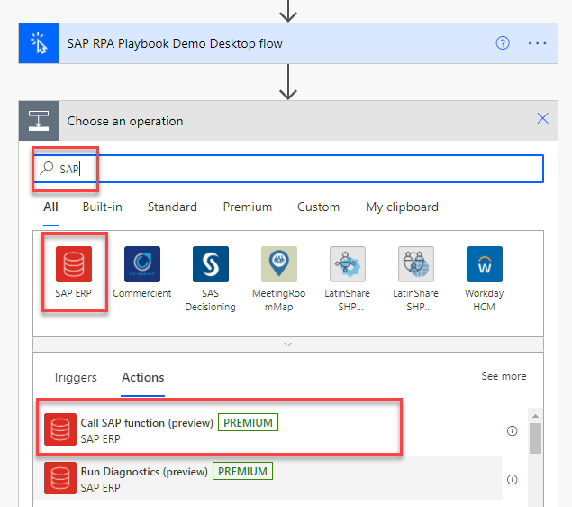

1. For **Authentication Type**, select **SAP Authentication**. Enter the **Data Gateway**, **SAP Username**, and **SAP Password**.

   >[!NOTE]
   >You'll need to supply your credentials manually. You can't use Azure Key Vault secrets here because Power Automate validates the connection at design time.

   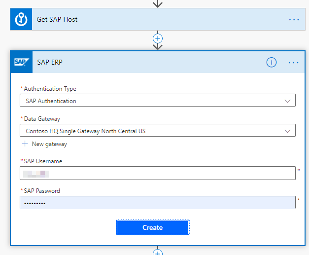

1. Select **More** (**...**), and then select **Settings**.

   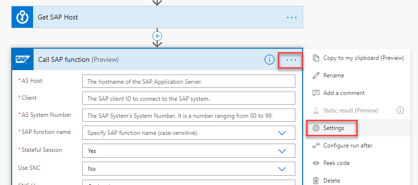

1. Turn on **Secure Inputs** and **Secure Outputs**, and then select **Done**.

   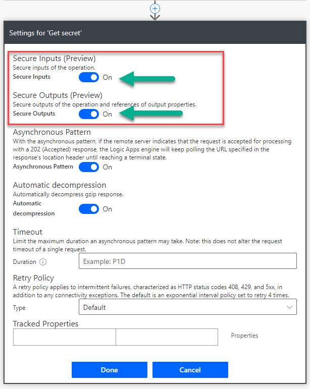

   >[!TIP]
   >Use these settings to hide sensitive text from the run flow history.

1. Rename the action to **Check whether the personnel number exists**.

1. Enter the following information:
   - Enter **AS host**, **Client**, and **AS System Number**.
   - For **SAP function name**, select **BAPI_EMPLOYEE_GETDATA**.
   - For **Stateful Session**, select **No**.
   - For **EMPLOYEE_ID**, enter a valid personnel number.

   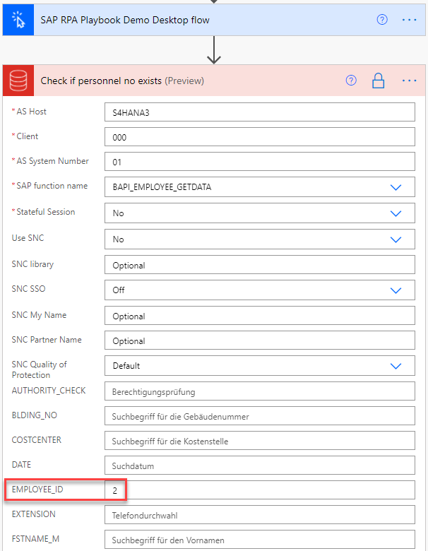

1. Under **Check whether the personnel number exists**, select **New step**.

1. Search for, and select, **Condition**. Rename the condition to something meaningful, and then select the dynamic content **TYPE** for the **Choose value** field.

   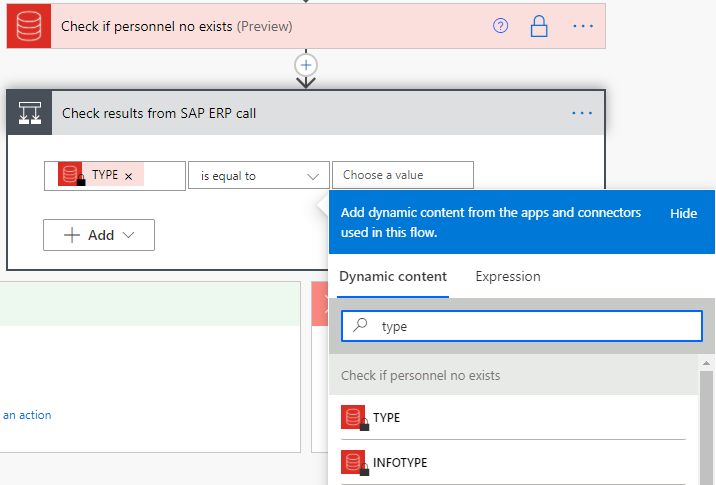

1. Drag the desktop flow action **SAP RPA Playbook** onto the **If yes** box.

   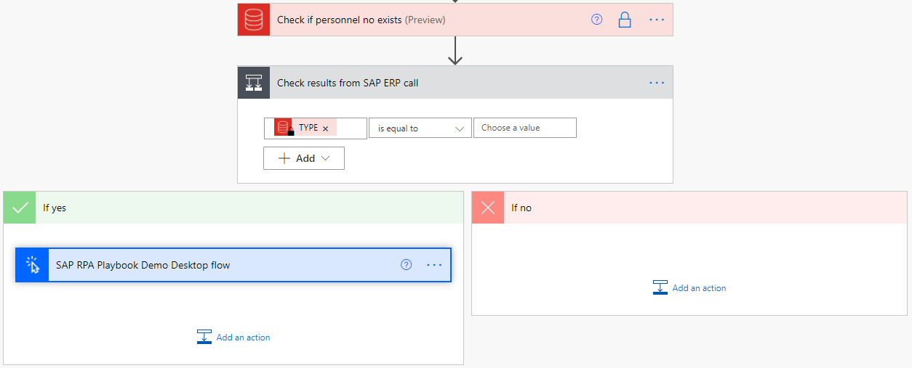

1. In the **If no** box, select **Add an action**, search for **Send an email** and configure the email action as shown in the following screenshot.

    :::image type="complex" source="media/configured-send-email-action.png" alt-text="Screenshot of a configured Send email action under the No branch.":::
   <!--NOTE FROM EDITOR: Needs a long description-->
    :::image-end:::
<!--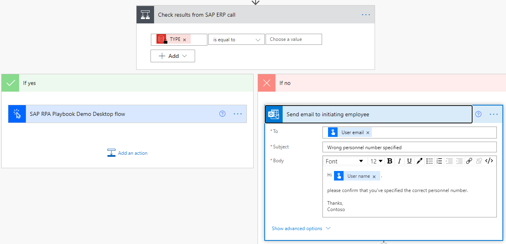-->

1. In the **If no** box and below the email action, select **Add an action**. Search for **Terminate** and configure the **Terminate** action as follows.

    

1. Go back up to the **SAP RPA Playbook Demo Desktop flow** action and enter a  personnel number that doesn't exist into the **EMPLOYEE ID** field.

    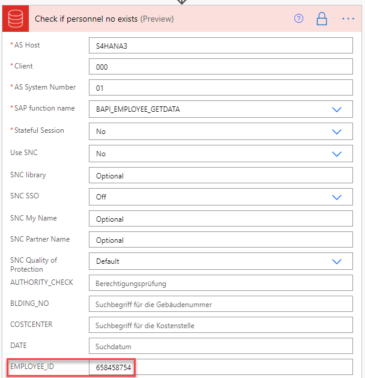

1. Select **Save**, and then select **Test** to test your flow with the nonexistent personnel number.

1. The resulting flow run should look like the following image.

    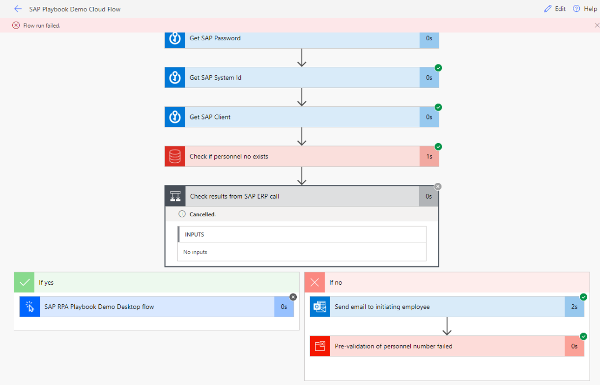

1. Select **Test** again, but this time use valid personnel number. Confirm that the results look like the following image now.

    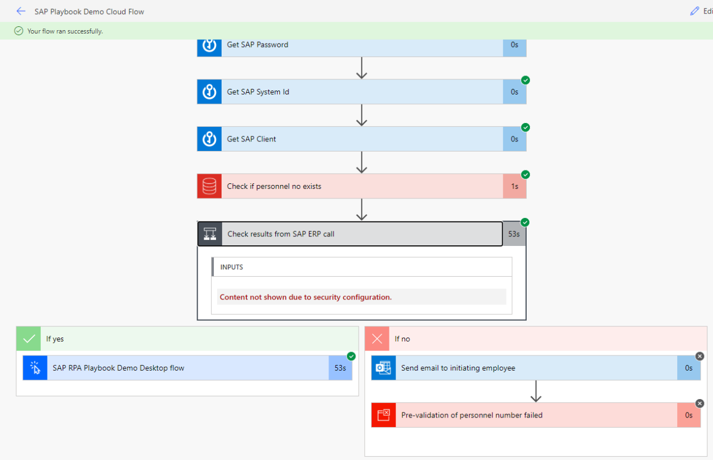

That's it. By incorporating the SAP ERP connector we've made the automation more efficient, intelligent, and user-friendly.

> [!div class="nextstepaction"]
> [Next step: Low-code RPA with SAP GUI in Power Automate Desktop](action-based-sap-gui-automation-manually-overview.md)
