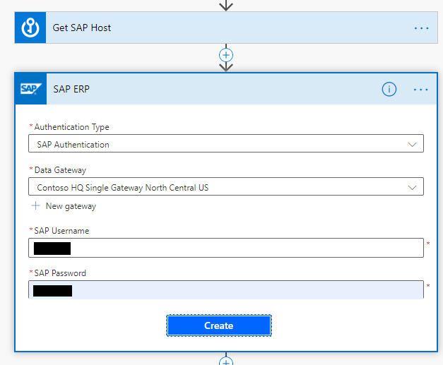

# Validate data with the SAP ERP (preview)

>[IMPORTANT]
>This is an optional step.

<!--Todo what's BAPI-->
This is an optional chapter that covers the [certified](https://www.sap.com/dmc/exp/2013_09_adpd/enEN/#/solutions?id=s:d0dcda07-de96-4870-bcad-dac797207da5) [SAP ERP (preview) connector](/power-platform-release-plan/2020wave1/cdm-data-integration/sap-erp-connector-power-apps-power-automate) which allows automation developers to connect to SAP through BAPI's and RFC's. There are [several pre-requisites that need to be met](https://powerapps.microsoft.com/blog/introducing-the-sap-erp-connector/).

Let's extend our current scenario to include a validation check that uses the SAP ERP connector to check whether the **Personnel no** supplied to the flow is valid and that the employee is in an active employment state. Depending on the results of this check, we'll decide if the flow ends.

Here's how the adjusted flow looks.

There are several benefits to employing this approach.

- Avoids unnecessary RPA processing and complex UI-based exception handling.

- Better user experience through near real-time data validation feedback.

- Frees up virtual machine and bot capacity to run only on validated data.

- Employs data loss prevention policies, allowing/disallowing this connector to be used in conjunction with others.

Follow these steps to adjust the existing flow to incorporate the validation check.

<!--todo: check the numbered sections to confirm they are correct-->

1. Edit the **SAP RPA Playbook Demo Flow** you've created in section [**5.1**](#creating-the-api-flow-with-the-power-automate-portal).

1. Under the **Get SAP Client** action, select **New step**.

3. Search for SAP, and then select **Call SAP function (preview)**.

   

1. Select **SAP Authentication** in  **Authentication Type**, and set the **Data Gateway**, **SAP Username**, and **SAP Password**.

   >[!NOTE]
   >You'll need to supply your credentials manually. You can't use Key Vault secrets here because Power Automate validates the connection at design time.

   

1. Select the three dots, and then select **Settings**.

   

1. Turn on the **Secure Input** and **Secure Output** options, and then select **Done**.

   

   >[!TIP]
   >Use these settings to hide sensitive text from the run flow history.

1. Rename the action to **Check if personnel no exists**.

1. Enter **AS host**, **Client**, **AS System Number**, **BAPI_EMPLOYEE_GETDATA** as **SAP function name**, **No** in the **Stateful Session** field, and enter a valid **Personnel no** as **EMPLOYEE_ID**.

   

1. Under the **Check if personnel no exists** select **New step**.

1. Search for, and select **Condition**. Rename the condition to something meaningful, and then select the dynamic content **TYPE** for the **Choose value** field.

   

1. Drag the desktop flow action **SAP RPA Playbook** onto the **If yes** box.

   

1. In the **If no** box, select **Add an action**, search for **Send an email** and configure the email action as shown in the following screenshot.

    

1. In the **If no** box and below the email action, select **Add an action**. Search for **Terminate** and configure the **Terminate** action as follows.

    

1. Go back up to action **SAP RPA Playbook Demo Desktop flow** and enter a  **Personnel No** that doesn't exist into the **EMPLOYEE ID** field.

    

1. Select **Save** and then **Test** to test your flow with the non-existent **Personnel no**.

1. The resulting flow run should look like this.

    

1. Run another **Test**, this time with a valid **Personnel no**. Confirm that the results look like this now.

    

That's it. By incorporating the SAP ERP connector we've made the automation more efficient, intelligent, and end-user friendly.
